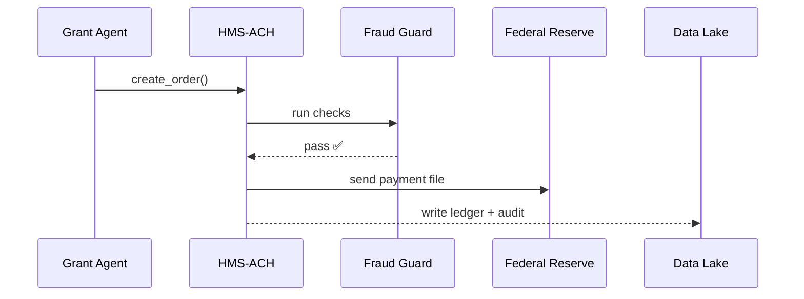

# Chapter 9: Financial Transaction Engine (HMS-ACH)

*(If you just finished storing data in the [Data Lake & Repository (HMS-DTA)](08_data_lake___repository__hms_dta__.md) you know **where** numbers live.  
Now let’s see **how real dollars actually move** while staying legal, auditable, and fraud-proof.)*

---

## 1. Why Do We Need HMS-ACH?

### Story – “NIH Awards a $50,000 Research Grant”

1. A review panel—powered by HMS-ACT agents—scores proposals.  
2. The winning lab at the University of Arizona must be paid **within 30 days** (Prompt Payment Act).  
3. The Treasury must:  
   • Transfer \$50,000 from the “Biomedical Fund” account.  
   • Record the outflow in its general ledger.  
   • Generate a **payment file** for the bank.  
   • Post a **public spending record** on USAspending.gov.  
4. If anything looks fishy (e.g., bank routing number = “000000000”), payment must be halted.

HMS-ACH is the **electronic checkbook** that performs all four steps—automatically, safely, and with a full audit trail.

---

## 2. Key Concepts (Plain English)

| Term / Emoji | What It Does | Government Analogy |
|--------------|-------------|--------------------|
| 📝 Payment Order | JSON request like “Pay UA \$50k.” | A signed SF-1034 voucher. |
| 🪙 Clearing | Matching funds moved from *Source* → *Destination*. | Treasury disbursing clerk pressing “Send.” |
| 📒 Ledger Entry | Debit + credit lines saved in a DB. | Double-entry bookkeeping in USSGL. |
| 🛡️ Fraud Guard | Rules that reject suspicious orders. | Treasury Inspector General review. |
| 🔄 Reconciliation Job | Nightly script that compares ledger ↔ bank report. | “Treasury Statement of Transactions.” |

Remember **order, clearing, ledger, guard, reconciliation** and you already speak ACH!

---

## 3. First Walk-Through  
### Use Case: Pay the $50k Grant in <20 Lines

#### 3.1 Submit a Payment Order

```python
# file: pay_grant.py
from hms_ach import AchClient

ach = AchClient(token="AGENCY_PIV")

order = {
    "pay_to":  "University of Arizona",
    "bank_routing": "122105278",
    "bank_account": "987654321",
    "amount": 50000,
    "budget_line": "BIOMED-2025-042",   # USSGL code
    "memo": "Cancer research grant"
}

resp = ach.create_order(order)
print("📨 Order ID:", resp["id"])
```

Explanation  
1. Authenticate once.  
2. Describe **who**, **where**, **how much**, and **why**.  
3. `create_order` returns an `id` like `ORD-581`.

*What happens behind the curtain?*  
• HMS-ACH stores the order as *PENDING*.  
• Fraud Guard runs basic checks (amount ≤ \$10M, routing number valid).  
• If safe, status flips to *APPROVED* and moves to clearing.

#### 3.2 Check Status Later (optional)

```python
status = ach.get_status("ORD-581")
print(status)    # e.g. "CLEARED"
```

When `CLEARED`, money is already at the university’s bank.

---

## 4. Under the Hood—5-Step Flow



*If Fraud Guard shouts “❌,” ACH returns `REJECTED` and nothing reaches the bank.*

---

## 5. Peeking Inside the Source Tree

```
hms-ach/
├── api/
│   ├── orders.py         # REST endpoints
│   └── status.py
├── core/
│   ├── guard.py          # fraud rules
│   ├── ledger.py         # double-entry
│   └── clearing.py       # bank file builder
└── jobs/
    └── reconcile.py      # nightly matcher
```

### 5.1 Minimal Fraud Guard (15 lines)

```python
# core/guard.py
def validate(order):
    if order["amount"] <= 0:
        return "amount_must_be_positive"
    if len(order["bank_routing"]) != 9:
        return "bad_routing_number"
    # 👇 budget overspend check (pseudo-code)
    if get_budget_used(order["budget_line"]) + order["amount"] > get_budget_cap(order["budget_line"]):
        return "budget_exceeded"
    return None    # all good
```

*Explanation:* simple, readable guards—easily extended by finance staff.

### 5.2 Ledger Entry (12 lines)

```python
# core/ledger.py
def post(order, txn_id):
    records = [
        {"account": order["budget_line"], "delta": -order["amount"]},
        {"account": "cash_outflow",       "delta":  order["amount"]}
    ]
    for r in records:
        db.insert("ledger", {**r, "txn_id": txn_id, "ts": now()})
```

*Explanation:* classic double-entry: one debit, one credit—auditors smile.

### 5.3 Reconciliation Job (simplified – 18 lines)

```python
# jobs/reconcile.py
from core import ledger, bank_feed

def nightly():
    bank = bank_feed.load_today()          # CSV from Federal Reserve
    for row in bank:
        if not ledger.exists(txn_id=row["id"]):
            alert("Missing ledger for bank txn", row)
        else:
            ledger.mark_reconciled(row["id"])
```

Runs at 02:00 AM; mismatches ping HMS-OPS dashboards.

---

## 6. How ACH Talks to Other Layers

Layer | Interaction Example
------|--------------------
[HMS-ACT](03_action_orchestrator__hms_act__.md) | Grants agent calls `create_order`.
[HMS-MCP](05_model_context_protocol__hms_mcp__.md) | Each order is wrapped in an **envelope** with `trace_id`.
[HMS-DTA](08_data_lake___repository__hms_dta__.md) | Ledger & bank files stored in the *Finance* zone.
[HMS-ESQ](10_compliance___legal_reasoner__hms_esq__.md) | Later scans ledger to verify Prompt Payment Act deadlines.
[HMS-OPS](12_activity___operations_monitoring__hms_ops___hms_oms__.md) | Streams cleared vs. rejected counts for dashboards.

---

## 7. Try It Yourself (5-Minute Lab)

```bash
git clone https://github.com/hms-example/hms-ach
cd hms-ach/examples
# 1. Start ACH + tiny mock bank
docker compose up ach
# 2. Pay the demo grant
python pay_grant.py
# 3. Watch logs
docker logs -f hms-ach | grep ORD-
```

You should see:

```
[FRAUD] checks passed ✔
[CLEAR] ORD-581 sent to bank file FED_2025_04_01.ach
[LEDGER] txn TXN-992 posted
```

---

## 8. Recap & What’s Next

In this chapter you learned:

✓ HMS-ACH is the platform’s **electronic checkbook**.  
✓ A single JSON **Payment Order** triggers clearing, ledger posting, and compliance logging.  
✓ **Fraud Guard** and nightly **reconciliation** keep the money trail clean.  
✓ All actions carry the same MCP `trace_id`, so auditors can follow dollars just like data.

Next we’ll verify that every dollar (and byte) obeys the law using the [Compliance & Legal Reasoner (HMS-ESQ)](10_compliance___legal_reasoner__hms_esq__.md).

---

---

Generated by [AI Codebase Knowledge Builder](https://github.com/The-Pocket/Tutorial-Codebase-Knowledge)