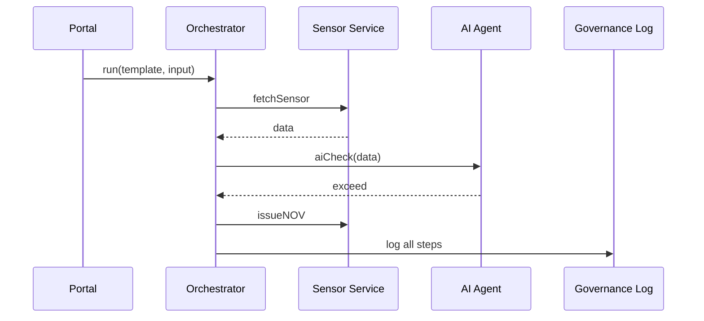

# Chapter 9: HMS-ACT Orchestration Engine

*(continuation of [Management Layer (HMS-ACT, HMS-OMS, HMS-OPS)](08_management_layer__hms_act__hms_oms__hms_ops__.md))*  

---

## 1. Why Do We Need a Digital “Conductor”?

### 60-Second Story — “The Smoky-Factory Complaint”

1. **Elena**, a Dallas resident, files a complaint on **epa.gov/air**:  
   “The factory on Maple St emits black smoke every night.”  
2. The system must now:  
   a. **Fetch data** — pull last-week sensor numbers.  
   b. **Analyze** — ask an AI expert if levels break EPA rules.  
   c. **Deploy policy** — if true, generate a notice of violation.  
3. Miss any step, or run them out of order, and the factory keeps polluting.

**HMS-ACT** is the orchestra conductor that ensures  
*violins (data fetch), brass (AI), and percussion (policy)* play **exactly in time**.

---

## 2. Key Concepts in Plain English

| Term | Friendly Explanation |
|------|----------------------|
| Workflow Template | The “sheet music” — JSON describing the steps. |
| Step | One instrument’s line (e.g., `fetchSensorData`). |
| Transition | The arrow to the next step (`onSuccess → analyze`). |
| Retry | “Missed note?”  Automatic re-attempt with back-off. |
| Event Bus | The hallway where steps shout *“Done!”* |
| Audit Trail | The tamper-proof diary of every note played. |
| Adapter | A plug that lets a new micro-service become an “instrument.” |

Analogy:  
A government *orchestra* may add a harp next year (new rule).  
Admins just hand HMS-ACT a new **Adapter** and update the **Workflow Template**.  
No core code changes.

---

## 3. Seeing ACT in Action (5-Minute Demo)

### 3.1 Declare the Workflow (10 lines)

```json
// workflows/epaComplaint.json
{
  "id": "epa-complaint-v1",
  "steps": [
    { "id": "fetchSensor", "run": "svc:getSensor", "retry": 3 },
    { "id": "aiCheck",     "run": "agt:airQualityAI"          },
    { "id": "issueNOV",    "run": "svc:sendViolation"         }
  ],
  "transitions": {
    "fetchSensor:success": "aiCheck",
    "aiCheck:exceed":      "issueNOV"
  }
}
```

What it says:
1. Call the **sensor** service (up to 3 tries).  
2. Give results to the **air-quality AI**.  
3. If AI returns `exceed`, fire the **Notice of Violation (NOV)** step.

### 3.2 Launch the Workflow (18 lines)

```javascript
// startComplaint.js
import { ActClient } from '@hms-act/client';
import { getToken }  from '@hms-auth/client';   // Chapter 2 badge

async function run(caseId) {
  const token = await getToken({ actor: 'elena@citizen' });

  const res = await ActClient.run({
    headers: { Authorization: `Bearer ${token}` },
    template: 'epa-complaint-v1',
    input:    { caseId, plant: 'Maple St Factory' }
  });

  console.log('🎟️ Orchestration Ticket:', res.runId);
}

run('CASE-413');
```

What happens next?
* ACT stores a **run record**, enqueues **Step 1** into HMS-OMS, and starts the clock.

---

## 4. A Beginner-Friendly Walkthrough



Only **5 actors** — easy to trace.

---

## 5. Peeking Under the Hood

### 5.1 Run Record (8 lines)

```json
{
  "runId": "RUN-845",
  "template": "epa-complaint-v1",
  "pointer": "aiCheck",        // current step
  "state": { "caseId": "CASE-413", "...": "..." },
  "logs": [ /* each step result */ ]
}
```

Saved in `act.runs`.

### 5.2 Minimal Orchestrator Loop (18 lines)

```javascript
// engine/loop.js
import { dequeue } from '@hms-oms/queue';

export async function tick() {
  const msg = await dequeue('act:event');     // sensorDone, aiCheckDone…
  if (!msg) return;

  const run = await db.runs.find(msg.runId);
  const next = templateNext(run.template, msg); // look up transition

  if (next) {
    await enqueueStep(next, run);             // push to OMS
    run.pointer = next.id;
  }
  await db.runs.save(run);
  tick();
}
```

• **`dequeue`** listens on the **Event Bus**.  
• **`enqueueStep`** schedules the next “instrument.”  
• State is **updated once** per event — simple & robust.

### 5.3 Adapter Skeleton (15 lines)

```javascript
// adapters/svc-getSensor.js
export default {
  id: 'svc:getSensor',
  run: async ({ plant }) => {
    // call external EPA API
    const r = await fetch(`https://epa.gov/api/sensor?site=${plant}`);
    return await r.json();
  }
};
```

Any new micro-service can join by exporting `{ id, run() }`.

---

## 6. Handling Errors & Retries

```javascript
// engine/retry.js
if (step.retry > run.retries[step.id]) {
  run.retries[step.id] += 1;
  enqueueStep(step, run, delay = 2 ** run.retries[step.id] * 1000);
} else {
  failRun(run, 'step exceeded retries');
}
```

1. Exponential back-off (`2ⁿ` seconds).  
2. After max retries, ACT marks the run **failed** and alerts HMS-OPS (Chapter 12).

---

## 7. Live Monitoring & Control

```javascript
import { streamRuns } from '@hms-act/client';

streamRuns('epa-complaint-v1', r =>
  console.log(`${r.runId} – ${r.pointer} – ${r.status}`)
);
```

Sample console:

```
RUN-845 – aiCheck – running
RUN-845 – issueNOV – running
RUN-845 – completed
```

Managers can **pause**, **resume**, or **cancel** a run with one API call.

---

## 8. Linking Back to Other Layers

* **Templates** often originate from [Policy & Process Model (HMS-CDF)](07_policy___process_model__hms_cdf__.md).  
* **Steps** are executed by workers/agents registered via [Backend Service APIs (HMS-SVC & HMS-API)](10_backend_service_apis__hms_svc___hms_api__.md).  
* **Retries & alerts** surface in [Monitoring & Telemetry Stack (HMS-OPS)](12_monitoring___telemetry_stack__hms_ops__.md).  
* **Every event** is signed and stored for auditors in [Security & Compliance Engine (HMS-ESQ)](11_security___compliance_engine__hms_esq__.md).

---

## 9. Directory Peek

```
hms-act/
 ├─ engine/        // loop.js, retry.js
 ├─ templates/     // epaComplaint.json …
 ├─ adapters/      // svc-getSensor.js, agt-airQualityAI.js
 ├─ client/        // tiny SDK used above
 └─ README.md
```

Everything is small, text-based, and version-controlled.

---

## 10. Recap

You learned:

1. HMS-ACT is the **conductor** that sequences services, agents, and policy steps.  
2. A **Workflow Template** (≤ 10 lines) can automate a real EPA complaint.  
3. How ACT guarantees order, retries, and a full audit trail with minimal code.  
4. How adapters let new micro-services join the orchestra in minutes.

Ready to see the **service endpoints** that steps like `svc:getSensor` call?  
Jump to [Backend Service APIs (HMS-SVC & HMS-API)](10_backend_service_apis__hms_svc___hms_api__.md).

---

Generated by [AI Codebase Knowledge Builder](https://github.com/The-Pocket/Tutorial-Codebase-Knowledge)