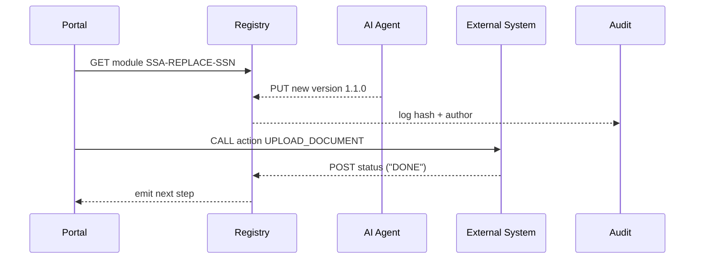

# Chapter 9: Process Module / Policy Artifact  

[← Back to Chapter 8: Security & Privacy Guardrails](08_security___privacy_guardrails_.md)

---

## 0. Why Do We Need a “Recipe Book” for Government Tasks?  

Picture **Sam**, a citizen who lost his Social-Security card while moving from Alaska to Texas.  
Today he must:

1. Find Form SS-5.  
2. Mail identity proofs.  
3. Wait, wonder, and repeatedly call SSA for status updates.  

What if instead the system already owned a **Process Module** called **“Issue Replacement SSN Card”**?  
Any portal (web, phone, kiosk) could fetch that module, show Sam the **exact** steps, enforce service-level times, and even trigger downstream print-and-mail systems—while auditors watch every change.

That’s the promise of **Process Modules / Policy Artifacts (PM/PAs)**:  
version-controlled, machine-readable “recipes” that everyone—humans, AIs, micro-services—can follow and trust.

---

## 1. Key Concepts (Plain English Cheat-Sheet)

| Term | Friendly Meaning | Analogy |
|------|------------------|---------|
| Process Module | YAML/JSON file listing steps, roles, SLAs. | A cooking recipe. |
| Policy Artifact | Same file plus legal/compliance hooks. | Recipe with nutrition labels & allergy warnings. |
| Version | Immutable snapshot with a semantic tag (`v1.2.0`). | Edition of a cookbook. |
| Hash Signature | SHA-256 digest proving no one tampered. | Wax seal on a letter. |
| Chain-of-Custody | History of who edited what, when, and why. | Google-Docs revision log. |

---

## 2. A 3-Minute Tour: “Replacement SSN Card” Module

### 2.1 Minimal YAML (11 lines)

```yaml
# ssa_replace_ssn.yaml
id: SSA-REPLACE-SSN
version: "1.0.0"
title: "Issue Replacement SSN Card"
roles:
  applicant: "Citizen"
  approver: "SSA_Officer"
sla:
  submit_to_mail: "10 business days"
steps:
  - id: UPLOAD_ID
    action: "UPLOAD_DOCUMENT"
    required_role: "Citizen"
  - id: VALIDATE_ID
    action: "AI_ID_MATCH"
    required_role: "SSA_Officer"
  - id: PRINT_MAIL
    action: "TRIGGER_PRINT_FULFILLMENT"
    required_role: "System"
```

Explanation (bullet-quick):  
• `roles` state **who** can do each step.  
• `sla` gives auditors a timer.  
• Each `step` has an `id`, an executable `action`, and a `required_role`.

### 2.2 Hash-Signing It (Python, 8 lines)

```python
import hashlib, json, base64, pathlib
mod = pathlib.Path("ssa_replace_ssn.yaml").read_bytes()
digest = hashlib.sha256(mod).digest()
print("SHA-256:", base64.b64encode(digest).decode())
```

Run once → paste the hash into your registry UI.  
Anyone downloading the file later re-hashes it to confirm integrity.

---

## 3. How Do I Use a Process Module?

### 3.1 Fetch & Start (REST, 8 lines)

```bash
# Get latest approved version
curl https://registry.hms/api/v1/modules/SSA-REPLACE-SSN
```

Sample response (trimmed):

```json
{
  "version":"1.0.0",
  "steps":["UPLOAD_ID","VALIDATE_ID","PRINT_MAIL"],
  "hash":"H4s7...="
}
```

### 3.2 Execute First Step (Portal Code, 12 lines)

```javascript
// portal/replaceCard.js
import api from '../sdk.js'

export async function startFlow(moduleId){
  const mod = await api.getModule(moduleId)
  const step = mod.steps[0]              // UPLOAD_ID
  showUploadDialog(async (file)=>{
     await api.completeStep(mod.id, step, file)
  })
}
```

Explanation:  
1. Portal pulls module.  
2. Reads the **first** step id (`UPLOAD_ID`).  
3. Shows an upload dialog; on success calls backend `completeStep`.

### 3.3 AI Agent Editing a Module (Python, 15 lines)

```python
# ai/update_sla.py
import yaml, datetime, openai, requests
mod = yaml.safe_load(open('ssa_replace_ssn.yaml'))
# Ask GPT to recommend faster SLA
prompt = f"Current SLA is {mod['sla']['submit_to_mail']}."
prompt+= " Suggest an improved but realistic time frame."
resp = openai.ChatCompletion.create(model="gpt-4o-mini",
        messages=[{"role":"user","content":prompt}])
new_sla = resp.choices[0].message.content.strip()
mod['sla']['submit_to_mail'] = new_sla
yaml.safe_dump(mod, open('ssa_replace_ssn.yaml','w'))
requests.post("https://registry.hms/api/v1/modules", files={'file':open('ssa_replace_ssn.yaml','rb')})
```

The registry stores this as **version 1.1.0**, signs it, and notifies stakeholders.

---

## 4. Under the Hood (5 Participants Max)



Key flow points:  
• Registry is the **source of truth**.  
• Every edit (human or AI) registers a new version + hash.  
• External systems only execute steps that match a verified hash.

---

## 5. What Lives Where?

```
process-modules/
├─ registry/
│  └─ app.py              # REST + hashing
├─ examples/
│  └─ ssa_replace_ssn.yaml
├─ sdk/
│  ├─ client.py
│  └─ validator.py
└─ hooks/
   └─ notify_slack.py
```

### 5.1 Micro-Registry (Flask, 18 lines)

```python
# registry/app.py
from flask import Flask, request, jsonify
import hashlib, base64, os, yaml, time
app = Flask(__name__)

STORE = {}   # {id: {version: file_bytes}}

@app.get("/modules/<mid>")
def get_mod(mid):
    latest = sorted(STORE[mid])[-1]
    file = STORE[mid][latest]
    h = base64.b64encode(hashlib.sha256(file).digest()).decode()
    return jsonify({"version": latest, "steps": yaml.safe_load(file)["steps"],
                    "hash": h})

@app.post("/modules")
def add_mod():
    f = request.files['file'].read()
    m = yaml.safe_load(f)
    ver = m["version"]
    mid = m["id"]
    STORE.setdefault(mid, {})[ver] = f
    # normally: sign, push to git, notify
    return jsonify({"status":"stored", "version": ver})
```

Beginner explanation:  
• Stores bytes in memory (swap for S3/Git).  
• On `GET`, returns latest version + hash.  
• On `POST`, adds new version and replies.

---

## 6. How Does This Tie to Other Layers?

* **Journey Engine** ([Chapter 6](06_intent_driven_journey_engine_.md)) reads the `steps` array to plan user waypoints.  
* **Role Matrix** ([Chapter 7](07_role_based_access___entitlement_matrix_.md)) checks `required_role` before allowing a user/agent to perform a step.  
* **Guardrails** ([Chapter 8](08_security___privacy_guardrails_.md)) scan the module file on `POST` for PII or malicious code.  
* **Audit & Compliance Ledger** ([Chapter 14](14_audit___compliance_ledger_.md)) stores every hash & editor for chain-of-custody.  
* Next chapter’s **Deployment Pipeline** will pick up approved versions and roll them out to staging/prod systems.

---

## 7. Hands-On Lab (5 Commands)

```bash
git clone https://github.com/example/hms-act
cd process-modules/registry
pip install flask pyyaml
python app.py &        # Registry on :7600

# 1. Upload the example module
curl -F "file=@../examples/ssa_replace_ssn.yaml" localhost:7600/modules

# 2. Fetch it
curl localhost:7600/modules/SSA-REPLACE-SSN
```

You’ll see JSON with `version":"1.0.0"` and a base-64 hash.

---

## 8. Frequently Asked Questions

**Q: Do I need YAML?**  
A: JSON works too; the registry stores raw bytes plus mime-type.

**Q: Who bumps the version number?**  
A: The editor (human or AI). If omitted, the registry can auto-append `+build123`.

**Q: Can two agencies share a module?**  
A: Yes. Add `owners: ["SSA","IRS"]` in metadata. The Role Matrix prevents unauthorized edits.

**Q: What if a bad module slips in?**  
A: Governance rules can flag or block any module failing unit tests or compliance scans before it’s “approved”.

---

## 9. What You Learned

• **Process Modules / Policy Artifacts** are signed, versioned recipes that encode every step, role, and SLA of a government task.  
• Portals fetch modules at runtime; micro-services and external systems execute verified steps only.  
• AI agents can safely propose edits—each change is hashed and audited.  
• The registry is tiny to start but scales to Git-backed, multi-agency stores.  

Ready to see how an approved module travels from the registry to live systems?  
Jump to [Chapter 10: Backend Policy Deployment Pipeline](10_backend_policy_deployment_pipeline_.md).

---

Generated by [AI Codebase Knowledge Builder](https://github.com/The-Pocket/Tutorial-Codebase-Knowledge)