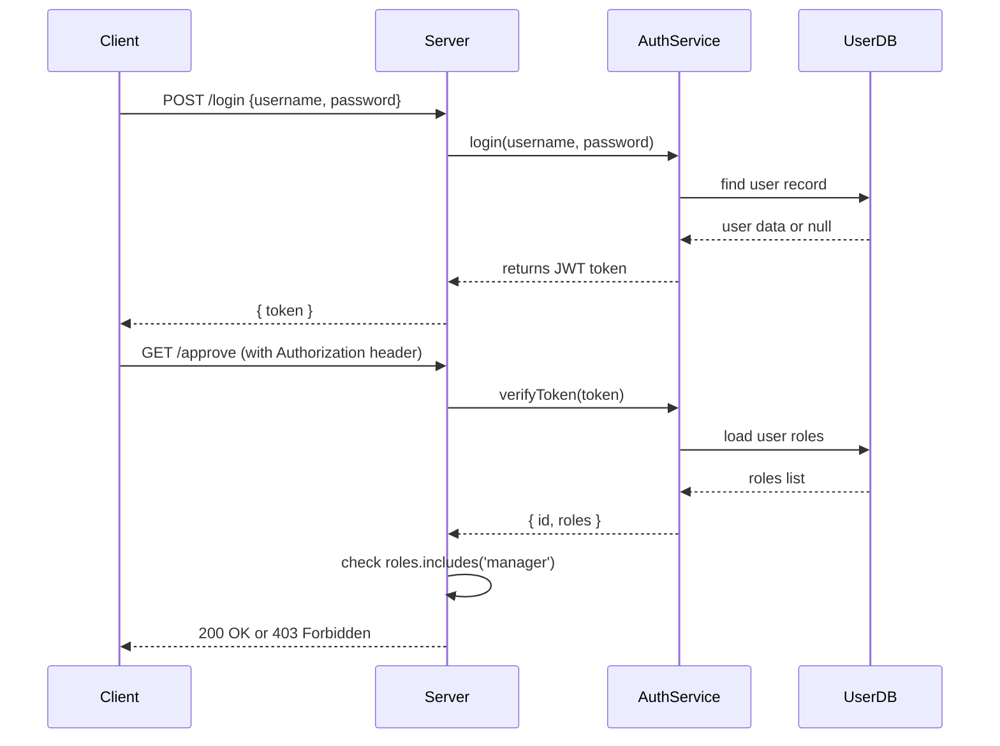

# Chapter 10: Account & Authorization System

In [Chapter 9: Core System Platform (HMS-SYS)](09_core_system_platform__hms_sys__.md) we saw how every service can fetch identity, config, logging, and basic security checks. Now we’ll build the **Account & Authorization System**: the layer that issues credentials (accounts), verifies logins, and enforces who can do what.

---

## Why We Need Accounts & Authorization

Imagine a federal grant portal where:

1. A **clerk** enters citizen applications.
2. A **manager** reviews and approves large grants.
3. A **public viewer** can only see published grant data, never drafts.

We must ensure that each user—based on their **account**—can only perform allowed **actions**. Our Account & Authorization System handles:

- **Registration** of user accounts (who you are).  
- **Authentication** (verifying your password/login).  
- **Authorization** (checking your roles and permissions).

---

## Key Concepts

1. **Account**  
   A user identity with credentials (username & password) and assigned **roles**.

2. **Authentication**  
   The process of verifying an account’s credentials and issuing a **token** (e.g., JWT).

3. **Authorization**  
   Checking whether an authenticated user’s **roles** grant them permission to perform an action.

4. **Roles & Permissions**  
   - **Role**: a label (e.g., `clerk`, `manager`).  
   - **Permission**: an action on a resource (e.g., `submit_application`, `approve_grant`).  
   Roles map to sets of permissions.

5. **Middleware**  
   A function that protects API routes by verifying tokens and roles.

---

## How to Use the Account & Authorization System

Let’s walk through a simple lobby:

1. **Login** to get a token.  
2. **Call** a protected endpoint with that token.  
3. **Middleware** checks the token and role.  

### 1. Login Route

```javascript
// File: src/auth/routes.js
import express from 'express';
import { authService } from './AuthService';

const router = express.Router();

router.post('/login', async (req, res) => {
  const { username, password } = req.body;
  const token = await authService.login(username, password);
  if (!token) return res.status(401).json({ error: 'Invalid credentials' });
  // Return a JWT token to the client
  res.json({ token });
});

export default router;
```
> Users send `username`/`password` and receive a JWT if they’re valid.

### 2. Authorization Middleware

```javascript
// File: src/auth/middleware.js
import { authService } from './AuthService';

export function authorize(requiredRole) {
  return (req, res, next) => {
    const header = req.headers.authorization || '';
    const token = header.split(' ')[1];              // "Bearer <token>"
    const user = authService.verifyToken(token);     // returns { id, roles }
    if (!user || !user.roles.includes(requiredRole)) {
      return res.status(403).json({ error: 'Forbidden' });
    }
    req.user = user;  // Attach user info for handlers
    next();
  };
}
```
> Wrap any route to require a specific role.

### 3. Protecting an Endpoint

```javascript
// File: src/api/grants.js
import express from 'express';
import { authorize } from '../auth/middleware';

const router = express.Router();

// Only users with 'manager' role can approve grants
router.post('/approve', authorize('manager'), (req, res) => {
  // req.user.id tells us who approved
  res.json({ status: 'Grant approved by ' + req.user.id });
});

export default router;
```
> If a non-manager tries to call `/approve`, they’ll get 403 Forbidden.

---

## What Happens Under the Hood?



---

## Inside: Core Implementation

### A. User Repository (In-Memory Example)

```javascript
// File: src/auth/UserRepo.js
const users = [
  { id: 'u1', username: 'alice', password: 'pass123', roles: ['clerk'] },
  { id: 'u2', username: 'bob',   password: 'secure!', roles: ['manager'] }
];

export const userRepo = {
  findByUsername: (name) => users.find(u => u.username === name)
};
```
> A simple list of users. In production, swap for a database call.

### B. AuthService: Login & Token Verification

```javascript
// File: src/auth/AuthService.js
import jwt from 'jsonwebtoken';
import { userRepo } from './UserRepo';

const SECRET = process.env.JWT_SECRET || 'dev-secret';

export class AuthService {
  async login(username, password) {
    const user = await userRepo.findByUsername(username);
    if (!user || user.password !== password) return null;
    // Create a JWT containing user ID and roles
    return jwt.sign({ id: user.id, roles: user.roles }, SECRET, { expiresIn: '1h' });
  }

  verifyToken(token) {
    try {
      return jwt.verify(token, SECRET);  // returns { id, roles }
    } catch {
      return null;
    }
  }
}

export const authService = new AuthService();
```
> `login()` issues a JWT; `verifyToken()` parses it and returns user info or null.

---

## Summary

In this chapter you learned how the **Account & Authorization System**:

- Defines **accounts** with roles and credentials.  
- Implements **authentication** via a `/login` route that issues JWTs.  
- Applies **authorization** middleware to protect routes based on roles.  

This ensures that only the right people—like clerks or managers—can view or modify sensitive data.

Next up: we’ll build out our domain logic in [Chapter 11: Backend Services (HMS-SVC / HMS-ACH)](11_backend_services__hms_svc___hms_ach__.md).

---

Generated by [AI Codebase Knowledge Builder](https://github.com/The-Pocket/Tutorial-Codebase-Knowledge)