# Chapter 10: Backend Policy Deployment Pipeline  

[← Back to Chapter 9: Process Module / Policy Artifact](09_process_module___policy_artifact_.md)

---

## 0. Why Do We Need Yet **Another** Pipeline?

Imagine the Occupational Safety and Health Review Commission (OSHRC) just **approved** a new “Expedited Hazard-Report” policy module (`HAZ-FAST`) that promises to cut factory-injury paperwork from **7 days to 24 hours**.  
Great—until we remember that:

1. Every agency instance runs in a different AWS GovCloud account.  
2. All code must pass FedRAMP moderate scans.  
3. Nobody wants downtime during end-of-quarter reporting.

The **Backend Policy Deployment Pipeline (BPDP)** is the **robotic mail-room** that takes an approved policy artifact, stamps it, scans it, and rolls it out—*without* human SSH or Friday-night heroics.

Think: **GitHub Actions + FedRAMP + “undo” button**, but for rulebooks instead of source code.

---

## 1. Key Concepts (Plain-English Cheat-Sheet)

| Term | What It Really Does | Analogy |
|------|---------------------|---------|
| Build Stage | Wraps the YAML policy into a tiny OCI container. | Putting your letter into a tamper-proof envelope. |
| Security Scan | Runs Snyk/Anchore for CVEs & secret leaks. | X-ray at airport security. |
| Container Registry | Stores signed policy images (ECR, Harbor). | Locked PO boxes at the post office. |
| Blue-Green Rollout | Spins up **Green** pods with the new policy while **Blue** serves traffic. | Opening a second toll-booth lane before closing the first. |
| Telemetry Gate | Checks live KPIs (wait-time, 5xx errors) before final cut-over. | Doctor monitoring vitals during surgery. |
| Auto-Rollback | Reverts to **Blue** if KPIs spike. | Hitting “Ctrl+Z” when the new toll lane jams. |

---

## 2. Walk-Through Use-Case: Deploy `HAZ-FAST` to Production

We’ll ship the OSHA policy from **git tag `v1.0.0`** to the live cluster, watch latency drop, and auto-rollback if error-rate > 1 %.

### 2.1 10-Line Pipeline File (`.github/workflows/bpdp.yaml`)

```yaml
name: haz-fast-pipeline
on:
  push:
    tags: ['v*']
jobs:
  deploy:
    runs-on: ubuntu-latest
    steps:
      - uses: actions/checkout@v4
      - run: docker build -t haz-fast:${{ github.ref_name }} .
      - run: trivy image --exit-code 1 haz-fast:${{ github.ref_name }}
      - run: docker push ghcr.io/osha/haz-fast:${{ github.ref_name }}
      - run: helm upgrade --install haz-fast chart/ \
              --set image.tag=${{ github.ref_name }} \
              --set rollout=green
```

Explanation (line-by-line):

1. Triggers only on version tags.  
2. **Build** – `docker build` packages the YAML plus a tiny executor binary (~10 MB).  
3. **Scan** – `trivy` blocks on any critical CVE or hard-coded secret.  
4. **Publish** – pushes to GitHub Container Registry.  
5. **Deploy** – `helm upgrade … rollout=green` stands up the **Green** copy.

### 2.2 Mini Helm Snippet (`chart/values.yaml`, 9 lines)

```yaml
replicaCount: 2
image:
  repository: ghcr.io/osha/haz-fast
  tag: "latest"     # Overridden by pipeline
service:
  port: 8080
rollout:
  strategy: BlueGreen
```

Only the `tag` changes per deployment; everything else stays declarative.

---

## 3. What Really Happens—Step by Step

```mermaid
sequenceDiagram
    participant Git as Git Tag
    participant CI as Pipeline
    participant Scan as Sec-Scanner
    participant K8S as Cluster
    participant Mon as Telemetry
    Git->>CI: push v1.0.0
    CI->>Scan: run Trivy
    alt clean
        Scan-->>CI: PASS
        CI->>K8S: helm rollout green
        K8S-->>Mon: emit KPIs
        Mon-->>CI: waitTime↓ errorRate≤1%
        CI->>K8S: flip traffic to Green
    else dirty
        Scan-->>CI: FAIL
        CI-->>Git: block merge
    end
```



Takeaway: **CI** (the pipeline) won’t flip 100 % traffic until **Mon** (Prometheus/Grafana) green-lights KPI thresholds.

---

## 4. Under-the-Hood Folder Tour

```
backend-deploy-pipeline/
├─ Dockerfile
├─ chart/
│  └─ values.yaml
├─ hooks/
│  └─ kpi_gate.py
└─ .github/
   └─ workflows/
      └─ bpdp.yaml
```

### 4.1 KPI Gate Hook (`hooks/kpi_gate.py`, 18 lines)

```python
import requests, time, sys

PROM = "https://prom.gov.osha/api/v1/query"
QUERY = 'rate(haz_fast_errors[5m])'

def wait_ok(threshold=0.01, timeout=300):
    t0 = time.time()
    while time.time() - t0 < timeout:
        r = requests.get(PROM, params={'query': QUERY}).json()
        err = float(r['data']['result'][0]['value'][1])
        if err <= threshold:
            print("✅ KPI gate passed")
            return
        time.sleep(15)
    sys.exit("🚨 KPI gate failed")

if __name__ == "__main__":
    wait_ok()
```

Explanation:  
• Polls Prometheus every 15 s for 5 min.  
• Exits non-zero if error-rate stays above 1 % → GitHub Actions marks the job failed → **auto-rollback** happens via Helm’s built-in `rollback`.

*(Call this script as an extra step after Helm deploy.)*

---

## 5. Tying Back to Other Layers

* **Approved Source** – Only artifacts marked *Approved* in [Process Module / Policy Artifact](09_process_module___policy_artifact_.md) can trigger the pipeline (`branch: approved/*` or signed tag).  
* **Security & Privacy Guardrails** – The Docker image re-uses guardrail plugins to double-check secrets at runtime.  
* **Audit & Compliance Ledger** – Every pipeline step posts a log entry: tag, scan result, KPIs, and whether rollback occurred.  
* **Microservices Mesh & Service Registry** – After cut-over, the new policy registers itself so other services can discover its endpoint (see [Microservices Mesh & Service Registry](11_microservices_mesh___service_registry_.md)).

---

## 6. Try It Yourself — 4 Commands

```bash
# 1. Clone demo repo
git clone https://github.com/example/hms-act && cd backend-deploy-pipeline

# 2. Build + scan locally
docker build -t haz-fast:local .
trivy image haz-fast:local          # should show 0 critical CVEs

# 3. Spin up kind cluster & install chart
kind create cluster
helm upgrade --install haz-fast chart/ --set rollout=green

# 4. Watch rollout
kubectl rollout status deployment/haz-fast-green
```

Kubernetes will list two deployments: `haz-fast-blue` (old) and `haz-fast-green` (new).  
Switch traffic via:

```bash
kubectl patch svc haz-fast -p '{"spec":{"selector":{"version":"green"}}}'
```

Rollback by swapping selector back to `blue`.

---

## 7. Frequently Asked Questions

**Q: Why containerize a YAML file?**  
A: Containers give us immutability, easy scanning, and a single artifact format that every FedRAMP toolchain already speaks.

**Q: Can agencies still use Jenkins or GitLab?**  
A: Yes. Replace the `.github/workflows` file with equivalent groovy or `.gitlab-ci.yml`—the stages stay identical.

**Q: Where do rollback metrics come from?**  
A: The KPI Gate queries Prometheus for *wait-time* and *error-rate* emitted by the service or collected in [User Feedback & Telemetry Hub](13_user_feedback___telemetry_hub_.md).

**Q: How long does blue-green take?**  
A: For stateless policies < 50 MB, under 2 minutes; stateful ones depend on DB migrations (run in a pre-traffic hook).

---

## 8. What You Learned

• The **Backend Policy Deployment Pipeline** packages, scans, and rolls out policy artifacts with zero downtime.  
• Blue-green plus a **Telemetry Gate** give safe, automatic rollbacks.  
• Everything is logged for auditors and plugs into the broader HMS-ACT ecosystem.  

Ready to see how these freshly deployed policies register themselves and communicate inside the service fabric?  
Jump to [Chapter 11: Microservices Mesh & Service Registry](11_microservices_mesh___service_registry_.md).

---

Generated by [AI Codebase Knowledge Builder](https://github.com/The-Pocket/Tutorial-Codebase-Knowledge)