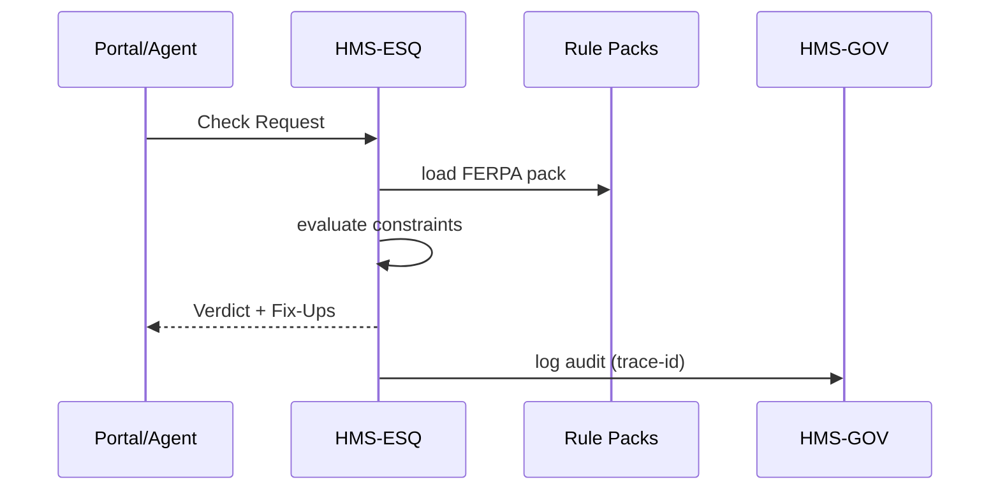

# Chapter 10: Compliance & Legal Reasoner (HMS-ESQ)

*(Coming from the money-moving world of the [Financial Transaction Engine (HMS-ACH)](09_financial_transaction_engine__hms_ach__.md)?  
Great!  You just saw how dollars flow.  Now let’s make sure every **byte _and_ buck** obeys the law before it flows anywhere.)*  

---

## 1. Why Do We Need HMS-ESQ?

### Story – “E-Transcript for a High-School Senior”

1. A student clicks **“Send Transcript to University”** on the Department of Education portal.  
2. The portal must ship grades stored in the **Data Lake** to a private college’s API.  
3. **Problem:** Grades are **FERPA-protected** student records.  
4. 30 ms after the click, the platform must answer:  

   “📬 Allowed” *or* “⛔ Blocked – needs consent.”

If a mistake slips through, the agency faces fines and lawsuits.

HMS-ESQ is the platform’s **AI-speed General Counsel**.  
It listens to every planned action—“Send grades,” “Publish dataset,” “Pay vendor in Cuba”—and instantly checks:

* Which **law / regulation / executive order** applies?  
* Does the action violate any clause?  
* If so, can it be **auto-remediated** (mask fields, redact SSN) or must it be blocked?

---

## 2. Key Concepts (Plain English)

| Word | What It Really Means | Analogy |
|------|----------------------|---------|
| **Rule Pack** | Machine-readable file derived from a law (FERPA, HIPAA, FOIA). | A binder on counsel’s shelf. |
| **Constraint** | One computable line in a pack, e.g. “Student GPA may leave system **only** if `consent=yes`.” | A sticky note inside the binder. |
| **Check Request** | JSON sent to ESQ describing the *planned* action. | “Hey counsel, can we mail this?” |
| **Verdict** | `ALLOW`, `ALLOW_WITH_FIXES`, or `BLOCK`, plus citations. | Counsel’s yellow or red stamp. |
| **Fix-Up** | Auto remediation steps (mask, delay, seek consent). | Counsel scribbling “Remove SSN.” |

Remember **Pack → Constraint → Check → Verdict → Fix-Up** and you speak ESQ fluently.

---

## 3. First Walk-Through  
### Use Case: “Can We Send This Transcript?”

Below are all the moving parts in **32 lines of code total**.

#### 3.1 Caller Side (Portal or Agent)

```python
# file: ask_esq.py
from hms_esq import EsqClient

esq = EsqClient(token="AGENCY_PIV")

check = {
    "action": "HTTP_POST",
    "destination": "https://api.university.edu/transcript",
    "payload_tags": ["student_record", "gpa", "ssn"],
    "subject": "student:12489",
    "context": { "consent": False }    # student unchecked consent box
}

verdict = esq.check(check)
print(verdict)
```

Explanation  
1. Build a **Check Request** describing *what* will be sent, *where*, and any relevant context.  
2. `esq.check()` returns something like:

```json
{
  "decision": "BLOCK",
  "reason": "FERPA §99.30(a) – no consent.",
  "fixes": ["ask_for_consent"]
}
```

The portal sees `BLOCK` and pops up **“We need your consent”** instead of silently leaking data.

---

## 4. What Happens Under the Hood?



Only four actors; the whole dance finishes in **<50 ms**.

---

## 5. Digging Into the Rule Pack

A pack is simple YAML so lawyers can tweak it themselves.

```yaml
# file: ferpa.yml
law: "FERPA"
version: "20 U.S.C. §1232g"
constraints:
  - id: FERPA_CONSENT
    when:
      payload_tags: ["student_record"]
      destination: "external"
    unless:
      context.consent: true
    decision: BLOCK
    reason: "FERPA §99.30(a) – disclosure requires prior consent."
    fixes: ["ask_for_consent"]
```

Four fields to grok:

* `when` – trigger conditions.  
* `unless` – the escape hatch.  
* `decision` – what to do if matched.  
* `fixes` – recommended remediation.

*Lawyers edit text; ESQ turns it into Python predicates automatically.*

---

## 6. Inside the Code (≤20 Lines Each)

### 6.1 Tiny Evaluator (`rule_engine.py`)

```python
# core/rule_engine.py
def evaluate(check, constraints):
    for c in constraints:
        if matches(c["when"], check) and not matches(c.get("unless", {}), check):
            return {
                "decision": c["decision"],
                "reason": c["reason"],
                "fixes":  c.get("fixes", [])
            }
    return {"decision":"ALLOW"}
```

Beginners’ takeaway: the engine loops until a rule hits—no black magic.

### 6.2 API Endpoint (`api.py`)

```python
# api/esq.py
from fastapi import APIRouter, Request
from core.rule_engine import evaluate
from core.loader import load_packs, write_audit

router = APIRouter()

@router.post("/check")
async def check(req: Request):
    body = await req.json()
    packs = load_packs(body)           # pick FERPA, HIPAA, etc.
    verdict = evaluate(body, packs)
    write_audit(body, verdict)
    return verdict
```

*Five lines of real logic; everything else is FastAPI boilerplate.*

### 6.3 Loading Packs (`loader.py` – 10 lines)

```python
def load_packs(check):
    needed = ["FERPA"] if "student_record" in check["payload_tags"] else []
    packs  = []
    for name in needed:
        with open(f"rules/{name.lower()}.yml") as f:
            packs += yaml.safe_load(f)["constraints"]
    return packs
```

Smart routing keeps the server fast—only the relevant law files are parsed per request.

---

## 7. Relationship to Other Layers

Layer | Interaction
------|------------
[HMS-GOV](01_governance_layer__hms_gov__.md) | Stores and versions every **Rule Pack** like other policies.
[HMS-CDF](02_codified_democracy_foundation_engine__hms_cdf__.md) | Confirms packs do not conflict with existing statutes.
[HMS-ACT](03_action_orchestrator__hms_act__.md) | Calls `esq.check()` before it executes **every** route.
[HMS-SVC](06_backend_service_core__hms_svc__.md) | Wraps DB writes in a check request (e.g., “Can I store SSN in plaintext?”).
[HMS-ACH](09_financial_transaction_engine__hms_ach__.md) | Fraud Guard asks ESQ for sanctions lists (OFAC) compliance.
[HMS-OPS](12_activity___operations_monitoring__hms_ops___hms_oms__.md) | Streams verdict metrics (blocks per day) to dashboards.

---

## 8. Try It Yourself (5-Minute Lab)

```bash
git clone https://github.com/hms-example/hms-esq
cd hms-esq/examples
# 1. Start ESQ
uvicorn api:router --reload
# 2. Run the demo request
python ask_esq.py          # Expect BLOCK
# 3. Edit examples/consent_true.json (set consent:true) and re-run
python ask_esq.py          # Expect ALLOW
```

Watch the server logs:

```
[ESQ] Loaded 1 pack(s): FERPA
[ESQ] ➜ BLOCK (FERPA_CONSENT)
```

---

## 9. Common Fix-Ups Out-Of-The-Box

| Fix-Up ID | What It Does | Example Laws |
|-----------|--------------|--------------|
| `ask_for_consent` | Returns UI hint: “Show consent checkbox.” | FERPA |
| `mask_ssn` | Replace SSN digits with “XXX-XX-1234.” | Privacy Act |
| `delay_foia` | Hold release until 20-day window expires. | FOIA |
| `store_encrypted` | Force AES-256 at rest. | HIPAA |

You can add your own by dropping a Python function in `fixups/`.

---

## 10. Security & Performance Notes (TL;DR)

* **Zero Secrets in Rules** – Packs are pure YAML; no keys inside.  
* **Caching** – Packs load once, then live in memory ⇒ median check 3 ms.  
* **Traceability** – Every verdict logs `trace_id`, constraint id, and call-site service name into [HMS-DTA](08_data_lake___repository__hms_dta__.md).

---

## 11. Recap & What’s Next

Today you learned:

✓ HMS-ESQ is the **always-on digital counsel** that turns laws into machine constraints.  
✓ A simple **Check Request** yields `ALLOW`, `BLOCK`, or **auto-fix** suggestions within milliseconds.  
✓ Rule Packs live next to other policies, so lawyers—not engineers—own legal logic.  
✓ Every service in the platform calls ESQ, ensuring **no step** can accidentally break FERPA, HIPAA, FOIA, or sanctions rules.

But sometimes the law *requires* an actual human to review sensitive content (classified data, life-changing benefit denials, etc.).  
That’s where we’ll head next: [Human-in-the-Loop (HITL) Control](11_human_in_the_loop__hitl__control_.md).

---

Generated by [AI Codebase Knowledge Builder](https://github.com/The-Pocket/Tutorial-Codebase-Knowledge)