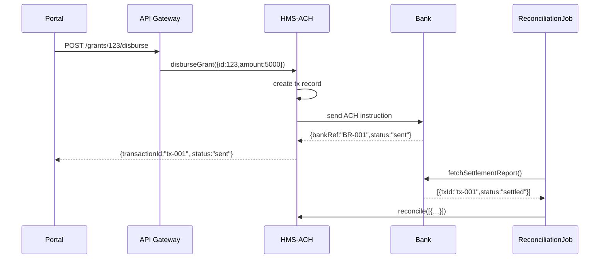

# Chapter 10: Financial Systems (HMS-ACH)

Welcome back! In [Chapter 9: Backend Services (HMS-SVC)](09_backend_services__hms_svc__.md) we saw how microservices implement domain logic. Now we’ll explore **Financial Systems (HMS-ACH)**—the part of HMS-ACT that securely moves, tracks, and reconciles money flows (think Treasury operations for grants or tax refunds).

---

## Why HMS-ACH?

Imagine the Department of Agriculture needs to disburse disaster-relief grants to small farms. Each approved application must:

1. Create a transaction record  
2. Send funds over ACH or wire transfer  
3. Track status (“pending,” “sent,” “settled”)  
4. Reconcile amounts with the bank’s report  
5. Keep a full audit log  

HMS-ACH handles all of that in a secure, auditable, and standardized way—so agencies don’t reinvent banking integrations or risk compliance gaps.

---

## Central Use Case: Disbursing a Grant

1. **Citizen Portal** calls `POST /grants/:id/disburse`  
2. **API Gateway** routes to HMS-ACH’s **Payment Service**  
3. HMS-ACH creates a transaction and calls the bank’s ACH API  
4. Bank responds with a transaction reference  
5. HMS-ACH logs it, returns `transactionId` to the portal  
6. Later, a **Reconciliation Job** fetches the bank’s settlement report and updates statuses  



---

## Key Concepts

1. **Transaction Service**  
   Creates and stores payment records (`pending`, `sent`, `failed`, `settled`).

2. **Disbursement Workflow**  
   Orchestrates steps: record → send → confirm.

3. **Bank Integration**  
   Connects to ACH or wire-transfer APIs, handling credentials and payload formats.

4. **Reconciliation Service**  
   Periodically matches your records with the bank’s settlement file to update statuses.

5. **Audit & Security**  
   Logs every step with timestamps, user IDs, and digital signatures for compliance.

---

## Using HMS-ACH in Your Code

Below is a minimalist client showing how to kick off a disbursement.

```js
// hms-ach/paymentClient.js
import { TransactionService } from './services/transactionService';

export async function disburseGrant({ applicationId, amount }) {
  // 1. Create local transaction
  const tx = await TransactionService.create({ applicationId, amount });
  // 2. Send instruction to the bank
  await TransactionService.sendToBank(tx);
  // 3. Return the transaction reference
  return { transactionId: tx.id, status: tx.status };
}
```

Explanation:
- We first call `create()` to store a `pending` record.  
- Then `sendToBank()` translates that record into an ACH request.  
- Finally, we return the `transactionId` and current `status` to the caller.

Example input/output:

- Input: `{ applicationId: 123, amount: 5000 }`  
- Output: `{ transactionId: "tx-1623456789", status: "sent" }`

---

## Internal Implementation

Here’s how the **TransactionService** might look under the hood.

```js
// hms-ach/services/transactionService.js
export class TransactionService {
  static async create({ applicationId, amount }) {
    // (Imagine this writes to a database)
    return { id: `tx-${Date.now()}`, applicationId, amount, status: 'pending' };
  }

  static async sendToBank(tx) {
    // Call the bank’s ACH API (credentials/config from HMS-SYS)
    // On success: tx.status = 'sent', update the DB
  }
}
```

And the **Reconciliation Service**:

```js
// hms-ach/services/reconciliationService.js
import { getBankReport } from './bankClient';

export async function reconcile(transactions) {
  const report = await getBankReport(); // fetch settlement file
  report.forEach(item => {
    // find matching tx record and update its status
    // e.g. if item.status === 'settled', mark tx as settled
  });
}
```

---

## How It All Works

1. **Client Call**  
   Frontend or API calls `disburseGrant()`.  
2. **Local Record**  
   HMS-ACH stores a `pending` transaction in its database.  
3. **Bank Instruction**  
   It formats an ACH payload and calls the bank’s network.  
4. **Bank Response**  
   On `"sent"`, the service updates the status.  
5. **Reconciliation**  
   A scheduled job fetches the bank’s settlement file and updates each transaction’s final status.

Analogy: HMS-ACH is like a Treasury clerk who logs requests, submits checks to the Federal Reserve (ACH), then tallies even­tual clearances against their ledger.

---

## Conclusion

In this chapter, you learned how **Financial Systems (HMS-ACH)**:

- Create and manage payment transactions  
- Integrate with banking networks (ACH, wire)  
- Reconcile payments against bank reports  
- Maintain a full audit trail for compliance  

Next up, we’ll look at bringing in outside data and systems in **[Chapter 11: External System Integration](11_external_system_integration_.md)**.

---

Generated by [AI Codebase Knowledge Builder](https://github.com/The-Pocket/Tutorial-Codebase-Knowledge)