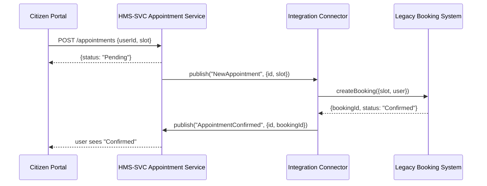

# Chapter 11: External System Integration

In the last chapter, you learned how **HMS-ACH** handles payments and bank reconciliations. Now let’s build the **bridge** between HMS-ACT and third-party platforms—legacy databases, scheduling tools, or other agencies. Welcome to **External System Integration**!

---

## Why External System Integration?

Imagine a state health department still runs its vaccination scheduling on an older COBOL booking system. Meanwhile, citizens use our modern **HMS-MFE** portal to book appointments. We need:

- When a citizen books online, to **push** that appointment into the legacy system  
- When the legacy system updates or cancels slots, to **pull** updates back into our microservices  
- Real-time consistency so nobody double-books or misses a slot  

This chapter shows how to write **connectors** and **adapters** that keep data in sync.

---

## Central Use Case: Vaccination Scheduling

1. Citizen uses **HMS-MFE** to request a vaccine appointment.  
2. The **Appointment Service** ([Chapter 09: HMS-SVC](09_backend_services__hms_svc__.md)) writes to its database.  
3. An **Integration Connector** picks up the new record and calls the legacy booking API.  
4. If the legacy system confirms or rejects, the connector sends an event back.  
5. The **Appointment Service** updates status in our database; the citizen sees it on the portal.



---

## Key Concepts

1. **Connector**  
   A service that *listens* for domain events (e.g., `NewAppointment`) and *forwards* them to an external API.

2. **Adapter**  
   A small module that *transforms* our data model into the external system’s shape (and vice versa).

3. **Polling vs. Event-Driven**  
   - *Event-Driven*: React immediately to our own internal events.  
   - *Polling*: At regular intervals, check the external system for changes.

4. **Idempotency**  
   Ensure repeated sync calls for the same appointment don’t create duplicates.

5. **Error Handling & Retries**  
   Store failed messages and retry later (back-off, dead-letter queue).

---

## Using the Integration Connector

Below is a tiny Node.js connector that listens for “NewAppointment” and calls a fictional legacy API.

```js
// src/connectors/appointmentConnector.js
import { subscribe } from '@hms-mgmt/bus';       // from [Chapter 06](06_management_layer_.md)
import axios from 'axios';

subscribe('NewAppointment', async ({ id, slot, userId }) => {
  try {
    // Transform and send to legacy system
    const payload = { customer: userId, timeSlot: slot };
    const res = await axios.post('https://legacy.local/book', payload);
    // Publish confirmation back
    publish('AppointmentConfirmed', { id, bookingId: res.data.id });
  } catch (err) {
    console.error('Sync failed, will retry', err);
    // Optionally send to dead-letter or retry queue
  }
});
```

This code:
- Subscribes to our internal event bus.  
- Maps fields (`userId` → `customer`, `slot` → `timeSlot`).  
- Calls the legacy system with Axios.  
- On success, publishes a follow-up event.

---

## Adapter Example

An **adapter** isolates transformation logic:

```js
// src/adapters/legacyAdapter.js
export function toLegacy(appointment) {
  return {
    customerName: appointment.userName,
    slotDate: appointment.slot.date,
    slotTime: appointment.slot.time,
  };
}

export function fromLegacy(legacy) {
  return {
    id: legacy.bookingRef,
    status: legacy.state, // e.g. "Confirmed" or "Cancelled"
  };
}
```

Explanation:
- `toLegacy` shapes our object to match the legacy API spec.  
- `fromLegacy` converts responses back into our domain model.

---

## Internal Implementation Walkthrough

When a user books:

1. **Appointment Service** writes to our DB and fires `NewAppointment`.  
2. **Integration Connector** (ESI) hears that event.  
3. It calls `toLegacy()` to transform the data.  
4. It issues a POST to the legacy API.  
5. On response, it calls `fromLegacy()` and fires `AppointmentConfirmed`.  
6. **Appointment Service** listens for that and updates its record.

---

## File Structure

```
/hms-esi
  /connectors
    appointmentConnector.js
  /adapters
    legacyAdapter.js
  index.js             # boots the connector service
```

- **connectors/** holds event listeners that call external systems.  
- **adapters/** holds mapping functions so you’re not scattering transformations across code.  
- **index.js** initializes subscriptions and error handlers.

---

## Polling External Changes

If the legacy system can update slots directly, you might **poll**:

```js
// src/connectors/poller.js
setInterval(async () => {
  const resp = await axios.get('https://legacy.local/changes');
  resp.data.forEach(item => {
    const update = fromLegacy(item);
    publish('AppointmentUpdated', update);
  });
}, 60_000); // every minute
```

This snippet:
- Hits the legacy “changes” endpoint every 60 seconds.  
- Converts each change via `fromLegacy()`.  
- Publishes an event for our services to consume.

---

## Conclusion

In this chapter you learned how **External System Integration**:

- Uses **connectors** and **adapters** to sync data both ways  
- Handles real-time (event-driven) and scheduled (polling) workflows  
- Applies **idempotency** and **retry** patterns to keep data consistent  

Up next, we’ll dive into the **[Governance Layer](12_governance_layer_.md)**—where audit, compliance, and policy enforcement come together!

---

Generated by [AI Codebase Knowledge Builder](https://github.com/The-Pocket/Tutorial-Codebase-Knowledge)