# Chapter 11: Security & Compliance Engine (HMS-ESQ)

*(continuation of [Backend Service APIs (HMS-SVC & HMS-API)](10_backend_service_apis__hms_svc___hms_api__.md))*  

---

## 1. Why Another Layer? – “The $75,000 HIPAA Oops”

The **Indian Health Service (IHS)** launches a new *Tele-Clinic* feature.  
During launch‐day traffic, a junior developer adds an innocent looking log line:

```javascript
console.log("Patient SSN:", req.body.ssn);
```

Minutes later, thousands of **full Social-Security numbers** start streaming into Cloud-Watch—violating HIPAA and exposing the agency to a \$75 000 fine *per record*.

**HMS-ESQ** is the always-awake *in-house counsel* that catches this *before* it happens:

1. Sees a log entry containing a field tagged `phi:true`.  
2. Checks HIPAA rule pack → “PHI may not be written to logs.” 
3. Issues an **injunction** that blocks the deployment pipeline.  
4. Sends a Slack alert to DevOps: “Build #981 halted – HIPAA §164.502(b) breach.”

No fines, no FOIA headlines, and the clinic opens on time.

---

## 2. Key Concepts in Plain English

| Term | Friendly Explanation |
|------|----------------------|
| Rule Pack | A bundle of legal or security rules (HIPAA, Section 508, FedRAMP, etc.). |
| Watch-Point | A data stream ESQ is monitoring (API calls, build logs, exports). |
| Injunction | A stop-signal that blocks the offending action instantly. |
| Audit Stamp | A cryptographic hash proving *what* ESQ saw *when*. |
| Plug-In | Custom rule code that a cybersecurity team can add. |

Analogy:  
Think of HMS-ESQ as a *smoke detector* wired into every room of the house.  
A **Rule Pack** is its *smell sensor* (gas, smoke, CO₂).  
When smoke is detected at a **Watch-Point**, the siren (**Injunction**) goes off and the event is sealed with a **Stamp** for the fire marshal (auditor).

---

## 3. Installing Your First Rule Pack (HIPAA-PHI)

Below we load the default HIPAA rule pack and start watching API traffic—**under 20 lines**.

```javascript
// bootEsq.js  (18 lines)
import { ESQ } from '@hms-esq/core';
import hipaa from '@hms-esq/packs/hipaa';

const esq = new ESQ();
esq.loadPack(hipaa);                    // 1️⃣ add rules
esq.watch('api:traffic');               // 2️⃣ subscribe to API stream

esq.on('injunction', evt =>
  console.warn('🚫 Blocked:', evt.reason, 'at', evt.source)
);
```

Explanation  
1. `loadPack` parses 100+ HIPAA clauses into machine rules.  
2. `watch('api:traffic')` attaches to the API Gateway (Chapter 10).  
3. Any violation triggers an `'injunction'` event.

---

## 4. Triggering – A Tiny Demo

```javascript
// simulateLeak.js  (14 lines)
import { emitTraffic } from '@hms-esq/dev';

emitTraffic({
  endpoint: '/v1/claims/pay',
  body: { ssn: '123-45-6789', amountUsd: 99 },
  actor: 'finance-svc'
});
```

Console output from previous snippet:

```
🚫 Blocked: HIPAA: PHI must not appear in logs at api:traffic
```

No PHI leaked—deployment aborted.

---

## 5. Life of an Injunction (Step-By-Step)

```mermaid
sequenceDiagram
    participant GW as API Gateway
    participant ESQ as Compliance Engine
    participant OPS as Telemetry
    participant DEV as DevOps

    GW-->>ESQ: event {endpoint, body}
    ESQ-->>GW: injunction 📛
    ESQ-)OPS: auditStamp(hash)
    ESQ-->>DEV: Slack alert
```



Only **4 actors**—easy for beginners to follow.

---

## 6. Writing a Custom Plug-In (CISA Zero-Trust)

Cyber-security wants to ban **plain-HTTP** callbacks.

```javascript
// plugins/noHttp.js  (12 lines)
export default {
  id: 'no-http-callback',
  watch: 'api:traffic',
  check: ({ body }) => {
    if (/http:\/\//i.test(JSON.stringify(body)))
      throw 'Zero-Trust: HTTP callback detected';
  }
};
```

Then add one line:

```javascript
esq.loadPlugin(require('./plugins/noHttp.js'));
```

Done—every request is now scanned for `http://`.

---

## 7. Under the Hood – How ESQ Decides

1. **Parse** – Convert incoming event to JSON.  
2. **Match** – Find rules where `watch == event.topic`.  
3. **Evaluate** – Run each rule’s tiny predicate (`check`).  
4. **Injunction** – If any predicate throws, signal stop.  
5. **Stamp** – Serialize event + rule ID, hash with SHA-256, append to **ESQ.log**.

### 7.1 Mini Evaluator (18 lines)

```javascript
// core/eval.js
export function evaluate(event, rules) {
  for (const r of rules) {
    try {
      r.check(event);                 // may throw "violation"
    } catch (reason) {
      return { blocked: true, reason, rule: r.id };
    }
  }
  return { blocked: false };
}
```

Simple, readable, testable.

---

## 8. Browsing the Audit Log

```javascript
// showLog.js  (10 lines)
import { readLog } from '@hms-esq/core';

for (const line of readLog({ limit: 3 }))
  console.log(line.time, line.rule, line.hash.slice(0, 8));
```

Example:

```
2024-06-02T14:21  hipaa-phi   a1f3c9b2
2024-06-03T09:10  no-http     77e4ad08
```

Auditors can verify each hash against ESQ’s public ledger.

---

## 9. Connecting ESQ to the Rest of HMS

| Layer | What ESQ Watches | Why |
|-------|------------------|-----|
| [Interface Layer](01_interface_layer__hms_mfe___portals__.md) | ADA color-contrast scans | Section 508 rules |
| [HMS-MCP](04_agent_interaction_protocol__hms_mcp__.md) | Agent messages | Ban sensitive data in prompts |
| [HITL Panel](05_human_in_the_loop__hitl__control_panel_.md) | Final decisions | Ensure separation-of-duty |
| [Governance Layer](06_governance_layer__hms_sys___hms_gov__.md) | Policy toggles | Block unauthorized rule changes |
| [Monitoring Stack](12_monitoring___telemetry_stack__hms_ops__.md) | ESQ metrics | Show violations per day |

All events funnel into **the same evaluator**—one brain, many eyes.

---

## 10. Directory Peek

```
hms-esq/
 ├─ core/        // evaluator, log, pack loader
 ├─ packs/       // hipaa, section508, fedramp …
 ├─ plugins/     // noHttp.js, custom agency rules
 ├─ dev/         // emitTraffic() helper
 └─ README.md
```

Everything is plain text; teams can open a PR to tweak rules like any code.

---

## 11. Recap & What’s Next

In this chapter you learned:  
✓ HMS-ESQ is the **legal smoke detector** for every byte in HMS-ACT.  
✓ How to **load** rule packs, **watch** data streams, and handle **injunctions** in fewer than 20 lines.  
✓ How to add a **custom plug-in** for agency-specific policies.  
✓ The simple 5-step decision loop and immutable audit stamps.  

Ready to find out how ESQ’s alerts (and *every* other metric) show up on real-time dashboards?  
Jump to [Monitoring & Telemetry Stack (HMS-OPS)](12_monitoring___telemetry_stack__hms_ops__.md).

---

---

Generated by [AI Codebase Knowledge Builder](https://github.com/The-Pocket/Tutorial-Codebase-Knowledge)