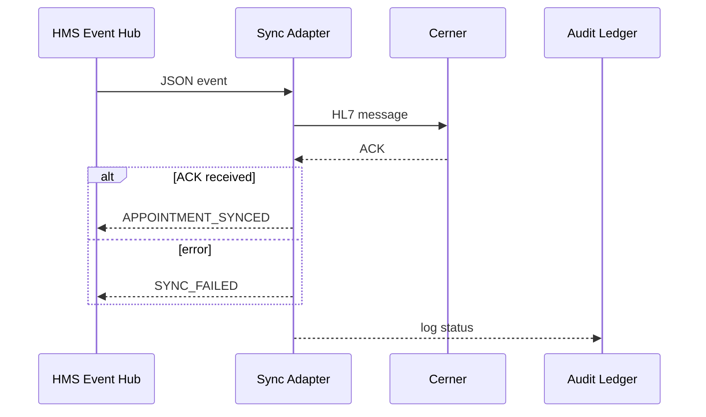

# Chapter 12: External System Sync Adapter  
[← Back to Chapter 11: Microservices Mesh & Service Registry](11_microservices_mesh___service_registry_.md)

---

## 0. Why Do We Need “Bilingual Diplomats” for Data?

Picture the Department of Veterans Affairs (VA) scheduling an appointment in the brand-new HMS portal.  
Within **seconds** that slot must also appear in:

* **Cerner** at the VA hospital (uses HL7 messages).  
* A state-level **immunization registry** (accepts CSV over SFTP).  
* A legacy **COBOL mainframe** that still wants fixed-width text files.

If one system lags, double-bookings happen, veterans miss care, and auditors come knocking.

**External System Sync Adapters (ESSAs)** are the polite diplomats who:

1. Listen to modern JSON events flowing through HMS-ACT.  
2. Translate them into the native dialect of each outside system—SOAP, flat-file, HL7, you name it.  
3. Send the message, wait for a reply, and report success/failure back into HMS-ACT.

Result: Every downstream system stays in perfect lock-step, no matter how old or proprietary.

---

## 1. Key Concepts (Plain English)

| Concept | What It Really Means | Analogy |
|---------|----------------------|---------|
| Source Event | JSON emitted by an HMS micro-service. | A U.N. speech in English. |
| Mapping Table | Field-by-field dictionary (`"patientId"` → `PID-3`). | Interpreter’s pocket glossary. |
| Protocol Bridge | Code that knows how to speak SOAP, SFTP, HL7, etc. | The translator’s microphone settings. |
| Ack/Nack | Positive or negative receipt from the target system. | “Message received” vs “Say again.” |
| Replay Queue | Durable log of unsent or failed messages. | Outbox tray holding letters until the postman arrives. |

---

## 2. Walk-Through Use Case: “Push VA Appointment to Cerner”

### 2.1 JSON Event Inside HMS

```json
{
  "event": "APPOINTMENT_CREATED",
  "payload": {
    "id": "apt-123",
    "patientId": "vet-99",
    "datetime": "2024-09-15T13:00:00Z",
    "clinic": "Cardiology"
  }
}
```

### 2.2 HL7 Message Expected by Cerner (Simplified)

```
MSH|^~\&|HMS|VA|Cerner|VA|202409151300||SIU^S12|apt-123|P|2.5
PID|||vet-99|||
SCH|apt-123|Cardiology|202409151300|
```

### 2.3 How the Adapter Bridges the Gap

1. Receives the JSON from an **Event Hub** (Kafka/SQS).  
2. Uses a **mapping table** to build the HL7 string.  
3. Sends it over a **TCP/MLLP** socket to Cerner.  
4. Waits for an **ACK**.  
5. Emits `APPOINTMENT_SYNCED` (success) or `SYNC_FAILED` back into HMS.

---

## 3. Tiny “Hello-World” Adapter (≤ 20 Lines)

```python
# adapter/va_to_cerner.py
import hl7, socket, json, os

MAP = {
  "patientId": lambda p: ("PID", 3, p["patientId"]),
  "id":        lambda p: ("SCH", 1, p["id"]),
  "datetime":  lambda p: ("SCH", 3, p["datetime"].replace("-", "").replace(":", ""))
}

def to_hl7(payload):
    msg = hl7.Message("MSH|^~\\&|HMS|VA|Cerner|VA||SIU^S12|{id}|P|2.5".format(**payload))
    for f in MAP.values():
        seg, idx, val = f(payload)
        msg.segment(seg)[idx] = val
    return str(msg)

def send(msg):
    s = socket.create_connection((os.getenv("CERNER_HOST"), 2575))
    s.send(b'\x0b' + msg.encode() + b'\x1c\r')   # MLLP frame
    ack = s.recv(1024)
    return b"MSA|AA" in ack

# pulled off a queue elsewhere:
payload = json.loads(os.getenv("EVENT_PAYLOAD"))
if send(to_hl7(payload)):
    print("SYNC OK")
else:
    print("SYNC FAILED")
```

Explanation  
1. `MAP` converts JSON fields to HL7 segments.  
2. `to_hl7()` builds an HL7 string in three lines.  
3. `send()` wraps the string in an MLLP envelope and waits for `MSA|AA` (ack).  
4. Success or failure can be published back to the HMS event bus.

---

## 4. Step-By-Step Life of a Message



Only four participants—easy to follow.

---

## 5. Internal Folder Layout

```
external-sync-adapter/
├─ adapters/
│  ├─ va_to_cerner.py
│  └─ va_to_epic.py
├─ mappings/
│  └─ cerner_appointment.yaml
├─ runner/
│  └─ worker.py
└─ queue/
   └─ sqs_listener.py
```

### 5.1 Mapping File (`mappings/cerner_appointment.yaml`, 12 lines)

```yaml
event: APPOINTMENT_CREATED
target: cerner
fields:
  id:     "SCH.1"
  patientId: "PID.3"
  datetime:  "SCH.3"
  clinic:    "SCH.4"
```

Beginner takeaway: non-dev staff can edit mappings without touching Python.

### 5.2 Minimal Worker (≤ 18 Lines)

```python
# runner/worker.py
import yaml, json, sqs_listener, adapters

MAPS = yaml.safe_load(open("mappings/cerner_appointment.yaml"))

def handle(msg):
    evt = json.loads(msg)
    if evt["event"] != MAPS["event"]:
        return
    hl7_msg = adapters.va_to_cerner.to_hl7(evt["payload"])
    ok = adapters.va_to_cerner.send(hl7_msg)
    status = "APPOINTMENT_SYNCED" if ok else "SYNC_FAILED"
    sqs_listener.emit(status, evt["payload"]["id"])

sqs_listener.consume("VA_EVENTS", handle)
```

Explanation  
* Listens on the `VA_EVENTS` queue.  
* Filters for `APPOINTMENT_CREATED`.  
* Converts + sends; then emits a status event.

---

## 6. How It Plays With Other HMS-ACT Layers

* **Microservices Mesh** ([Chapter 11](11_microservices_mesh___service_registry_.md))  
  – Adapters register themselves as `sync-adapter` services; retries & mTLS are automatic.  
* **Security Guardrails** ([Chapter 8](08_security___privacy_guardrails_.md))  
  – Payloads pass through DLP checks before leaving HMS.  
* **Role Matrix** ([Chapter 7](07_role_based_access___entitlement_matrix_.md))  
  – Only roles like `Sync_Admin` can edit mapping files.  
* **Audit & Compliance Ledger** ([Chapter 14](14_audit___compliance_ledger_.md))  
  – Every success/failure is recorded for auditors and SLA reporting.  
* **User Feedback & Telemetry Hub** (next chapter) will surface “Appointment synced ✓” or “Sync failed ✗” to staff dashboards.

---

## 7. Quick Lab (5 Commands)

```bash
git clone https://github.com/example/hms-act
cd external-sync-adapter
pip install hl7 boto3
# 1. Export fake env
export CERNER_HOST=localhost EVENT_PAYLOAD='{"event":"APPOINTMENT_CREATED","payload":{"id":"apt-1","patientId":"vet-99","datetime":"2024-09-15T13:00:00Z","clinic":"Cardiology"}}'
# 2. Run the adapter once
python adapters/va_to_cerner.py
# 3. Observe "SYNC OK" in console (mock Cerner always ACKs)
```

---

## 8. Frequently Asked Questions

**Q: Do I need one adapter per system?**  
A: Usually yes, but you can share code. Each adapter is tiny—often < 200 lines.

**Q: What if Cerner is down for maintenance?**  
A: Messages stay in the **Replay Queue**. A cron job replays them when the target system is back.

**Q: How do I test without touching production EHRs?**  
A: Point `CERNER_HOST` to a stub server in your CI pipeline; unit tests assert that the correct HL7 string is generated.

**Q: Can adapters work bidirectionally?**  
A: Absolutely. Incoming HL7 from Cerner can be converted back to JSON events (`APPOINTMENT_UPDATED`) and published into HMS.

---

## 9. What You Learned

• Sync Adapters translate HMS JSON events into any legacy or third-party protocol.  
• A mapping file + <20 lines of Python is often enough for a new adapter.  
• ACK/NACK handling and replay queues guarantee eventual consistency.  
• All activity is encrypted, audited, and visible on dashboards.  

Ready to watch those success/failure signals fuel real-time dashboards and heat-maps?  
Head over to [Chapter 13: User Feedback & Telemetry Hub](13_user_feedback___telemetry_hub_.md).

---

Generated by [AI Codebase Knowledge Builder](https://github.com/The-Pocket/Tutorial-Codebase-Knowledge)