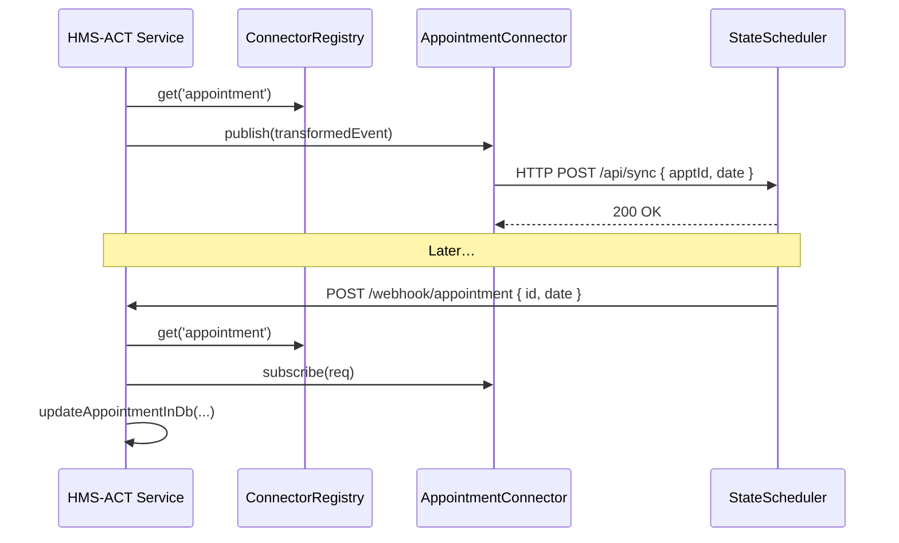

# Chapter 12: External System Synchronization

In [Chapter 11: Backend Services (HMS-SVC / HMS-ACH)](11_backend_services__hms_svc___hms_ach__.md) we built internal services for billing and payments. Now we'll learn how to **sync** data in real time with **external** systems—think scheduling, records, or legacy registries—so that any change in HMS-ACT shows up everywhere instantly.

---

## Why External System Synchronization?

Imagine the Farm Service Agency (FSA) uses a **state-run crop scheduling system**. When an FSA officer books a soil-testing appointment in HMS-ACT:

1. The external scheduler must receive the new booking immediately.
2. If the farmer reschedules in the state portal, HMS-ACT needs that update too.
3. Citizens and officers see the correct appointment everywhere, in real time.

Just like traffic lights sync with police radios to coordinate traffic flow, External System Synchronization keeps all platforms **in lock-step**.

---

## Key Concepts

1. **Connector**  
   A small module that knows how to **talk to** one external system (send and receive).

2. **Registry**  
   A central place where you **register** all connectors by name.

3. **Publish**  
   When HMS-ACT makes a change (e.g., new appointment), we **publish** an event to the external system.

4. **Subscribe** (Webhooks)  
   The external system pushes updates to an HMS-ACT **webhook** endpoint, which we **subscribe** to.

5. **Transform/Map**  
   Data often has different field names. We **transform** between HMS-ACT’s schema and the external schema.

6. **Idempotency**  
   Ensuring duplicate events don’t apply changes twice.

---

## How to Use Connectors: A Scheduling Example

### 1. Define a Connector Interface

Create a base `Connector` class:

```javascript
// File: src/sync/Connector.js
export class Connector {
  publish(event) { /* send to external API */ }
  subscribe(request) { /* handle incoming webhook */ }
  transformOut(evt) { return evt }    // HMS→External mapping
  transformIn(data) { return data }   // External→HMS mapping
}
```
> Every connector extends this and overrides two things:
> - `transformOut` maps HMS event → external payload.  
> - `transformIn` maps incoming data → HMS format.

### 2. Register Your Connector

```javascript
// File: src/sync/Registry.js
const registry = new Map();
export const ConnectorRegistry = {
  register: (name, conn) => registry.set(name, conn),
  get: (name) => registry.get(name)
};

// At app startup:
import { ConnectorRegistry } from './Registry';
import { AppointmentConnector } from './AppointmentConnector';

ConnectorRegistry.register('appointment', new AppointmentConnector());
```
> We can now look up `appointment` connector anywhere.

### 3. Publish an Event

In your service (e.g., after updating an appointment):

```javascript
import { ConnectorRegistry } from '../sync/Registry';

async function updateAppointment(id, newDate) {
  // ... update HMS database ...
  const event = { id, newDate };
  const connector = ConnectorRegistry.get('appointment');
  await connector.publish(connector.transformOut(event));
}
```
> This sends a POST to the external scheduler’s API with the mapped payload.

### 4. Handle Incoming Webhooks

Expose a webhook endpoint for external updates:

```javascript
// File: src/api/webhooks.js
import express from 'express';
import { ConnectorRegistry } from '../sync/Registry';
const router = express.Router();

router.post('/webhook/appointment', (req, res) => {
  const connector = ConnectorRegistry.get('appointment');
  const evt = connector.transformIn(req.body);
  // Apply the change in HMS-ACT
  updateAppointmentInDb(evt);
  res.sendStatus(200);
});

export default router;
```
> When the state portal reschedules, it POSTs here. We map it back and update our database.

---

## What Happens Under the Hood?



1. HMS-ACT calls the registry for the connector.  
2. Connector sends a POST to the external API.  
3. On the flip side, the external system calls our webhook.  
4. Connector maps that data back, and HMS-ACT updates its store.

---

## Inside the AppointmentConnector

```javascript
// File: src/sync/AppointmentConnector.js
import fetch from 'node-fetch';
import { Connector } from './Connector';

export class AppointmentConnector extends Connector {
  constructor() {
    super();
    this.url = 'https://state.api.gov/appointments/sync';
  }
  transformOut(evt) {
    // Map HMS fields → external API fields
    return { apptId: evt.id, scheduledDate: evt.newDate };
  }
  async publish(payload) {
    return fetch(this.url, {
      method: 'POST',
      headers: {'Content-Type':'application/json'},
      body: JSON.stringify(payload)
    });
  }
  transformIn(data) {
    // Map external fields → HMS fields
    return { id: data.apptId, newDate: data.scheduledDate };
  }
}
```
> This simple class knows the external URL and how to map fields back and forth.

---

## Conclusion

In this chapter you learned how to build a **real-time data pipeline** linking HMS-ACT with outside services:

- Define a **Connector** interface with `publish` and `subscribe`.  
- Use a **ConnectorRegistry** to manage them by name.  
- Transform data between HMS and external schemas.  
- Handle **webhooks** for two-way sync.  

This ensures changes in one system immediately reflect everywhere—just like traffic lights syncing with police radios.  

Up next: we’ll put policies around these integrations in the [Governance Layer](13_governance_layer_.md).

---

Generated by [AI Codebase Knowledge Builder](https://github.com/The-Pocket/Tutorial-Codebase-Knowledge)