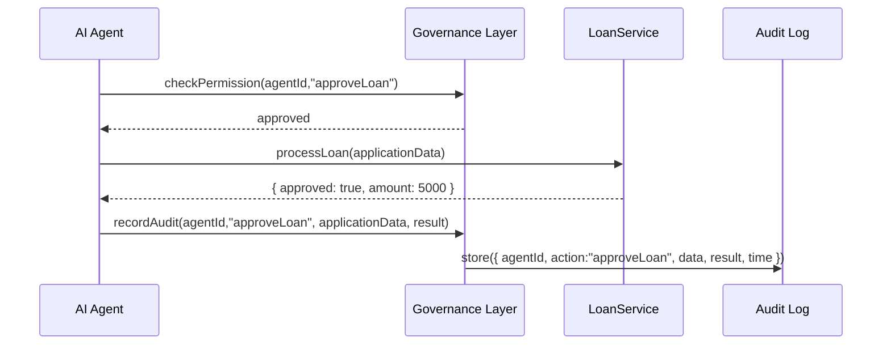
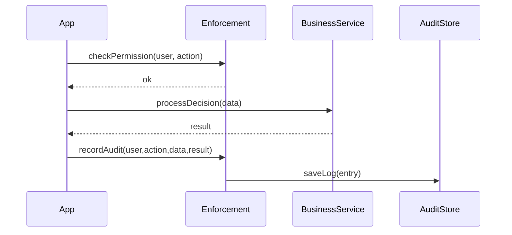

# Chapter 12: Governance Layer

In the previous chapter, we learned how to connect HMS-ACT to outside systems in [External System Integration](11_external_system_integration_.md). Now we’ll climb to the topmost level and explore the **Governance Layer**—the “Congress” of HMS-ACT that sets the rules, enforces compliance, and keeps everything transparent and accountable.

---

## Why a Governance Layer?

Imagine Congress passes a law requiring all federal agencies to log every automated decision that affects citizens’ privacy. The **Governance Layer** makes sure:

- Every service checks **permissions** before doing sensitive work  
- **Audit trails** record who did what and when  
- **Compliance checks** (ethics, privacy, transparency) run automatically  
- **Oversight dashboards** let stakeholders review activity  

Without a governance guardrail, AI-driven processes could drift out of policy, or misplace sensitive data. This layer ensures every part of HMS-ACT bows to a central rulebook.

---

## Central Use Case: Auditing an AI Decision

Let’s say an AI Agent in [Chapter 8: AI Agents (HMS-A2A)](08_ai_agents__hms_a2a__.md) automatically approves small business loans. The Governance Layer will:

1. **Permission Check**  
   Verify the AI Agent has authority to approve loans.  
2. **Execute Decision**  
   Call the loan service to run its logic.  
3. **Record Audit**  
   Log user/agent ID, input data, result, and timestamp.  
4. **Mask Sensitive Data**  
   Remove or hash PII (like SSNs) before storing logs.  
5. **Compliance Report**  
   Update a dashboard for auditors to review all decisions that day.



---

## Key Concepts

1. **Policy Enforcement**  
   Checks to ensure each action is allowed by current rules.  
2. **Permission Management**  
   Grants or denies service/system roles (e.g., “analyst,” “auditor,” “AI Agent”).  
3. **Audit Trails**  
   Structured logs that record every action with context.  
4. **Compliance Checks**  
   Automated scans for ethics, privacy, or regulatory requirements.  
5. **Oversight Dashboards**  
   Reports and views for stakeholders to track system-wide activity.

---

## Using the Governance Layer

Here’s a super-minimal example showing how an application or AI Agent talks to the Governance SDK.

```js
// src/app/makeDecision.js
import { checkPermission, recordAudit } from '@hms-governance';
import { processDecision } from '../services/DecisionService';

export async function makeDecision(user, input) {
  // 1. Make sure the user/agent can do this action
  await checkPermission(user, 'approveLoan');
  // 2. Run the core business logic
  const result = await processDecision(input);
  // 3. Log it for audit/compliance
  await recordAudit(user, 'approveLoan', { input, result });
  return result;
}
```

Explanation:  
- `checkPermission` throws an error if the role isn’t allowed.  
- `processDecision` is your core service (see [Backend Services](09_backend_services__hms_svc__.md)).  
- `recordAudit` writes a timestamped, masked log entry.

---

## Under the Hood: What Happens Step-by-Step

1. **checkPermission**  
   Looks up the user’s role and the action in an internal policy registry.  
2. **processDecision**  
   Your core service executes and returns a result.  
3. **recordAudit**  
   Masks any PII, attaches `user.id`, `action`, `data`, `result`, and current time, then sends to the audit store.



---

## Dive into the Code

Here’s a peek at the Governance Layer’s simple internal modules.

### enforcement.js

```js
// governance/enforcement.js
const policy = {
  approveLoan: ['analyst', 'admin', 'AI-Agent'],
  viewAudit:    ['auditor', 'admin']
};

export async function checkPermission(user, action) {
  if (!policy[action]?.includes(user.role)) {
    throw new Error('Permission denied');
  }
}
```

Explanation:  
- A hard-coded `policy` map ties actions to allowed roles.  
- `checkPermission` throws if you’re not on the list.

---

### audit.js

```js
// governance/audit.js
export async function recordAudit(user, action, details) {
  const entry = {
    time:     new Date().toISOString(),
    userId:   user.id,
    action,
    details:  maskPII(details)
  };
  // In real life, send to a secure log store or database
  console.log('[AUDIT]', entry);
}

function maskPII(obj) {
  // Very simplistic: remove any `ssn` fields
  const clone = { ...obj };
  if (clone.input?.ssn) delete clone.input.ssn;
  return clone;
}
```

Explanation:  
- Builds a log `entry` with timestamp, user, action, and masked data.  
- `maskPII` scrubs sensitive fields before logging.

---

### index.js

```js
// governance/index.js
export { checkPermission } from './enforcement.js';
export { recordAudit }    from './audit.js';
```

Explanation:  
- Exports a friendly API for applications and services.

---

## Conclusion

Congratulations! You’ve reached the top of the HMS-ACT stack. In this chapter, you learned how the **Governance Layer**:

- Enforces permissions and policies  
- Records detailed audit trails  
- Masks sensitive data for privacy  
- Provides a single place for compliance checks and oversight

With this layer in place, every AI-driven decision or service call in HMS-ACT stays accountable to stakeholders and regulations. This completes our deep dive into the HMS-ACT architecture. Thank you for following along!

---

Generated by [AI Codebase Knowledge Builder](https://github.com/The-Pocket/Tutorial-Codebase-Knowledge)