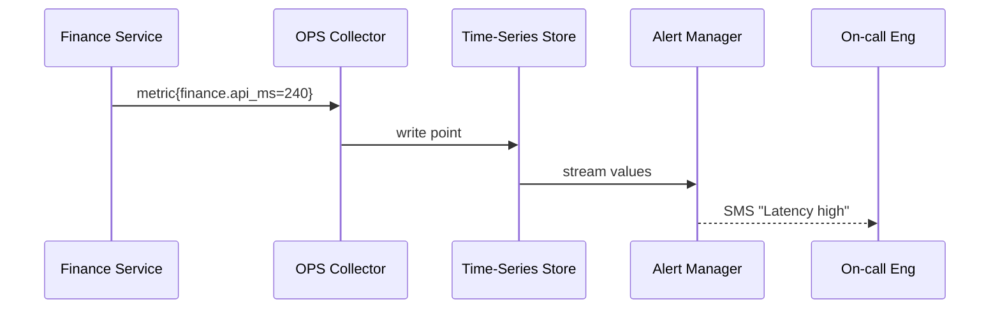

# Chapter 12: Monitoring & Telemetry Stack (HMS-OPS)

*Continuation of [Security & Compliance Engine (HMS-ESQ)](11_security___compliance_engine__hms_esq__.md)*  

---

## 1. Why Does Government Tech Need “Mission-Control” Screens?

### 60-Second Story — “IRS Refund Rush Day”

Every January the IRS receives a **tsunami** of e-filed tax returns.  
If database write-latency creeps above 200 ms, the queue snowballs and citizens wait weeks for refunds.  

With **HMS-OPS** in place:  

1. A metric `db.write_ms` spikes to 220 ms.  
2. OPS raises an *alert* → on-call engineer gets a text before Twitter explodes.  
3. The anomaly signal feeds an AI *auto-scaler* that spins up two extra database replicas.  
4. Latency drops below 150 ms within 2 minutes—no angry headlines.

**HMS-OPS = FEMA situation-room wall for software.**

---

## 2. Key Concepts in Plain English

| Term          | Friendly Explanation                                         |
|---------------|--------------------------------------------------------------|
| Metric        | A number that changes over time (CPU %, queue length).       |
| Log           | A timestamped diary line (“Job 219 succeeded”).              |
| Trace         | A breadcrumb chain of one request hopping across services.   |
| Alert         | A rule that pages humans (“if `write_ms > 200` for 3 min”).  |
| Dashboard     | A screen full of live charts & traffic lights.               |
| SLO / SLA     | Promised speed or uptime target (e.g., 99.9 % <200 ms).      |
| Anomaly       | A weird metric spike OPS’ ML model can’t explain.            |

Analogy:  
Metrics are **vital signs**, logs are the **patient chart**, traces are the **ER wristband** showing every room visited.

---

## 3. Instrumenting a Service in 12 Lines

Let’s add telemetry to the **Finance** service from [Chapter 10](10_backend_service_apis__hms_svc___hms_api__.md).

```javascript
// finance/metrics.js  (12 lines)
import { ops } from '@hms-ops/client';

export function timed(handler, name) {
  return async (req, res) => {
    const t0 = Date.now();
    await handler(req, res);
    ops.metric('finance.api_ms', Date.now() - t0); // 1️⃣ emit
  };
}
```

Explanation  
1. Wrap any route handler with `timed()`.  
2. After response, one line sends the latency metric to HMS-OPS.

---

### 3.1 Use the Wrapper

```javascript
svc.post('/v1/claims/pay', { schema }, 
  timed(async (req,res)=>{ /*…business…*/ }, 'pay'));
```

Now every payment call streams latency numbers—no extra infra to set up.

---

## 4. Setting an Alert in 8 Lines

```javascript
// alerts/latency.js
import { ops } from '@hms-ops/client';

ops.alert('finance.latency_high', {
  if: 'avg(finance.api_ms) > 200',   // threshold
  for: '3m',                         // duration
  notify: ['sms:+1-555-ONCALL']      // channel
});
```

Beginner notes:  

• Condition uses a mini-SQL dialect.  
• `notify` can be SMS, email, Slack, or MCP message to an AI repair agent.

---

## 5. Viewing a Dashboard in Any Portal

```javascript
// LatencyBoard.js  (15 lines)
import { MetricChart, StatusLight } from '@hms-mfe/bricks';
import { useMetric } from '@hms-ops/react';

export default function Board() {
  const latency = useMetric('finance.api_ms');
  const alert   = useMetric('finance.latency_high'); // 0 or 1

  return (
    <>
      <h1>Finance-API Health</h1>
      <MetricChart metric="finance.api_ms" unit="ms" />
      <StatusLight label="Latency OK"
                   ok={alert === 0} />
    </>
  );
}
```

Drop this component into any internal portal; no backend work required.

---

## 6. What Happens Under the Hood?



Five actors, easy to follow.

---

## 7. Internal Components (Tiny Peeks)

### 7.1 Collector – 10 Lines

```javascript
// collector/udp.js
import dgram from 'dgram';
const sock = dgram.createSocket('udp4');

sock.on('message', buf => {
  const msg = JSON.parse(buf);
  db.insert('metrics', msg);           // write to time-series table
});
sock.bind(8125);                       // listens for all apps
```

UDP keeps it fire-and-forget; no app blocks on metrics.

---

### 7.2 ML Anomaly Detector – 14 Lines

```javascript
// ml/anomaly.js
import { onMetric, metric } from '@hms-ops/core';

onMetric('finance.api_ms', v => {
  const mean = metric.mean('finance.api_ms', '10m');
  if (v > mean * 2) ops.alertNow('finance.anomaly', { value: v });
});
```

• Compares current value to 10-minute moving average.  
• Fires `finance.anomaly` alert if doubled.

---

### 7.3 Self-Healing Hook – 15 Lines

```javascript
// hooks/scaleUp.js
import { onAlert } from '@hms-ops/core';
import { ActClient } from '@hms-act/client';   // Chapter 9

onAlert('finance.anomaly', async () => {
  await ActClient.run({
    template: 'infra.scale-db',       // tiny orchestration
    input:    { replicas: 2 }
  });
});
```

OPS → ACT → extra database pods = **automatic recovery**.

---

## 8. Directory Peek

```
hms-ops/
 ├─ collector/      // UDP & HTTP listeners
 ├─ storage/        // time-series DB adapters
 ├─ alert/          // rule engine
 ├─ ml/             // anomaly scripts
 ├─ client/         // emit & query SDK
 └─ react/          // useMetric() hook, MFE bricks
```

All text files → easy Git diffs and PR reviews.

---

## 9. How OPS Talks to Other Layers

| Layer | Interaction | Example |
|-------|-------------|---------|
| HMS-SVC (Chapter 10) | Emits metrics & logs | `finance.api_ms` |
| HMS-ACT (Chapter 9)  | Triggers self-healing jobs | `infra.scale-db` |
| HMS-ESQ (Chapter 11) | Supplies security events | `esq.violation_count` |
| Governance Layer (Chapter 6) | Sets alert escalation policy | “Congressional SLA breaches page CIO” |
| Interface Layer (Chapter 1) | Embeds live charts | Citizen-facing uptime widget |

---

## 10. Recap

You now know:

1. Why HMS-OPS is the **ground-truth telemetry wall** for federal micro-services.  
2. Key terms: metric, log, trace, alert, anomaly, dashboard.  
3. How to emit a metric, create an alert, and embed a live chart—all under 20 lines each.  
4. The 5-actor data flow from service → collector → store → alert → human/AI.  
5. How OPS cooperates with ACT for self-healing and with ESQ for compliance metrics.

Up next we’ll see where all this *data* ultimately lives and how services query history for analytics:  
[Central Data Repository (HMS-DTA)](13_central_data_repository__hms_dta__.md)

---

---

Generated by [AI Codebase Knowledge Builder](https://github.com/The-Pocket/Tutorial-Codebase-Knowledge)