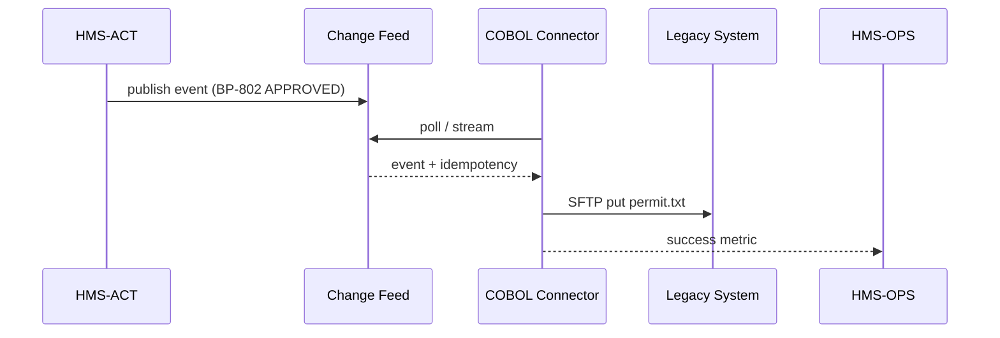

# Chapter 13: External System Synchronization  
*(If you just tuned up your dashboards in  
[Activity & Operations Monitoring (HMS-OPS / HMS-OMS)](12_activity___operations_monitoring__hms_ops___hms_oms__.md) you can now **see** everything.  
Next we’ll make sure old-school systems outside CodifyHQ **see the same truth at the same time**.)*

---

## 1. Why Do We Need “External System Sync”?

### Story – “City Hall Still Runs COBOL”

1. A contractor submits a **building-permit application** online.  
2. HMS-ACT agents review zoning rules and mark the permit **APPROVED** at 10:02 AM.  
3. Thirty seconds later the clerk at City Hall hits *F5* on their green-screen COBOL app…and still sees “PENDING”.  
4. Angry phone calls start.

**External System Synchronization (ESS)** is our **secure courier**:

* Grabs the change log from CodifyHQ.  
* Converts it into whatever the legacy target speaks (fixed-width, SOAP, CSV on an SFTP drop, you name it).  
* Retries politely until the target acknowledges.  
* Reports success/failure back to HMS-OPS so dashboards stay green.

Result: modern AI workflows and 40-year-old mainframes stay in lock-step.

---

## 2. Key Concepts (Plain English)

| Word            | What It Means                                                               | Government Analogy                    |
|-----------------|-----------------------------------------------------------------------------|---------------------------------------|
| **Connector**   | Tiny plug-in that knows how to talk to one external system.                 | Foreign-service interpreter           |
| **Change Feed** | Ordered list of events (INSERT, UPDATE, DELETE) produced by CodifyHQ.       | Diplomatic mail pouch                |
| **Mapping**     | JSON or YAML file that maps Codify fields → legacy fields.                  | Translation phrasebook               |
| **Idempotency Token** | Unique hash so re-sending a change is safe.                           | Certified mail number                |
| **Retry Ledger**| DB table storing “tried x, will try again at t”.                            | Outgoing mail log book               |

Remember **Connector → Feed → Mapping → Token → Ledger** and you already understand 90 % of ESS.

---

## 3. First Walk-Through  
### Use Case: Push Permit Status → COBOL

Goal: every time the permit status changes in CodifyHQ, push `PERMIT_ID|STATUS|TS` to City Hall’s mainframe via an **SFTP fixed-width file**.

#### 3.1 Declare the Mapping (8 lines)

```yaml
# file: permit_map.yml
target: city_hall_cobol
fields:
  PERMIT_ID: id
  STATUS    : status
  TS        : updated_at | format:%Y%m%d%H%M%S
```

Explanation  
Left = field name expected by COBOL, right = where to grab it in our event (with optional formatter).

#### 3.2 Send an Event Into the Feed (7 lines)

```python
# file: approve_permit.py
from hms_act_sdk import ActClient
ActClient().raise_event({
    "type": "PERMIT_STATUS",
    "payload": {"id": "BP-802", "status": "APPROVED"}
})
```

Result: the event lands in the **Change Feed**; nothing else to code on your side.

#### 3.3 Connector Picks It Up (≤ 20 lines)

```python
# file: connectors/cobol.py
from ess_sdk import connector, feed, retry

@connector("city_hall_cobol")
def push():
    for ev in feed.subscribe("PERMIT_STATUS"):
        row = map_event(ev, "permit_map.yml")      # 'BP-802APPROVED20250412100300'
        token = ev.idempotency()                   # prevents duplicates
        ok = sftp_put("/IN/permit.txt", row, token)
        retry.log(ev, ok)                          # auto-retry if False
```

Explanation  
1. `feed.subscribe` streams events in order.  
2. `map_event` applies our YAML mapping.  
3. `sftp_put` handles auth + writes a file; returns `False` on network error.  
4. `retry.log` stores success or schedules a back-off retry.

That’s it—**no** while-true loops, **no** Cron jobs.

---

## 4. What Happens Under the Hood?



Five actors, one happy clerk.

---

## 5. Inside the Source Tree

```
hms-ess/
├── connectors/
│   ├── cobol.py          # our example
│   ├── court_docket.py   # SOAP
│   └── payroll_fmis.py   # CSV via REST
├── core/
│   ├── feed.py           # subscribe(), ack()
│   ├── mapper.py         # map_event()
│   ├── retry.py          # ledger + scheduler
└── cli/essctl            # list, replay, stats
```

### 5.1 `feed.py` (10 lines)

```python
def subscribe(event_type):
    while True:
        rows = db.fetch(
            "SELECT * FROM feed WHERE type=%s AND ack IS FALSE ORDER BY ts", 
            (event_type,))
        for r in rows:
            yield r
            db.execute("UPDATE feed SET ack=TRUE WHERE id=%s", (r["id"],))
```

Take-away: **one** SQL table drives the whole courier.

### 5.2 `retry.py` (14 lines)

```python
import time, math, db

def log(event, ok):
    if ok:
        db.insert("retry", {"id": event.id, "tries": 1, "done": True})
    else:
        tries = db.value("SELECT tries FROM retry WHERE id=%s", (event.id,))+1
        delay = math.pow(2, tries)                # 2,4,8… seconds
        db.insert_or_update("retry", id=event.id,
                            tries=tries, next=time.time()+delay)

def scheduler():
    while True:
        todo = db.fetch("SELECT * FROM retry WHERE done=FALSE AND next<=now()")
        for row in todo:
            resend(row["id"])      # calls the connector again
```

Beginners’ note: exponential back-off in 4 lines.

---

## 6. Security, Compliance & Observability

* **MCP Envelope** – every change leaves CodifyHQ wrapped in an  
  [Model Context Protocol](05_model_context_protocol__hms_mcp__.md) envelope; connectors unwrap but keep the `trace_id` in log lines.  
* **Compliance Check** – before sending, the connector calls  
  [HMS-ESQ](10_compliance___legal_reasoner__hms_esq__.md) to ensure data is allowed off-prem.  
* **Metrics** – `retry.log` emits `ess_retry_pending` & `ess_success_total` so  
  [HMS-OPS](12_activity___operations_monitoring__hms_ops___hms_oms__.md) dashboards show sync health.  

---

## 7. Try It Yourself (5-Minute Lab)

```bash
git clone https://github.com/hms-example/hms-ess
cd hms-ess/examples
# 1. Start feed + connector + mock SFTP
docker compose up ess
# 2. Fire a status change
python approve_permit.py
# 3. Watch logs
docker logs -f ess-connector | grep BP-802
```

You should see something like:

```
[MAP]  BP-802APPROVED20250412100300
[SFTP] ✔ uploaded permit.txt  (token 1d4a…)
```

Now open `mock_sftp/IN/permit.txt`—the COBOL clerk would see the same status!

---

## 8. Common Patterns in One-Liners

Need it? | YAML Snippet
---------|-------------
Append to one daily CSV | `mode: append_csv file: /IN/permits_{{date}}.csv`
Call SOAP endpoint | `type: soap wsdl: https://court.gov/docket.wsdl operation: UpdateCase`
Ignore weekends | `schedule: "Mon-Fri 06:00-22:00"`
Mask PII before send | `transform: drop_fields ["ssn","dob"]`
Keep last 7 days only | `rotate: 7d`

Drop the snippet into your connector config—no code edits required.

---

## 9. Recap & What’s Next

You learned:

✓ **External System Sync** is a plug-in courier that streams CodifyHQ changes to legacy apps in real time.  
✓ Declare a **Mapping**, write a small **Connector**, and the framework handles feeds, retries, metrics, and compliance.  
✓ Legacy clerks, court dockets, and payroll systems all stay in sync—no nightly batch jobs, no manual re-typing.

In the next chapter we’ll zoom out to see **agency-to-agency messaging** at national scale via a dedicated bus:  
[Inter-Agency Communication Bus (HMS-A2A)](14_inter_agency_communication_bus__hms_a2a__.md).

---

Generated by [AI Codebase Knowledge Builder](https://github.com/The-Pocket/Tutorial-Codebase-Knowledge)