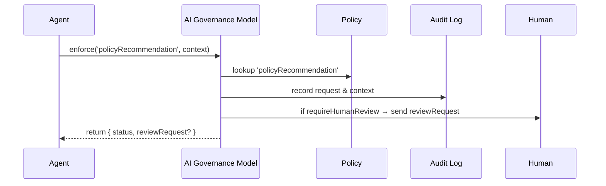

# Chapter 14: AI Governance Model

In [Chapter 13: Governance Layer](13_governance_layer_.md) we built a policy engine for data and workflow rules. Now we turn to our “AI ethics committee”: the **AI Governance Model**. This rulebook sits alongside every AI agent—our “automated clerk”—to ensure it acts **ethically**, **safely**, and **transparently**, with clear human oversight.

---

## Why an AI Governance Model?

Imagine the Department of Transportation uses an **AI Representative Agent** to propose new traffic‐signal timings across the city. That agent might:

- Suggest rerouting emergency vehicles.  
- Recommend turning a green light shorter to ease congestion.  
- Adapt its plan over time.

Without rules, it could inadvertently cause delays or safety hazards. The AI Governance Model is like an ethics committee: it defines what the agent **can** do autonomously, when it must ask a human, and how it logs every decision.

---

## Key Concepts

1. **Governance Rulebook**  
   A set of named **policies** that describe allowed actions, transparency requirements, and human-in-the-loop triggers.

2. **Enforcement Points**  
   Specific steps in an agent’s workflow where we **invoke** the governance model to check compliance.

3. **Human Oversight**  
   If a policy says “requireHumanReview,” the model flags the action for a human and pauses the AI.

4. **Audit Logging**  
   Every governance check and outcome is recorded, ensuring full traceability.

5. **Autonomy Level**  
   Defines how much freedom an AI has (e.g., “low” for simple tasks, “high” only under supervision).

---

## How to Use the AI Governance Model

Below is a minimal example of an AI agent proposing a new traffic rule and asking the governance model to enforce a policy.

```javascript
// File: ai/TrafficAgent.js
import { aiGovernance } from '../governance/aiGovernanceModel';

// The agent builds a suggestion
const suggestion = { location: '5th & Main', newTiming: 30 };
const context = { suggestion, explanation: 'Reduces peak congestion by 15%' };

// Enforce the 'policyRecommendation' rule before applying it:
const result = await aiGovernance.enforce('policyRecommendation', context);

if (result.status === 'approved') {
  // Safe to deploy automatically
  deployTiming(suggestion);
} else if (result.status === 'pending_human_review') {
  // Notify a traffic manager
  notifyManager(result.reviewRequest);
}
```

Explanation:
- We import the singleton `aiGovernance`.  
- We call `enforce()` with a policy name and context.  
- Depending on `status`, the agent either proceeds or waits for a human.

---

## What Happens Under the Hood?



1. **Agent** calls `enforce()`.  
2. **Governance Model** looks up the named policy.  
3. It **logs** the check with details.  
4. If the policy demands human review, it sends a **reviewRequest**.  
5. Finally, it returns an object telling the agent what to do next.

---

## Internal Implementation

Below is a simplified walkthrough of how the **AI Governance Model** is built.

### 1. Governance Config

We store policies in a JSON file:

```json
// File: config/aiGovernanceConfig.json
{
  "policyRecommendation": {
    "maxAutonomyLevel": "low",
    "requireHumanReview": true,
    "requireExplanation": true
  },
  "dataPrivacy": {
    "allowedOutputs": ["aggregateStats"],
    "requireHumanReview": false
  }
}
```
> Each policy defines flags like `requireHumanReview` and `requireExplanation`.

### 2. AI Governance Model Class

```javascript
// File: governance/aiGovernanceModel.js
import policies from '../config/aiGovernanceConfig.json';
import { auditLog, humanQueue } from './helpers';

export class AIGovernanceModel {
  constructor() { this.policies = policies; }
  async enforce(name, context) {
    const policy = this.policies[name];
    if (!policy) throw new Error(`Unknown policy: ${name}`);
    auditLog.record(name, context);                   // always log

    // Check explanation requirement
    if (policy.requireExplanation && !context.explanation) {
      return { status: 'error', message: 'Explanation is required' };
    }

    // Human-in-the-loop if flagged
    if (policy.requireHumanReview) {
      const reviewRequest = await humanQueue.submit({ name, context });
      return { status: 'pending_human_review', reviewRequest };
    }

    return { status: 'approved' };
  }
}

export const aiGovernance = new AIGovernanceModel();
```

Explanation:
- We load policies from JSON.  
- `enforce()` finds the policy, logs the call, checks rules, and may enqueue a human review.

---

## Conclusion

The **AI Governance Model** acts as an ethics committee for our automated agents. You learned to:

- Define **policies** in a central rulebook.  
- Invoke `aiGovernance.enforce()` at key steps.  
- Log every check and route high-risk actions to human overseers.  
- Control autonomy levels and explanation requirements.

Next up, we’ll see how these governance rules fit into the broader **Policy & Process Module** in [Chapter 15: Policy & Process Module](15_policy___process_module_.md).

---

Generated by [AI Codebase Knowledge Builder](https://github.com/The-Pocket/Tutorial-Codebase-Knowledge)