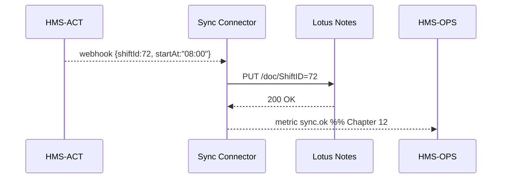

# Chapter 14: External System Sync Connector  
*(a continuation of [Central Data Repository (HMS-DTA)](13_central_data_repository__hms_dta__.md))*  

---

## 1. Why Do We Need a “Live Translator” for Legacy Apps?

### 60-Second Story — “The Lotus Notes Calendar That Wouldn’t Die”

The **Forest Service** still schedules ranger patrols in a 1998 Lotus Notes calendar.  
Meanwhile, a shiny new **Wildfire-Response** workflow runs inside HMS-ACT:

1. Rangers file shift requests through an HMS portal.  
2. An AI agent (Chapter 3) optimises the roster.  
3. Field supervisors, however, *only* look at Lotus Notes on the rugged laptops in their trucks.

If HMS updates a shift but Lotus Notes doesn’t hear about it, rangers drive to the wrong forest and fires burn unchecked.

**External System Sync Connector** is the *bilingual interpreter* that keeps both worlds in perfect, near-real-time harmony—no matter how old the legacy system is.

---

## 2. Key Concepts in Plain English

| Term | Friendly Explanation |
|------|----------------------|
| **Connector** | A tiny bridge service that speaks *both* HMS and the legacy dialect. |
| **Mapping Table** | A cheat-sheet: “HMS field `startAt` ↔ Lotus field `BeginTime`.” |
| **Webhook** | A push notification (“Shift #72 changed!”). |
| **ETL Job** | A scheduled pull that *Extracts → Transforms → Loads* missing data. |
| **Conflict Resolver** | The referee when both sides change the same record. |
| **Sync Ticket** | A short-lived record describing one pair of mirrored changes. |

Analogy  
Think of the Connector as a real-time **UN interpreter**: it listens to HMS in English, repeats in Lotus-speak, and instantly echoes Lotus updates back in English.

---

## 3. Quick-Start: Syncing a Calendar in <20 Lines

Below we create a **NotesCalendarConnector** that:

1. Listens to HMS shift changes (`/webhook/hms` endpoint).  
2. Listens to Lotus change feed (simulated via polling).  
3. Keeps a mapping table in plain JSON.

```javascript
// notesConnector/index.js   (18 lines)
import { createConnector } from '@hms-sync/core';
import mapping from './mapping.json';        // ❶

createConnector({
  name: 'NotesCalendar',
  mapping,                                   // field cheatsheet
  hmsWebhook: '/webhook/hms',                // ❷
  legacyPull: async since => {               // ❸ poll Lotus
    return await lotus.listChanges({ since });
  },
  applyLegacy: rec => lotus.update(rec),     // → Lotus
  applyHMS: rec => hms.patch('shifts', rec)  // → HMS
}).listen(7070, () =>
  console.log('🔄 NotesCalendar Connector up on 7070')
);
```

What each part does  
❶ `mapping.json` says how to translate fields.  
❷ HMS pushes every shift change here.  
❸ Every 30 s the framework calls `legacyPull(sinceStamp)` to fetch new Lotus edits.

---

### 3.1 Example Mapping File (6 Lines)

```json
{
  "id":        "ShiftID",
  "startAt":   "BeginTime",
  "endAt":     "FinishTime",
  "assignee":  "RangerName"
}
```

Beginner take-away: No code changes if the Lotus admin renames a column—just update this JSON.

---

## 4. How a Single Shift Update Travels (Step-By-Step)



Four participants—easy to follow for beginners.

---

## 5. Under the Hood

### 5.1 Conflict Resolution (11 Lines)

```javascript
// core/resolve.js
export function resolve(hmsRec, legacyRec) {
  if (hmsRec.updatedAt > legacyRec.updatedAt) return 'pushToLegacy';
  if (legacyRec.updatedAt > hmsRec.updatedAt) return 'pushToHMS';
  return 'noop';               // timestamps equal → ignore
}
```

Default rule: **“Last writer wins.”**  
Agencies can plug in their own resolver (e.g., “manager edits outrank ranger edits”).

---

### 5.2 Sync Ticket Schema (8 Lines)

```json
{
  "ticketId":  "SYNC-991",
  "hmsId":     "shift/72",
  "legacyId":  "ShiftID=72",
  "direction": "pushToLegacy",
  "status":    "completed"
}
```

Stored for 30 days in HMS-DTA (Chapter 13) for audit & troubleshooting.

---

### 5.3 Minimal Webhook Handler (18 Lines)

```javascript
// hmsWebhook.js
import { mapOut } from '@hms-sync/utils';   // uses mapping.json

export async function hmsWebhook(req, res) {
  const change = req.body;                 // {id, startAt, …}
  const legacy = mapOut(change);           // HMS → Lotus fields
  const verdict = resolve(change, await lotus.get(legacy.ShiftID));

  if (verdict === 'pushToLegacy')
    await lotus.update(legacy);

  res.send({ ok: true });
}
```

Less than 20 lines, yet performs translation **and** conflict handling.

---

## 6. Monitoring & Alerts

Because the Connector emits **`sync.*` metrics**, a single alert protects you:

```javascript
// ops/alerts.js
import { ops } from '@hms-ops/client';

ops.alert('sync.failure', {
  if: 'rate(sync.fail) > 3 per 5m',
  notify: ['sms:+1-555-ONCALL']
});
```

(`ops` comes from [Monitoring & Telemetry Stack](12_monitoring___telemetry_stack__hms_ops__.md))

---

## 7. Where the Connector Touches Other HMS Layers

* **Security** — Webhook tokens are verified by middleware from [Role & Identity Management](02_role___identity_management__accounts___authorization__.md).  
* **ESQ Compliance** — Every Sync Ticket is hashed by [Security & Compliance Engine](11_security___compliance_engine__hms_esq__.md).  
* **Governance Toggles** — A policy officer can set `sync.enabled:false` in [Governance Layer](06_governance_layer__hms_sys___hms_gov__.md) to pause all connectors.  
* **ACT Workflows** — Orchestrated steps (Chapter 9) can include `svc:syncNow` to force a one-off reconciliation.  
* **DTA Lineage** — Sync Tickets appear as lineage edges inside [Central Data Repository](13_central_data_repository__hms_dta__.md).

---

## 8. Directory Peek

```
hms-sync/
 ├─ core/          // createConnector(), resolve()
 ├─ utils/         // mapIn/out helpers
 ├─ adapters/      // lotus.js, sap.js, mainframeCobol.js
 ├─ examples/      // notesConnector/
 └─ README.md
```

All JavaScript/JSON—easy diff reviews and quick onboarding.

---

## 9. Recap

You learned:

1. Why legacy apps **must** stay in sync with HMS-ACT.  
2. Key terms: Connector, Mapping Table, Webhook, ETL Job, Conflict Resolver, Sync Ticket.  
3. How to spin up a real connector in <20 lines and customise field mapping.  
4. Internal flow: webhook → mapping → resolve → push → metrics.  
5. How the Connector plugs into security, governance, monitoring, and data layers.

Ready to build citizen-facing UIs that *show* these synced records with reusable bricks?  
Jump to the final UI chapter:  
[Micro-Frontend Component Library (HMS-MFE)](15_micro_frontend_component_library__hms_mfe__.md)

---

Generated by [AI Codebase Knowledge Builder](https://github.com/The-Pocket/Tutorial-Codebase-Knowledge)