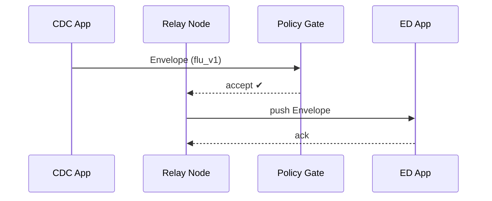

# Chapter 14: Inter-Agency Communication Bus (HMS-A2A)

*(If you just finished  
[External System Synchronization](13_external_system_synchronization_.md) you saw how HMS talks to **legacy** systems outside the platform.  
Now let’s see how two *modern* agencies swap data with each other—instantly, securely, and without leaking PII.)*  

---

## 1. Why Do We Need HMS-A2A?

### Story – “Flu Surge Meets Mid-Term Exams”

1. The **Centers for Disease Control (CDC)** sees a sudden uptick in student flu cases.  
2. The **Department of Education (ED)** wants to know *only the counts per ZIP code* so it can move exams online—**no student names allowed**.  
3. Meanwhile, the **National Guard** must sync truck locations with **FEMA** during hurricane relief—messages must be **encrypted** and arrive even if one data center goes dark.

HMS-A2A is the **digital diplomatic pouch** for these cross-agency chats:

* Point-to-point or publish/subscribe.  
* End-to-end encryption.  
* JSON-Schema validation so bad data is rejected at the border.  
* Automatic PII scrubbing and policy enforcement.

Result: agencies share **only** what’s lawful & useful—nothing more, nothing less.

---

## 2. Key Concepts (Plain English)

| Word | What It Really Means | Analogy |
|------|----------------------|---------|
| **Channel** | Named pipe (e.g., `cdc.flu.trends`) that other agencies can subscribe to. | TV station |
| **Envelope** | Encrypted wrapper that carries the message + metadata. | Diplomatic pouch |
| **Schema Registry** | JSON blueprint every message must follow. | Customs form |
| **Policy Gate** | Checks PII, encryption level, sender list. | Border agent |
| **Relay Node** | Server that stores & forwards messages with retries. | Mail sorting center |

Keep these five terms in mind—90 % of A2A is just connecting them.

---

## 3. First Walk-Through  
### Use Case: CDC Sends De-Identified Flu Counts to Education

We’ll:

1. CDC publishes today’s counts.  
2. ED receives them in near real-time.  
3. *No* names leave CDC’s boundary.

### 3.1 Publisher Side (CDC) – 15 lines

```python
# file: send_flu.py
from hms_a2a import A2AClient

cdc = A2AClient(token="CDC_PIV")

msg = {
    "zip": "30301",
    "date": "2025-02-14",
    "cases": 128           # no patient names!
}

cdc.publish(
    channel="cdc.flu.trends",
    schema="flu_v1",        # registered once
    payload=msg
)
print("✅ Sent!")
```

Explanation  
1. Authenticate once.  
2. `publish` wraps `msg` in an **Envelope**, signs it, encrypts it, and hands it to the nearest **Relay Node**.

### 3.2 Subscriber Side (ED) – 13 lines

```python
# file: receive_flu.py
from hms_a2a import A2AClient, consume

ed = A2AClient(token="ED_PIV")

@consume("cdc.flu.trends")
def handle(msg):
    print("🦠  Flu cases:", msg["zip"], msg["cases"])

ed.listen()      # blocks & processes forever
```

Explanation  
1. `listen()` opens a secure WebSocket to the Relay.  
2. Every valid message triggers `handle(msg)`.  
3. All decryption + schema validation happens before the callback—ED sees **only** safe data.

---

## 4. What Happens Under the Hood?



1. **Policy Gate** validates schema, runs PII scrubbing.  
2. Relay stores & retries until ED acknowledges.

---

## 5. Under the Hood – Code Peeks

### 5.1 Envelope Builder (8 lines)

```python
# core/envelope.py
def build(payload, schema_id, sender):
    blob = json.dumps(payload).encode()
    cipher = encrypt(blob, key_for(sender))
    return {
        "schema": schema_id,
        "cipher": cipher,
        "sig": sign(cipher, sender),
        "trace_id": uuid4().hex
    }
```

Take-away: Encrypt first, sign second; `trace_id` survives hops for audits.

### 5.2 Policy Gate Check (≤15 lines)

```python
# gate/check.py
def vet(env, sender):
    if not verify_signature(env["sig"], env["cipher"], sender):
        return "bad_sig"
    data = decrypt(env["cipher"], key_for(sender))
    if not schema_ok(data, env["schema"]):
        return "schema_fail"
    if pii_found(data):
        return "pii_block"
    return "ok"
```

*Any* failure returns a rejection to the sender; citizens’ data never leaks.

### 5.3 Relay Retry Loop (12 lines)

```python
# relay/retry.py
while True:
    for msg in unsent():
        ok = push_ws(msg, msg["dest"])
        if ok:
            mark_sent(msg)
        else:
            backoff(msg)      # 2,4,8… seconds then try again
```

Same exponential pattern you saw in ESS—newbie-friendly.

---

## 6. How to Register a New Channel & Schema

1. **Define Schema** (safe for non-devs):

```yaml
# file: flu_v1.yml
type: object
required: [zip, date, cases]
properties:
  zip:   {type: string, pattern: "^[0-9]{5}$"}
  date:  {type: string, format: date}
  cases: {type: integer, minimum: 0}
```

2. **Upload Once**:

```bash
a2actl schema add flu_v1.yml
a2actl channel create cdc.flu.trends --schema flu_v1 --owners CDC --subscribers ED
```

After that, any message that fails the schema is rejected automatically.

---

## 7. Relationship to Other HMS Layers

Layer | How It Connects
------|-----------------
[HMS-MCP](05_model_context_protocol__hms_mcp__.md) | Re-uses `trace_id`; envelopes nest inside MCP envelopes if needed.
[HMS-ESQ](10_compliance___legal_reasoner__hms_esq__.md) | Policy Gate calls ESQ before forwarding to enforce laws (FERPA, HIPAA, etc.).
[HMS-OPS](12_activity___operations_monitoring__hms_ops___hms_oms__.md) | Relay emits `a2a_deliver_latency` & `a2a_reject_total` metrics.
[External System Sync](13_external_system_synchronization_.md) | ESS can read from A2A channels to update legacy systems.

---

## 8. Try It Yourself (5-Minute Lab)

```bash
git clone https://github.com/hms-example/hms-a2a
cd hms-a2a/examples
# 1. Start local relay + gate
docker compose up a2a
# 2. In one terminal, run subscriber
python receive_flu.py
# 3. In another, publish
python send_flu.py
# 4. Watch logs
docker logs -f a2a-relay | grep trace
```

You should see:

```
[GATE] schema ok, pii ok → forward
[RELAY] delivered trace 8af2… to ED
```

---

## 9. Quick Cheat-Sheet for Daily Use

Task | Command
-----|---------
List channels you own | `a2actl channel list --owner CDC`
Show last 10 messages | `a2actl log tail cdc.flu.trends`
Replay yesterday’s messages | `a2actl replay cdc.flu.trends --since 1d`
Add a new subscriber | `a2actl channel grant cdc.flu.trends --to DHS`
Rotate encryption keys | `a2actl keys rotate --channel cdc.flu.trends`

All commands are safe: Policy Gate refuses changes that violate governance rules.

---

## 10. Recap & What’s Next

You learned:

✓ HMS-A2A is the **encrypted message bus** for agency-to-agency data.  
✓ **Channels + Schemas + Policy Gates** guarantee each side sees only valid, lawful data.  
✓ Publishing & subscribing is a **few-line SDK call**; the bus handles encryption, retries, and metrics.  
✓ Everything integrates with governance, compliance, and monitoring layers you already know.

Ready to let agencies **discover** each other’s channels and apps like an App Store?  
Jump to [Marketplace & Discovery Hub (HMS-MKT)](15_marketplace___discovery_hub__hms_mkt__.md).

---

Generated by [AI Codebase Knowledge Builder](https://github.com/The-Pocket/Tutorial-Codebase-Knowledge)