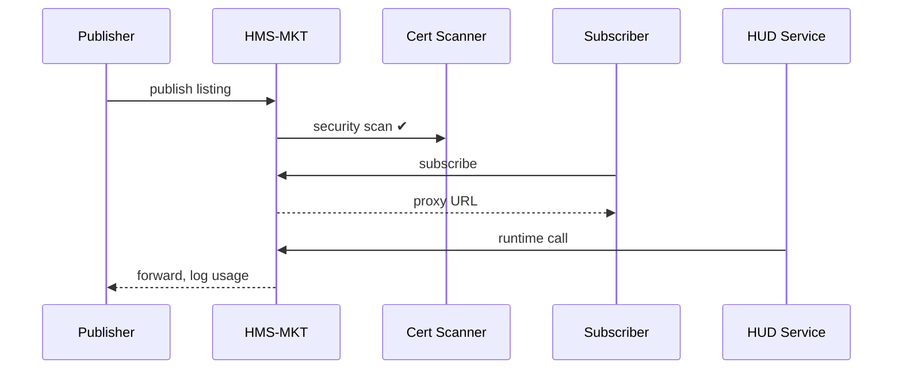

# Chapter 15: Marketplace & Discovery Hub (HMS-MKT)

*(If you just finished sending encrypted messages in  
[Inter-Agency Communication Bus (HMS-A2A)](14_inter_agency_communication_bus__hms_a2a__.md) you learned **how** to exchange data.  
Now let’s learn **where** agencies find the reusable modules, data feeds, and AI agents they want to exchange in the first place.)*  

---

## 1. Why Do We Need HMS-MKT?

### Story – “One-Click Veteran Eligibility”

1. The Department of Veterans Affairs (VA) builds a small micro-service that returns **“Is this citizen a veteran?”** in JSON.  
2. The Department of Housing & Urban Development (HUD) wants to add an automatic rent-discount if the applicant **is** a veteran.  
3. Today HUD developers must:  
   • Find the right VA contact.  
   • Sign a new MOU.  
   • Re-implement authentication from scratch.  
   • Hope the API never changes.  
4. Weeks pass. Citizens keep waiting.

**HMS-MKT is the App Store for government code.**  
It lets VA publish the module on Monday, HUD click **“Subscribe”** on Tuesday, and citizens enjoy the benefit on Wednesday.

---

## 2. Key Concepts (Plain English)

| Word | What It Means | Analogy |
|------|---------------|---------|
| Listing | A catalog entry that points to a module, data feed, or agent. | App Store page |
| Version | Immutable snapshot of a listing (`v1.0.2`). | Edition of a book |
| Subscription | Agreement that a consumer auto-receives new versions. | Magazine subscription |
| Certification Badge | Stamp that GOV, ESQ, or OPS has approved security / compliance. | USDA “Organic” seal |
| Revenue Hook | Optional setting that bills per call via [HMS-ACH](09_financial_transaction_engine__hms_ach__.md). | EZ-Pass toll |

Remember these five and you can already navigate the marketplace.

---

## 3. First Walk-Through  
### Goal: HUD Installs VA’s “Veteran Check” Module

We will:

1. VA publishes the module.  
2. HUD finds and subscribes.  
3. The module auto-updates inside HUD’s workflow.

---

### 3.1 Publisher Side (VA) – 18 lines

```python
# file: publish_vet_check.py
from hms_mkt import MktClient

va = MktClient(token="VA_PIV")

listing = va.publish({
    "name": "veteran-check",
    "title": "Veteran Benefits Eligibility",
    "description": "Returns true/false if SSN belongs to a veteran.",
    "artifact_url": "https://va.gov/artifacts/vetcheck_1.0.0.zip",
    "version": "1.0.0",
    "price_per_call": 0.00,          # free service
    "badges": ["security-reviewed"]  # auto-pulled from OPS
})

print("🛒 Published ID:", listing["id"])
```

Explanation  
1. One method call sends all metadata.  
2. HMS-MKT stores it, scans the artifact for viruses, and shows it in the catalog.

---

### 3.2 Consumer Side (HUD) – 14 lines

```python
# file: install_vet_check.py
from hms_mkt import MktClient

hud = MktClient(token="HUD_PIV")

result = hud.subscribe(
    listing_id="veteran-check",
    env="production",              # or "sandbox"
    auto_update=True
)

print("📥 Installed → endpoint:", result["service_url"])
```

Explanation  
`subscribe()` creates a **Subscription** record and returns a ready-to-call URL.  
If VA later pushes **v1.1.0**, HUD’s endpoint auto-switches after integration tests pass.

---

### 3.3 Using the Module (inside HUD workflow) – 8 lines

```python
import requests
resp = requests.post(
    "https://mkt-proxy.gov/hud/veteran-check",
    json={"ssn": "123-45-6789"}
)
print("Is veteran?", resp.json()["is_veteran"])
```

Result  
HUD instantly knows whether to apply the rent discount—no extra MOUs, no custom keys.

---

## 4. What Happens Under the Hood?



1. OPS certifies the artifact once.  
2. Marketplace proxies all runtime calls, so version swaps happen invisibly and usage is metered for billing or analytics.

---

## 5. Peeking Inside the Source Tree

```
hms-mkt/
├── api/
│   ├── listings.py      # publish, update
│   ├── subscribe.py
│   └── proxy.py         # runtime calls
├── core/
│   ├── registry.py      # in-memory catalog
│   ├── updater.py       # auto version bump
│   └── billing.py       # ACH hooks
└── ui/                  # React + MFE blocks
```

### 5.1 Registry Insert (10 lines)

```python
# core/registry.py
def add(listing):
    listing["id"] = slugify(listing["name"])
    listing["created_at"] = time.time()
    DB.insert("listings", listing)
    return listing
```

### 5.2 Simple Auto-Updater (≤15 lines)

```python
# core/updater.py
def check_updates():
    for sub in DB.find("subscriptions", auto_update=True):
        latest = latest_version(sub["listing_id"])
        if latest > sub["current_version"]:
            run_tests(sub, latest)      # smoke tests
            sub["current_version"] = latest
            DB.update("subscriptions", sub)
```

*Smoke tests* run inside the subscriber’s sandbox before the switch.

### 5.3 Billing Hook (12 lines)

```python
# core/billing.py
def bill(call):
    price = call["price_per_call"]
    if price > 0:
        order = {
            "pay_to": call["publisher"],
            "amount": price,
            "memo": f"MKT usage {call['listing_id']}"
        }
        hms_ach.create_order(order)   # see Chapter 9
```

Each API hit can trigger an automatic ACH order (daily batch to keep fees low).

---

## 6. Relationship to Other Layers

Layer | Interaction Example
------|--------------------
[HMS-ACH](09_financial_transaction_engine__hms_ach__.md) | Handles optional per-use or subscription billing.
[HMS-ESQ](10_compliance___legal_reasoner__hms_esq__.md) | Approves public listings against laws (e.g., HIPAA if health data).
[HMS-OPS](12_activity___operations_monitoring__hms_ops___hms_oms__.md) | Scans artifacts, tracks reliability scores shown as “badges.”
[HMS-A2A](14_inter_agency_communication_bus__hms_a2a__.md) | Marketplace can expose A2A channels as subscribable assets.
[HMS-ACT](03_action_orchestrator__hms_act__.md) | Auto-imports installed modules as new actions or agents.

---

## 7. Try It Yourself (5-Minute Lab)

```bash
git clone https://github.com/hms-example/hms-mkt
cd hms-mkt/examples
# 1. Start marketplace + proxy
docker compose up mkt
# 2. Publish from VA
python publish_vet_check.py
# 3. Subscribe from HUD
python install_vet_check.py
# 4. Call the proxy
python call_vet_check.py
```

Open `http://localhost:8080/catalog` and you’ll see the shiny listing with a green “security-reviewed” badge.

---

## 8. Cheat-Sheet for Daily Commands

| Task | Command |
|------|---------|
| Search listings | `mktctl search "veteran"` |
| View your installs | `mktctl subs list --agency HUD` |
| Push new version | `mktctl publish veteran-check --artifact vet_1.1.0.zip` |
| Roll back | `mktctl subs pin veteran-check 1.0.0` |
| See usage stats | `mktctl stats veteran-check --since 30d` |

All commands call the same REST API shown earlier; nothing special on your workstation.

---

## 9. Recap & What’s Next

You now know:

✓ HMS-MKT is the **App Store** for data feeds, agents, and widgets.  
✓ Publishing = one function call; subscribing = one function call.  
✓ Auto-updates, security badges, compliance checks, and optional billing happen automatically.  
✓ Other HMS layers plug in seamlessly: ACH for money, OPS for scans, ESQ for law.

Next we’ll see a specialized marketplace pack that wires *health* data across states, clinics, and payers:  
[Universal Health Connector (HMS-UHC / HMS-MED)](16_universal_health_connector__hms_uhc___hms_med__.md).

---

Generated by [AI Codebase Knowledge Builder](https://github.com/The-Pocket/Tutorial-Codebase-Knowledge)