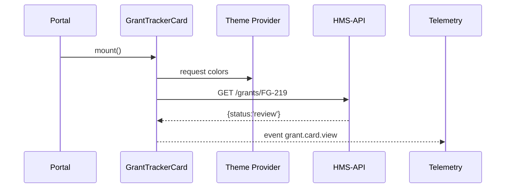

# Chapter 15: Micro-Frontend Component Library (HMS-MFE)
*(continuation of [External System Sync Connector](14_external_system_sync_connector_.md))*  

---

## 1. Why Do We Need Yet **Another** UI Library?

### 60-Second Story – “Grant Tracker Goes Viral”  
The **Department of Commerce** spends a week building a **Grant Tracker Card** that shows:

* Award amount  
* Current stage  
* “Upload Invoice” button  

Because it was built with **HMS-MFE**, the card is:

1. **Drag-n-drop ready** – it snaps into any HMS portal.  
2. **ADA-compliant by default** – auto color-contrast & keyboard nav.  
3. **Theme-aware** – picks up USAID red or AbilityOne green at runtime.  
4. **Telemetry-wired** – every click is timed & sent to [Monitoring & Telemetry Stack](12_monitoring___telemetry_stack__hms_ops__.md).

A week later USAID simply **imports** the same card—zero re-coding, citizens everywhere see the *exact* same UX, and auditors cheer.

That is the promise of the **Micro-Frontend Component Library (HMS-MFE)**.

---

## 2. Key Concepts (Plain English)

| Term | Friendly Explanation |
|------|----------------------|
| Brick | A Lego-like UI piece (button, data table, card). |
| Micro-Frontend (MFE) | A self-contained bundle: JS + CSS + tests + manifest. |
| Registry | The “app store” where agencies publish & pull bricks. |
| Theme Provider | Live style sheet that repaints every brick (no build needed). |
| ADA Hook | Auto tests & props that enforce accessibility. |
| Telemetry Hook | One-liner that reports usage to HMS-OPS. |

Analogy: building a portal = snapping Lego bricks on a base plate; HMS-MFE makes sure **every** brick fits, matches color, and carries a tiny sensor.

---

## 3. Hello, Brick! – A 15-Line Quick-Start

```bash
npm i @hms-mfe/bricks           # 1️⃣ install once
```

```javascript
// portal/src/App.js  (15 lines)
import { Theme, GrantTrackerCard } from '@hms-mfe/bricks';

export default function App() {
  return (
    <Theme agency="USDA">        {/* auto-loads usda.json */}
      <main style={{padding:20}}>
        <h1>Farm-Grant Dashboard</h1>
        <GrantTrackerCard
          grantId="FG-219"
          onComplete={msg => console.log('✅', msg)}
        />
      </main>
    </Theme>
  );
}
```

What happens when the page loads?

1. `Theme` downloads `/themes/usda.json` and injects CSS variables.  
2. `GrantTrackerCard` fetches data with the citizen’s JWT (see [Role & Identity Management](02_role___identity_management__accounts___authorization__.md)).  
3. Each click fires `telemetry('grant.card.click')` → HMS-OPS.

No extra plumbing—beginners can copy-paste and ship.

---

## 4. Re-using the Card Across Agencies

### 4.1 USAID Consumes the Same Card (7 lines)

```javascript
import { Theme, GrantTrackerCard } from '@hms-mfe/bricks';
<Theme agency="USAID">
  <GrantTrackerCard grantId="US-441" />
</Theme>
```

### 4.2 How Did It Get There?

```bash
hms-mfe pull commerce/GrantTrackerCard@1.0.0   # 1 line CLI
```

The CLI:

1. Verifies the signature with [Security & Compliance Engine](11_security___compliance_engine__hms_esq__.md).  
2. Adds the brick to the local registry cache.  
3. Updates a lock-file so builds stay reproducible.

---

## 5. Theming & Branding in 12 Lines

```json
// themes/usda.json  (≤12 lines)
{
  "primary":   "#2e8540",
  "secondary": "#fdb81e",
  "font":      "Public Sans",
  "logo":      "/img/usda.svg",
  "borderRad": "4px"
}
```

Drop a new JSON file, **refresh**, and every brick adapts instantly—no recompile.

---

## 6. Accessibility for Free

Each brick ships with a **pre-commit test**:

```bash
npm run ada:test
```

Under the hood it calls `axe-core` and fails if:

* Color contrast < 4.5 : 1  
* Missing `aria-label` on interactive element  
* Wrong heading order  

A failing brick **cannot** be published to the Registry—guardrails enforced by [Governance Layer](06_governance_layer__hms_sys___hms_gov__.md).

---

## 7. What Happens Inside? (5-Actor Walk-Through)



Five participants—simple mental model for beginners.

---

## 8. Under-the-Hood Code Peeks

### 8.1 Tiny Brick Skeleton (18 lines)

```javascript
// bricks/GrantTrackerCard/index.js
import { useFetch, useTelemetry } from '../_hooks';
import Spinner from '../_atoms/Spinner';

export default function Card({ grantId, onComplete }) {
  const { data, loading } = useFetch(`/grants/${grantId}`);
  useTelemetry('grant.card.view');

  if (loading) return <Spinner />;
  const { stage, amount } = data;

  return (
    <article role="region" aria-labelledby={`${grantId}-h`}>
      <h2 id={`${grantId}-h`}>Grant {grantId}</h2>
      <p>Stage: {stage}</p>
      <p>Amount: ${amount}</p>
      {stage === 'paid' && <button onClick={onComplete}>Receipt</button>}
    </article>
  );
}
```

Notes  
• `useFetch` auto-adds the citizen’s JWT header.  
• `useTelemetry` sends one line to HMS-OPS—no boilerplate.

### 8.2 The Tiny Theme Hook (10 lines)

```javascript
// _hooks/useTheme.js
import { createContext, useContext } from 'react';

export const ThemeCtx = createContext({});

export function Theme({ agency, children }) {
  const theme = useJson(`/themes/${agency}.json`);
  return (
    <ThemeCtx.Provider value={theme}>
      <style>{`body{--primary:${theme.primary}}`}</style>
      {children}
    </ThemeCtx.Provider>
  );
}

export const useTheme = () => useContext(ThemeCtx);
```

Beginners can read & modify—no magic.

---

## 9. Publishing a New Brick in 3 Commands

```bash
cd bricks/PermitForm
npm run ada:test              # ensure accessibility
npm version patch
hms-mfe publish               # signs & uploads to Registry
```

The Registry automatically:

* Stores artifact in S3-ish bucket.  
* Adds a changelog entry.  
* Notifies subscribers via email & [Agent Interaction Protocol](04_agent_interaction_protocol__hms_mcp__.md).

---

## 10. Directory Peek

```
hms-mfe/
 ├─ bricks/           // GrantTrackerCard, PermitForm, Spinner …
 ├─ _hooks/           // useFetch, useTelemetry, useTheme
 ├─ themes/           // usda.json, usaid.json …
 ├─ registry/         // CLI + cache
 └─ README.md
```

All small, readable files—great first repo for junior devs.

---

## 11. How HMS-MFE Talks to the Rest of the Stack

| Layer | Interaction | Example |
|-------|-------------|---------|
| [Interface Layer](01_interface_layer__hms_mfe___portals__.md) | Portals **import** bricks | `<PermitForm />` |
| [Role & Identity](02_role___identity_management__accounts___authorization__.md) | `useFetch` injects JWT | Header `Authorization: Bearer…` |
| [Monitoring Stack](12_monitoring___telemetry_stack__hms_ops__.md) | `useTelemetry` emits events | `grant.card.view` |
| [Governance Layer](06_governance_layer__hms_sys___hms_gov__.md) | ADA tests enforced at publish | Block non-compliant brick |
| [Security Engine](11_security___compliance_engine__hms_esq__.md) | Registry signatures | Verify before `hms-mfe pull` |

---

## 12. Recap

In this final chapter you learned:

1. **Why** HMS-MFE exists: one drag-n-drop toolkit that bakes in accessibility, theming, and telemetry.  
2. Key vocabulary: Brick, Registry, Theme Provider, ADA Hook, Telemetry Hook.  
3. How to **import**, **theme**, **monitor**, and **publish** bricks—all in snippets under 20 lines.  
4. A 5-actor journey showing how a brick fetches data, paints itself, and reports usage.  
5. How HMS-MFE plugs into every other HMS-ACT layer for auth, compliance, governance, and monitoring.

**Congratulations!**  
You’ve reached the end of the HMS-ACT beginner tutorial.  
Spin up your own portal, drag in a few bricks, and help citizens get answers in minutes—not months. 🎉

---

Generated by [AI Codebase Knowledge Builder](https://github.com/The-Pocket/Tutorial-Codebase-Knowledge)