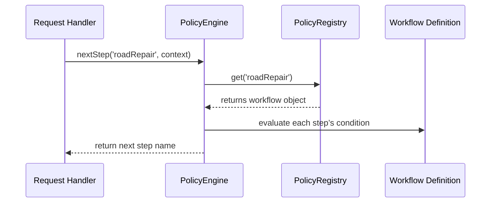

# Chapter 15: Policy & Process Module

In [Chapter 14: AI Governance Model](14_ai_governance_model_.md) we built an ethics committee for our AI agents. Now we’ll turn to the “city clerk’s office” of HMS-ACT: the **Policy & Process Module**. This component stores **workflows**, **business rules**, and **approval chains**—just like a library of municipal ordinances. Every service request checks these rules to decide what to do next.

---

## Why We Need a Policy & Process Module

Imagine a citizen submits a **road repair request**:

1. Small potholes (under \$1,000) go straight to a local crew.
2. Bigger jobs need a **manager’s sign-off** before work begins.
3. **Emergencies** skip straight to dispatch.

Without a central rulebook, one officer might dispatch crews directly while another stalls for approvals, confusing everyone. The Policy & Process Module ensures **consistent**, **audited**, and **flexible** handling for all requests.

---

## Key Concepts

1. **Workflow Definition**  
   An ordered list of named steps (tasks) that a request follows.

2. **Business Rules**  
   Conditional logic (e.g., “if cost > \$10,000, require manager approval”).

3. **Approval Chain**  
   A sequence of roles or users who must review or sign off.

4. **Policy Library**  
   A registry of all workflows, rules, and chains.

5. **Enforcement Engine**  
   The runtime that reads a workflow, evaluates rules, and returns the next step.

---

## Defining and Registering a Workflow

First, we declare workflows in a central file.

```javascript
// File: src/policy/workflows.js
export const workflows = {
  roadRepair: {
    steps: [
      { name: 'initialReview' },
      { name: 'assignCrew' },
      { name: 'checkCost' },
      {
        name: 'managerApproval',
        condition: ctx => ctx.estimatedCost > 10000
      },
      { name: 'executeRepair' },
      { name: 'finalInspection' }
    ]
  }
};
```
> Here we map each step. The `managerApproval` step only applies when `estimatedCost > 10000`.

Next, register the workflows at startup:

```javascript
// File: src/policy/PolicyRegistry.js
import { workflows } from './workflows';
const registry = new Map();
Object.entries(workflows)
  .forEach(([key, wf]) => registry.set(key, wf));
export const PolicyRegistry = {
  get: name => registry.get(name)
};
```

---

## Enforcing Policies at Runtime

When a new repair request arrives, we ask the **PolicyEngine** for the next action:

```javascript
// File: src/policy/PolicyEngine.js
import { PolicyRegistry } from './PolicyRegistry';

export class PolicyEngine {
  static nextStep(workflowName, context) {
    const wf = PolicyRegistry.get(workflowName);
    if (!wf) throw new Error('Workflow not found: ' + workflowName);
    for (const step of wf.steps) {
      if (!step.condition || step.condition(context)) {
        return step.name;
      }
    }
    return null; // all steps done
  }
}
```

Usage in your request handler:

```javascript
// In your service code
import { PolicyEngine } from './policy/PolicyEngine';

const ctx = { estimatedCost: 15000 };
const next = PolicyEngine.nextStep('roadRepair', ctx);
console.log(next); // prints "managerApproval"
```

---

## Example Input & Output

Request context:
```json
{ "estimatedCost": 2000, "isEmergency": false }
```

PolicyEngine.nextStep('roadRepair', context) → `"assignCrew"`

For high-cost:
```json
{ "estimatedCost": 12000 }
```
PolicyEngine.nextStep('roadRepair', context) → `"managerApproval"`

---

## What Happens Under the Hood?



1. **Request Handler** calls `nextStep`.  
2. **PolicyEngine** looks up the workflow in **PolicyRegistry**.  
3. It evaluates each step’s `condition` (if any).  
4. The engine returns the first matching step to perform.

---

## Deeper Dive: Approval Chains

You can define who must approve:

```javascript
// In workflows.js
maintenanceApproval: {
  steps: [
    {
      name: 'managerApproval',
      approvers: ['managerId', 'deptHeadId'],
      condition: ctx => ctx.estimatedCost > 5000
    },
    // …
  ]
}
```

And the engine can return both step name and approvers:

```javascript
// In PolicyEngine.nextStep
if (step.condition(ctx)) {
  return { step: step.name, approvers: step.approvers || [] };
}
```

---

## Summary

In this chapter you learned to:

- Define **workflows** as ordered steps with optional conditions.  
- Register them in a **Policy Library**.  
- Use a simple **Enforcement Engine** to get the next step for any request.  
- Extend workflows with **approval chains** to route tasks to the right decision-makers.

With the Policy & Process Module in place, every citizen service follows consistent, auditable processes—just like municipal ordinances.  

This completes our core modules. Explore the codebase to see how these pieces fit into the HMS-ACT ecosystem!

---

Generated by [AI Codebase Knowledge Builder](https://github.com/The-Pocket/Tutorial-Codebase-Knowledge)