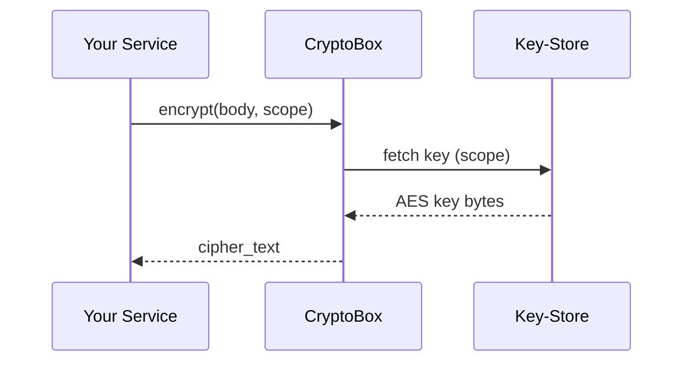

# Chapter 18: Shared Utilities Library (HMS-UTL)

*(If you just flew a thousand synthetic citizens through your sandbox in  
[Simulation & Training Sandbox (HMS-ESR)](17_simulation___training_sandbox__hms_esr__.md) you probably copy-pasted a bit of code—an AES snippet here, an ISO-date formatter there.  
HMS-UTL exists so you **never have to copy-paste those helpers again**.)*

---

## 1. Why Do We Need a “Swiss-Army” Library?

### Quick Story – “Treasury Refund Bot”

1. The **Department of the Treasury** is writing a tiny service that e-mails citizens when their tax refund is sent.  
2. The bot must  
   • Encrypt the e-mail body before storing it (`AES-256 + key from KMS`).  
   • Log every step for auditors (`INFO`, `WARN`, `ERROR`).  
   • Calculate a “delivery estimate = send date + 5 federal business days.”  
3. Each of those jobs is *solvable*—but six teams already solved them six different ways.  
4. Enter **HMS-UTL**: one import gives identical, policy-compliant helpers to **every** service in the platform.

---

## 2. Key Concepts (Plain English)

| Term | What It Gives You | Government Analogy |
|------|-------------------|--------------------|
| CryptoBox | `encrypt()` / `decrypt()` that auto-pulls the correct agency key from KMS. | A GSA-issued lockbox—same key standard everywhere. |
| LogKit | Opinionated `log.info() / warn() / error()` that writes to [HMS-OPS](12_activity___operations_monitoring__hms_ops___hms_oms__.md) with the MCP `trace_id`. | The unified incident form every office uses. |
| DateMath | Utilities like `add_business_days()` that respect the **Federal Holiday Calendar** from [HMS-GOV](01_governance_layer__hms_gov__.md). | OPM’s leave chart stuck on every cubicle wall. |
| RetryHelper | Tiny wrapper that retries HTTP calls with exponential back-off & metrics. | The “three call attempts before paper letter” rule many agencies follow. |
| Formatters | One-liners for SSN masking, currency formatting, and FIPS-state codes. | Style sheet in the Federal Register. |

Remember them: **CryptoBox → LogKit → DateMath → Retry → Formatters**.

---

## 3. Solving the Treasury Bot in 25 Lines

Below we build the **refund-notice** bot using only UTL helpers.

```python
# file: refund_bot.py  (25 lines total)
from hms_utl import CryptoBox, LogKit, DateMath, RetryHelper, fmt

log = LogKit(service="treasury-refund-bot")

@RetryHelper(max_tries=3)
def send_email(enc_body):
    # pretend email_api.post exists
    return email_api.post("/send", {"body": enc_body})

def notify(refund):
    log.info("Notifying citizen", trace_id=refund["trace_id"])
    
    body = f"""
    Hi {refund['name']},
    Your refund of {fmt.currency(refund['amount'])} was issued today.
    Expect it by {DateMath.add_business_days(5)}.
    """
    enc = CryptoBox.encrypt(body, scope="citizen-email")
    
    resp = send_email(enc)      # auto-retry on 500 errors
    log.info("Email status", code=resp.status_code)

# --- run once for a single refund event
notify({
    "name": "Alex Doe",
    "amount": 1243.55,
    "trace_id": "abc123"
})
```

**What just happened?**

1. **CryptoBox** used the Treasury’s key without you reading KMS docs.  
2. **LogKit** attached `trace_id=abc123`; dashboards group all messages.  
3. **DateMath** skipped weekends & federal holidays automatically.  
4. **RetryHelper** exposed zero retry math.  
5. **fmt.currency** printed “$1,243.55” per Treasury style.

---

## 4. How Does UTL Work Behind the Curtain?



Five steps, one black-box call for you.

---

## 5. Inside the Source Tree (Bird’s-Eye View)

```
hms-utl/
├── crypto/
│   └── box.py          # CryptoBox
├── logging/
│   └── kit.py          # LogKit
├── date/
│   └── math.py         # DateMath
├── retry/
│   └── helper.py       # RetryHelper
└── fmt/
    └── masks.py        # Formatters
```

### 5.1 CryptoBox (excerpt – 16 lines)

```python
# crypto/box.py
import base64, json, requests
from Crypto.Cipher import AES

def _key(scope):
    r = requests.get(f"http://kms.local/key/{scope}")
    return base64.b64decode(r.json()["key"])

def encrypt(plain, scope):
    key = _key(scope)
    cipher = AES.new(key, AES.MODE_GCM)
    ct , tag = cipher.encrypt_and_digest(plain.encode())
    blob = {"nonce": cipher.nonce, "tag": tag, "ct": ct}
    return base64.b64encode(json.dumps(blob).encode()).decode()

def decrypt(blob, scope):
    raw = json.loads(base64.b64decode(blob))
    key = _key(scope)
    cipher = AES.new(key, AES.MODE_GCM, nonce=raw["nonce"])
    return cipher.decrypt_and_verify(raw["ct"], raw["tag"]).decode()
```

*Beginners’ takeaway*: only 5 real lines of crypto—the rest is plumbing.

---

### 5.2 DateMath (excerpt – 12 lines)

```python
# date/math.py
import datetime as dt, holidays

US_FED = holidays.US()          # 2025 calendar auto-loaded

def add_business_days(days, start=None):
    date = start or dt.date.today()
    added = 0
    while added < days:
        date += dt.timedelta(1)
        if date.weekday() < 5 and date not in US_FED:
            added += 1
    return date.isoformat()
```

Automatically respects New Year’s Day, Juneteenth, etc.—no hard-coding.

---

### 5.3 LogKit (excerpt – 10 lines)

```python
# logging/kit.py
import json, requests, os, time

class LogKit:
    def __init__(self, service):
        self.service = service
        self.stream = os.getenv("OPS_URL", "http://ops/log")

    def info(self, msg, **extra):
        payload = {
            "svc": self.service,
            "lvl": "INFO",
            "ts":  time.time(),
            **extra,
            "msg": msg
        }
        requests.post(self.stream, json=payload)
```

All logs go to HMS-OPS with the same JSON shape.

---

## 6. Common One-Liners You’ll Reuse

Need it? | UTL Call
---------|----------
Mask an SSN for display | `fmt.mask_ssn("123-45-6789")  # → "***-**-6789"`
Generate a trace ID | `utl.trace_id()` (UUID-4 standard)
Retry **any** function | `RetryHelper()(my_func)(*args)`
Check if a date is a federal holiday | `DateMath.is_holiday("2025-07-04")`
Sign & verify payloads for [HMS-A2A](14_inter_agency_communication_bus__hms_a2a__.md) | `CryptoBox.sign()` / `verify()`

---

## 7. How UTL Talks to Other Layers

Layer | What It Reuses or Supplies
------|---------------------------
[HMS-GOV](01_governance_layer__hms_gov__.md) | Pulls holiday calendar & logging policy values.
[HMS-MCP](05_model_context_protocol__hms_mcp__.md) | LogKit auto-attaches current `trace_id`.
[HMS-OPS](12_activity___operations_monitoring__hms_ops___hms_oms__.md) | Receives structured logs & retry metrics.
[HMS-ESQ](10_compliance___legal_reasoner__hms_esq__.md) | CryptoBox tags each cipher with `scope`, letting ESQ verify encryption at rest.
[HITL Control](11_human_in_the_loop__hitl__control_.md) | DateMath’s `add_business_days()` used in pause-timers.

---

## 8. Try It Yourself (5-Minute Lab)

```bash
git clone https://github.com/hms-example/hms-utl
cd hms-utl/examples
# 1. Encrypt + decrypt a message
python demo_crypto.py      # prints ciphertext then plaintext
# 2. Log a message and tail OPS
python demo_log.py         # open http://localhost:8080/ops/logs
# 3. Check business-day math
python demo_date.py
```

All three scripts are under 15 lines—read them, copy them, be happy.

---

## 9. Recap

You learned:

✓ **HMS-UTL** is the shared toolbox: crypto, logging, date math, retries, and formatters that match federal rules.  
✓ Import once, configure zero times—get encryption, audits, and holiday logic “for free.”  
✓ The library glues neatly into every other HMS layer—keys from GOV, trace IDs from MCP, metrics to OPS.

This is the final core chapter.  You now have **governance, agents, data, payments, compliance, monitoring, connectors, and a Swiss-Army library** to tie them all together.  
Grab the repo, build something good for the public! 🎉

---

Generated by [AI Codebase Knowledge Builder](https://github.com/The-Pocket/Tutorial-Codebase-Knowledge)