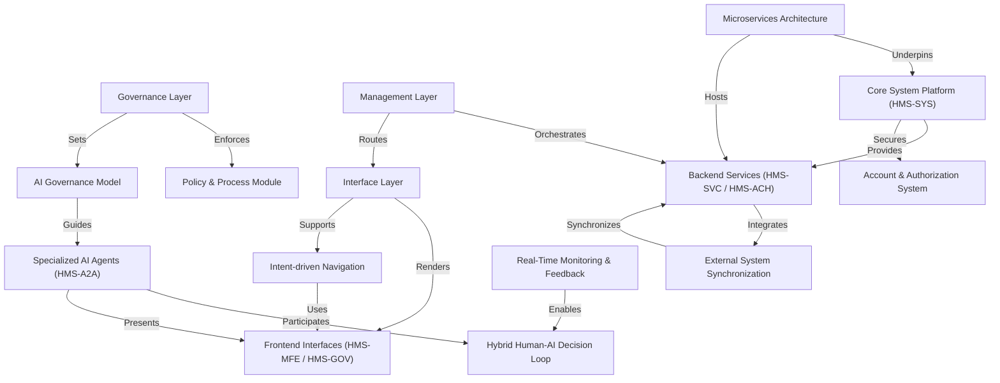

# Tutorial: HMS-ACT

**HMS-ACT** is a *comprehensive action intelligence system* that integrates AI-powered insights across government workflows.  
It synthesizes data from **microservices**, *front-end interfaces*, and **specialized AI agents** to drive proactive citizen services, policy management, and *hybrid human-AI decision loops*.  
By combining **real-time monitoring**, **intent-driven navigation**, and **external system synchronization**, it ensures *transparent*, *efficient*, and *secure* operations for agencies and end-users.

**Source Repository:** [None](None)

## Chapters

1. [Frontend Interfaces (HMS-MFE / HMS-GOV)
](01_frontend_interfaces__hms_mfe___hms_gov__.md)
2. [Intent-driven Navigation
](02_intent_driven_navigation_.md)
3. [Specialized AI Agents (HMS-A2A)
](03_specialized_ai_agents__hms_a2a__.md)
4. [Hybrid Human-AI Decision Loop
](04_hybrid_human_ai_decision_loop_.md)
5. [Real-Time Monitoring & Feedback
](05_real_time_monitoring___feedback_.md)
6. [Interface Layer
](06_interface_layer_.md)
7. [Management Layer
](07_management_layer_.md)
8. [Microservices Architecture
](08_microservices_architecture_.md)
9. [Core System Platform (HMS-SYS)
](09_core_system_platform__hms_sys__.md)
10. [Account & Authorization System
](10_account___authorization_system_.md)
11. [Backend Services (HMS-SVC / HMS-ACH)
](11_backend_services__hms_svc___hms_ach__.md)
12. [External System Synchronization
](12_external_system_synchronization_.md)
13. [Governance Layer
](13_governance_layer_.md)
14. [AI Governance Model
](14_ai_governance_model_.md)
15. [Policy & Process Module
](15_policy___process_module_.md)

---

Generated by [AI Codebase Knowledge Builder](https://github.com/The-Pocket/Tutorial-Codebase-Knowledge)