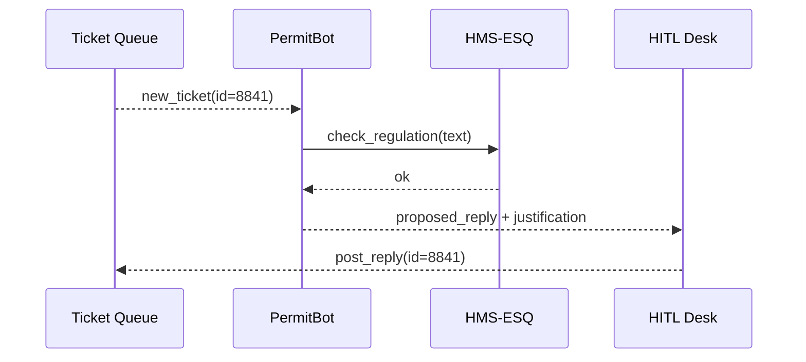

# Chapter 6: AI Agent Framework (HMS-AGT / HMS-AGX)

*(coming from [Intent-Driven Navigation & AI-Guided Journeys](05_intent_driven_navigation___ai_guided_journeys_.md))*  

---

## 1 · Why Do We Need “Digital Civil Servants”?

Imagine the **Department of the Interior** has a 50 000-ticket backlog of wildlife-permit questions.  
Humans can’t read them all; citizens wait months.  

Solution ➜ spin-up a *task force* of AI agents that:

1. Read each ticket.  
2. Check regulations with the legal engine.  
3. Draft a reply or escalate complex cases.  

HMS-AGT gives each agent an **identity card**, mailbox, and memory vault.  
HMS-AGX bolts on specialist **skills** (multi-step reasoning, API calls, spreadsheet math).  
Together they behave like junior analysts—fast, audited, replaceable.

---

## 2 · Key Concepts (Plain English)

| Term | Beginner Analogy | Why It Matters |
|------|------------------|----------------|
| Agent | A digital employee | Does one job over and over |
| Profile (AGT) | Personnel file | Auth, role, inbox, memory |
| Skill (AGX) | Training certificate | e.g., call Medicare API |
| Justification Log | Agent’s diary | Every action explained for auditors |
| Supervisor | Team lead | Starts, pauses, or retires agents |

---

## 3 · Five-Minute Quick-Start

Goal: Create an agent that drafts first replies for wildlife-permit tickets.

```python
# quick_start.py
from hmsagt import Agent, Supervisor
from hmsagx.skills import LegalCheck, DraftReply

# 1️⃣ define agent
permit_bot = Agent(
    name="PermitBot",
    org="Interior",
    skills=[LegalCheck(), DraftReply()]
)

# 2️⃣ register & start
sup = Supervisor()
sup.hire(permit_bot)
sup.start("PermitBot")
```

What happens?  
1. `Agent` builds a profile with secure keys and an empty memory.  
2. `Supervisor.hire()` writes the record to [Central Data Repository](19_central_data_repository__hms_dta__.md).  
3. `start()` launches a container; the agent begins polling the ticket queue.  

Typical first log line:

```
[PermitBot] Drafted reply for Ticket #8841 — justification: cites 50 C.F.R §17.22
```

---

## 4 · Anatomy of an Agent

```mermaid
flowchart LR
    subgraph AGT (Core)
        ID[Identity] --token--> AUTH
        MSG[Inbox] --events--> REACT
        MEM[Memory] --vectors--> REACT
    end
    subgraph AGX (Add-ons)
        SK1[LegalCheck]
        SK2[API Call]
        SK3[Planner]
    end
    REACT --> SK1 & SK2 & SK3
```

• **AGT** is mandatory: identification, messaging, memory.  
• **AGX** is optional: plug in as many skills as needed.

---

## 5 · Supervising the Workforce

```python
# pause_and_retire.py
from hmsagt import Supervisor

sup = Supervisor()
sup.pause("PermitBot")       # stop now, keep state
sup.retire("PermitBot")      # archive + revoke keys
```

Every supervision action is forwarded to [Human-in-the-Loop Oversight (HITL)](07_human_in_the_loop_oversight__hitl__.md) for sign-off.  
Nothing runs in the dark.

---

## 6 · Life of One Ticket (Step-By-Step)



Five actors, crystal clear:

1. Agent pulls the ticket.  
2. Skill calls the legal engine to avoid bad advice.  
3. Human desk gets a one-click approve queue (optional).  
4. Reply posts back; audit log stores every step.

---

## 7 · A Peek Under the Hood

### 7.1 Core Agent Loop (trimmed to 18 lines)

```python
# hmsagt/agent.py
class Agent:
    def run(self):
        while self.active:
            t = self.queue.get()              # 1 fetch
            context = self.mem.retrieve(t.id)
            action = self.plan(t, context)    # 2 think
            if self.explain(action):          # 3 justify
                self.execute(action)          # 4 do
            self.mem.store(t.id, action)      # 5 learn
```

Explanation  
1. Pull one ticket.  
2. Merge fresh data with memory.  
3. Produce a *why* string; must pass policy checks.  
4. Execute (send draft, call API, etc.).  
5. Store the experience for next time.

### 7.2 Skill Plug-in Interface (8 lines)

```python
# hmsagx/skill.py
class Skill:
    name: str
    def can_handle(self, task): ...
    def handle(self, task, tools): ...
```

Any Python class implementing those two methods becomes a skill—easy to write, easy to test.

---

## 8 · Frequently Asked Beginner Questions

**Q: How many agents can run?**  
A: As many as Kubernetes pods you can afford; Supervisor auto-scales.

**Q: Can an agent refuse a task?**  
A: Yes—`can_handle()` may return `False`. The ticket then flows to another agent or a human.

**Q: Where are memories stored?**  
A: Vector store inside [Central Data Repository](19_central_data_repository__hms_dta__.md); encrypted at rest.

**Q: What stops an agent from going rogue?**  
A: 1) Guardrails in [AI Governance Value Guardrails](21_ai_governance_value_guardrails_.md)  
   2) Mandatory justification logs  
   3) HITL veto buttons

---

## 9 · Hands-On Exercise

1. Install SDK: `pip install hmsagt hmsagx`.  
2. Copy `quick_start.py`; run it.  
3. Open [Governance Portal](01_governance_portal__hms_gov__.md) → **Agents** tab.  
4. Pause the agent and watch the ticket queue stop moving.

---

## 10 · How AGT / AGX Connect Elsewhere

• **Intent Planner** in [Chapter 5](05_intent_driven_navigation___ai_guided_journeys_.md) uses agents for route planning.  
• Drafts pass through [Legal Reasoning & Compliance Engine](03_legal_reasoning___compliance_engine__hms_esq__.md) before going live.  
• Work status feeds the [Activity & Workflow Orchestrator](08_activity___workflow_orchestrator__hms_act___hms_oms__.md).  

---

## 11 · Summary & Next Steps

You learned:

1. AGT = core identity, memory, messaging; AGX = extra skills.  
2. How to hire, start, pause, and retire agents in <20 lines of Python.  
3. The oversight pipeline that keeps every action explainable.

Next we’ll zoom into the *human safeguard layer* that can approve, reject, or overrule any agent decision: [Human-in-the-Loop Oversight (HITL)](07_human_in_the_loop_oversight__hitl__.md).

---

Generated by [AI Codebase Knowledge Builder](https://github.com/The-Pocket/Tutorial-Codebase-Knowledge)