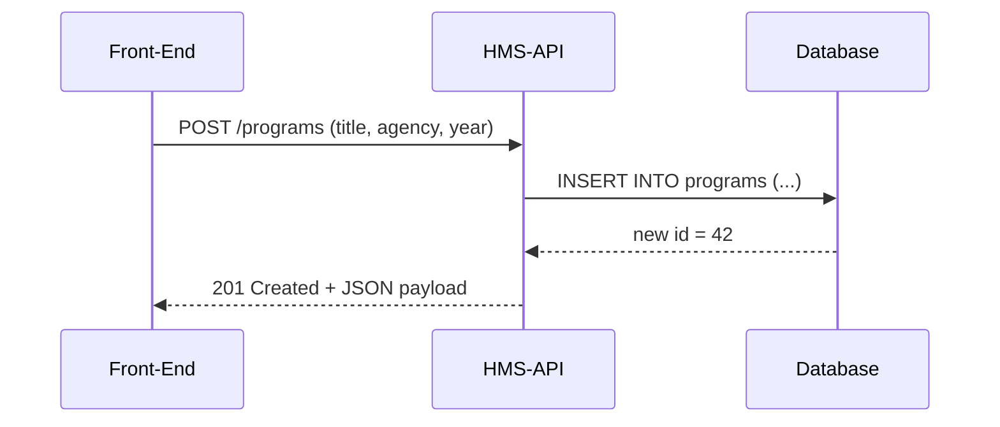
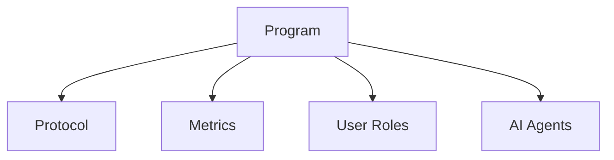

# Chapter 1: Program (Policy Container)

Welcome!  
Before we talk to databases, APIs, or AI agents, we need an anchor object that **everything else can hang off of**.  
In HMS-API that anchor is called a **Program**.

---

## 1. Why “Program”?

Think of a Program as a government filing cabinet:

* The cabinet has a label – e.g. “FY 2024 Veterans Housing Subsidy”.  
* Inside are folders (forms, budgets, workflows, metrics…).  
* Everyone knows: “If it belongs to this initiative, drop it in that cabinet.”

Without the cabinet, documents would wander around the office, and nobody could find anything!

---

## 2. Real-Life Story: The Veterans Housing Subsidy

Imagine the Department of Housing and Urban Development (HUD) launches a subsidy to help veterans pay rent.

1. **Program**  
   Title: “Veterans Housing Subsidy”  
   Governing agency: HUD  
   Budget year: 2024

2. **Things that will later live _inside_ the Program**  
   • Eligibility protocol  
   • Payment workflow  
   • Monthly compliance metrics  

Our job in this chapter is only the first step: **create the cabinet**.

---

## 3. Key Vocabulary

| Word                 | Plain-English meaning                                   |
|----------------------|---------------------------------------------------------|
| Program ID           | A unique number stamped on the cabinet.                 |
| Title                | The cabinet’s label.                                    |
| Agency               | Which federal board, office, or city hall owns it.      |
| Budget Year          | Fiscal window the cabinet is valid for.                 |
| Protocol             | A “recipe” folder inside the cabinet. (See next chapter)|

---

## 4. Hands-On: Creating Your First Program

We will call HMS-API (the backend gateway) to store our cabinet.  
In practice you may hit a REST endpoint, but for learning we’ll use a **super-tiny PHP sketch**.

```php
<?php
use App\Models\Core\Program\Program;

// 1. Create a blank cabinet
$program = new Program();

// 2. Fill in the label and metadata
$program->title  = 'Veterans Housing Subsidy';
$program->agency = 'HUD';
$program->year   = 2024;

// 3. Save it (pretend this writes to the DB)
$program->save();

echo "Created Program #{$program->id}";
```

Explanation line-by-line:

1. We pull in the `Program` class from the HMS-API codebase.  
2. We add real-world metadata.  
3. `save()` would call HMS-API’s persistence layer.  
4. We print the ID so later code can reference this cabinet.

---

### What Does HMS-API Return?

```json
{
  "id": 42,
  "title": "Veterans Housing Subsidy",
  "agency": "HUD",
  "year": 2024
}
```

Now other services (metrics, AI agents, etc.) will use `program_id = 42` to file their data.

---

## 5. Behind the Scenes – How Does It Work?

#### High-Level Flow



Plain words:

1. A client app sends program details to HMS-API.  
2. HMS-API inserts a row into the `programs` table.  
3. The database returns a primary key (`42`).  
4. The API responds with a confirmation payload.

---

#### Mini Peek at the Model (app/Models/Core/Program/Program.php)

```php
class Program {
    protected $attributes = [];   // title, agency, year…

    public function protocols() {
        // Later: $program->protocols() will fetch recipes.
    }
}
```

The model is intentionally thin:

* `$attributes` stores column values.  
* `protocols()` defines a **relationship** – “give me all recipes in this cabinet.”  
  (We will explore this relation in [Protocol (Process Blueprint)](02_protocol__process_blueprint__.md)).

---

## 6. Common Operations

### a) Update the Cabinet Label

```php
$program = Program::find(42);
$program->title = 'Veterans Rental Assistance';
$program->save();
```

### b) List All Programs for an Agency

```php
$programs = Program::where('agency', 'HUD')->get();
```

Returns an array of cabinets belonging to HUD.

### c) Delete a Program (Careful!)

```php
Program::destroy(42); // Removes cabinet & its folders
```

Most agencies disable hard deletes in production and use **archiving** instead.

---

## 7. Where Programs Fit in the Bigger Picture


Everything radiates out from Program.  
Without a Program ID, downstream components would have no context.

---

## 8. Recap

You can now:

1. Explain what a **Program** is (a master filing cabinet).  
2. Create, read, update, and delete Program records via HMS-API.  
3. Understand the basic flow between client, API, and database.

Next we’ll open the first folder inside the cabinet: the **Protocol**, a step-by-step recipe for handling requests.

Continue to: [Protocol (Process Blueprint)](02_protocol__process_blueprint__.md)

---

Generated by [AI Codebase Knowledge Builder](https://github.com/The-Pocket/Tutorial-Codebase-Knowledge)