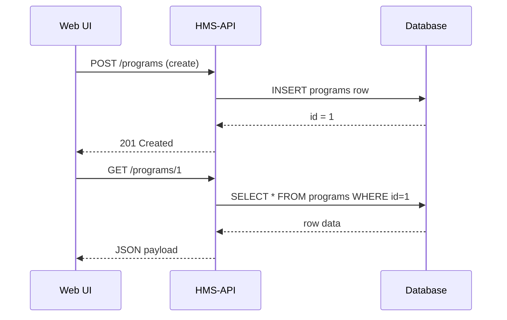
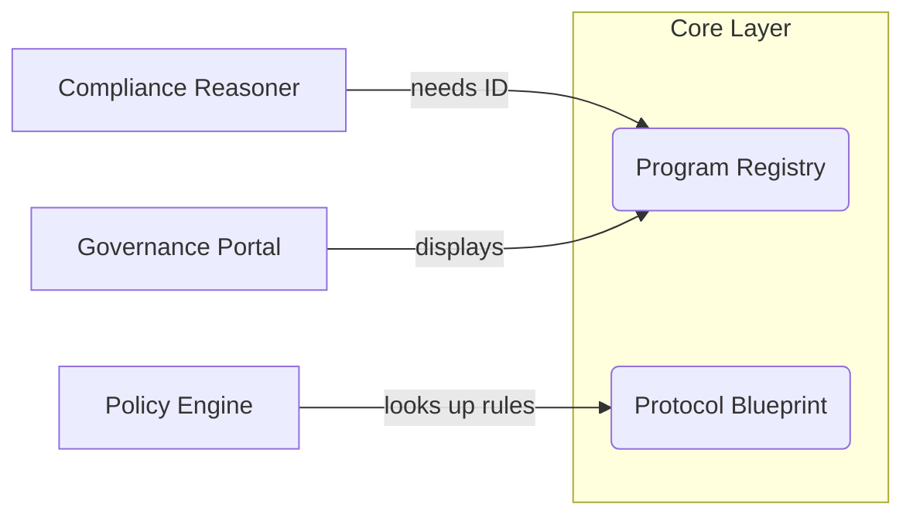

# Chapter 1: Program Registry (Program Model)

> “Where is the single source of truth for **Medicare**, the **School-Lunch Grant**, or the **Wildfire Relief Fund**?”  
> In HMS-API, the answer is the **Program Registry**.

---

## 1. Why Does a “Program” Matter?

Imagine the Governor’s office phones your team:

> “We just updated the COVID-19 Response budget.  
> Which rules, forms, and reports must be refreshed?”

If every document lived in a random folder, you would chase links for hours.  
Instead, HMS-API gives you **one master folder per government initiative**—the **Program**. Updating that folder instantly tells connected services what changed.

### Real-world use case

1. A citizen submits a *COVID Small-Business Grant* application.  
2. The Program Registry tags the submission as belonging to **`COVID-19 Response`**.  
3. Downstream services (policy engine, compliance checks, dashboards) look up everything they need with that single key.

---

## 2. Key Concepts (Plain English)

| Term | Think of it as… | Why you care |
|------|-----------------|--------------|
| Program | The master folder / record for a government initiative | All data hangs off it |
| Protocol | A rulebook, form, or procedure that belongs to a Program | One Program can have many Protocols (covered in [Protocol Blueprint (Protocol Model)](02_protocol_blueprint__protocol_model__.md)) |
| Metadata | Sticky notes on the folder: title, owner agency, fiscal year, status, etc. | Lets dashboards and reports classify the Program |

---

## 3. Creating Your First Program

Below is the smallest possible example.

```php
use App\Models\Core\Program\Program;

// 1. Create a new Program record
$program = new Program();
$program->title = 'COVID-19 Response';
$program->owner_agency = 'U.S. Department of Health';
$program->fiscal_year = 2024;
$program->save();        // writes to DB

// 2. Later: fetch it by ID
$program = Program::find(1);
echo $program->title;    // "COVID-19 Response"
```

Explanation:

1. We instantiate `Program`, fill out a few attributes, and `save()`.
2. Any micro-service can now fetch the same Program by its ID (`1`).

---

## 4. Attaching Protocols (Sneak Peek)

```php
// assume $program is already retrieved
$program->protocols()->create([
    'name' => 'Small Business Grant Form 42',
]);
```

This links a brand-new **Protocol** to **COVID-19 Response**.  
(Full details in the next chapter.)

---

## 5. What Happens Under the Hood?

Let’s trace a simplified save-and-fetch cycle.



Key points:

1. **Program.php** acts as the ORM (Object-Relational Mapping) layer.  
2. Other services never see raw tables; they reference the Program model directly.

---

## 6. Quick Look at the Model File

_Path: `app/Models/Core/Program/Program.php`_

```php
namespace App\Models\Core\Program;

class Program extends Model  // extends Laravel's base Model
{
    // (1) Mass-assignable attributes
    protected $fillable = ['title', 'owner_agency', 'fiscal_year'];

    // (2) One-to-Many: Program → Protocols
    public function protocols()
    {
        return $this->hasMany(
            \App\Models\Core\Protocol\Protocol::class
        );
    }
}
```

• `fillable` tells Laravel which columns we can set in bulk.  
• `protocols()` defines the relationship used earlier.

---

## 7. Government Analogy Cheat-Sheet

• Program = A three-ring binder labeled “Medicare” in a federal archive.  
• Protocols = The individual documents inside: benefit schedule, claim form, audit checklist.  
• `id` column = The barcode sticker on the binder—scan it and you get everything.

---

## 8. Hands-On Exercise

1. Spin up a local MySQL or SQLite database.  
2. Run migrations (`php artisan migrate`).  
3. Copy the “Creating Your First Program” code into `tinker` or a simple route.  
4. Verify a `programs` row is created.  
5. Add two fake protocols.  
6. Query `Program::with('protocols')->find(1)` and see the nested JSON.

---

## 9. Where Does the Program Registry Fit in the Big Picture?



Everything orbits around the Program ID.

---

## 10. Summary & What’s Next

You now know:

• Why the **Program Registry** is the cornerstone of HMS-API.  
• How to create, fetch, and relate Programs to other data.  
• The basic internals of `Program.php`.

Ready to dive into the rulebooks stored inside each Program?  
Continue to [Protocol Blueprint (Protocol Model)](02_protocol_blueprint__protocol_model__.md) where we turn folders into actionable procedures.

---

Generated by [AI Codebase Knowledge Builder](https://github.com/The-Pocket/Tutorial-Codebase-Knowledge)