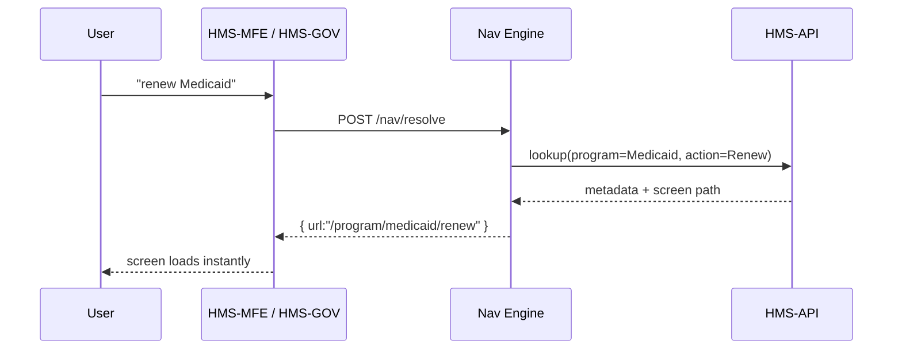

# Chapter 2: Intent-Driven Navigation Engine


*From clicks to plain-English requests*

---

[⬅︎ Back to Chapter&nbsp;1](01_frontend_interface_shells__hms_mfe___hms_gov__.md)

## 1. Why do we need an “Intent” engine?

Picture Clara, a park-loving mom who just moved to Phoenix. She lands on **AZHealth.gov** and types:  

> “I want to renew Medicaid for my kids”

Meanwhile, Officer Patel in the state capitol logs into the staff portal and types:  

> “increase income cap for CHIP”

In most government sites both users would now play **Menu Bingo**:
1. Scan endless sidebars
2. Guess which form hides the right action
3. Rage-click “Back” when wrong

The **Intent-Driven Navigation Engine** (IDNE) lets them simply **say what they want**. The engine:

1. Reads natural language with a light NLP model  
2. Maps the phrase to a *Program* (e.g., “Medicaid”) and a *Protocol* (e.g., “Renewal”)  
3. Sends the browser— or an AI agent— straight to the correct screen in HMS-MFE or HMS-GOV  

It works like a municipal *311* call center that hears “pothole” and instantly opens the right work order.

---

## 2. Key ideas in plain words

| Term | What it means | Analogy |
|------|---------------|---------|
| Intent | A short sentence that captures what the user wants (“renew Medicaid”) | The subject of an email |
| Entity | A specific item inside the intent (“Medicaid”, “income cap”) | The recipient in the email |
| Router | Little brain that converts `(intent, entity)` → URL | GPS turning “take me home” into directions |
| Confidence | How sure the model is (0-100 %) | Weather forecast probability |

---

## 3. Your first “I want to…” box

The citizen and staff shells share the same React component. Under 20 lines!

```tsx
// src/common/IntentBox.tsx
import { useState } from 'react';

export function IntentBox({ onNavigate }: { onNavigate: (url: string) => void }) {
  const [text, setText] = useState('');

  async function handleSubmit(e: React.FormEvent) {
    e.preventDefault();
    const res = await fetch('/nav/resolve', {
      method: 'POST',
      body: JSON.stringify({ text })
    });
    const { url } = await res.json();
    onNavigate(url);         // e.g., "/program/medicaid/renew"
  }

  return (
    <form onSubmit={handleSubmit}>
      <input
        placeholder="I want to..."
        value={text}
        onChange={e => setText(e.target.value)}
        aria-label="Intent search"
      />
    </form>
  );
}
```

Explanation  
1. User types a phrase and presses Enter.  
2. The component calls `/nav/resolve`.  
3. The backend returns a friendly URL.  
4. `onNavigate` (passed in by MFE/GOV) performs `history.push(url)`.

---

## 4. What happens under the hood?



*Note:* The Intent Engine itself is a **thin service**; heavy data about Programs/Protocols lives in the upcoming [Backend API Layer](03_backend_api_layer__hms_api__.md).

---

## 5. Inside the Navigation Engine

### 5.1 Minimal classifier (rules + fallback ML)

```ts
// services/classify.ts
export function classify(text: string) {
  const rules = [
    { match: /renew\s+medicaid/i, program: 'medicaid', action: 'renew' },
    { match: /raise\s+benefit\s+cap/i, program: 'chip', action: 'updateCap' },
  ];

  const rule = rules.find(r => r.match.test(text));
  if (rule) return { ...rule, confidence: 0.9 };

  // fallback to a tiny ML model (pseudo)
  return mlModel.predict(text); // { program, action, confidence }
}
```

Explanation  
• Start beginners with *regex rules*—easy to read and edit.  
• Anything unmatched is sent to a tiny model (maybe an open-source BERT-lite).  
• Returns the best guess plus confidence.

### 5.2 Router table

```ts
// services/route.ts
const table = {
  medicaid: {
    renew: '/program/medicaid/renew'
  },
  chip: {
    updateCap: '/program/chip/benefit-cap'
  }
};

export function route(p: string, a: string) {
  return table[p]?.[a] || '/search?query=' + a;
}
```

### 5.3 Putting it together

```ts
// api/nav.ts
import { classify } from './classify';
import { route } from './route';

export function resolve(text: string) {
  const { program, action, confidence } = classify(text);
  if (confidence < 0.5) return { url: `/search?query=${encodeURIComponent(text)}` };
  return { url: route(program, action) };
}
```

All three files are ≈ 40 lines total—small enough for beginners to grasp.

---

## 6. Handling “I’m not sure” cases

1. **Low confidence (< 50 %)** → fallback to plain keyword search results.  
2. **Multiple matches (tie)** → show disambiguation (“Did you mean Medicaid Renewal or SNAP Recertification?”).  
3. **Zero matches** → log the phrase to improve rules later.

Government staff can review these logs in HMS-GOV under *Intent Analytics*.

---

## 7. Testing the flow locally

```bash
# Start only the Nav Engine mock
node mock-nav-server.js &

# Start the citizen shell
npm run dev:mfe
```

Open `localhost:3000`, type “renew Medicaid”, and watch the address bar jump to `/program/medicaid/renew`.

Try “get national park pass” — you should land on a **search page** because we have no rule yet. Add one and watch confidence shoot up!

---

## 8. Common pitfalls & tips

| Pitfall | Avoid it by |
|---------|-------------|
| Hard-coding every phrase | Use wildcards like `/renew\s+(.*)/i` or ML fallback |
| Ignoring staff intents | Same engine serves **both** shells; never fork rules |
| Mystery redirects | Log `(text, intent, url, confidence)` to a dashboard |
| Out-of-date routes | Pull Program/Protocol paths live from [HMS-API](03_backend_api_layer__hms_api__.md) |

---

## 9. Summary & what’s next

You learned:

✓ Why “I want to…” beats menu diving  
✓ Core pieces: classifier, router, confidence handling  
✓ Tiny code samples you can run today  
✓ How the engine plugs into both HMS-MFE and HMS-GOV

Next we’ll open the **HMS-API** itself—the single source of truth for Programs, Protocols, and everything the Nav Engine looks up.

[Continue to Chapter&nbsp;3: Backend API Layer (HMS-API)](03_backend_api_layer__hms_api__.md)

---

Generated by [AI Codebase Knowledge Builder](https://github.com/The-Pocket/Tutorial-Codebase-Knowledge)