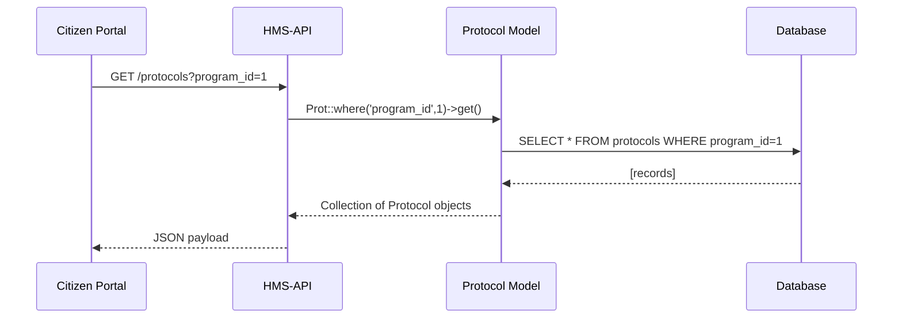
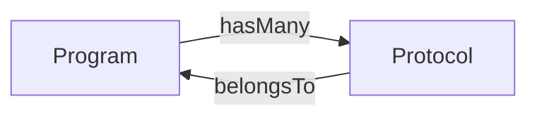

# Chapter 2: Protocol Model (Core/Protocol)

In [Chapter 1: Program Model (Core/Program)](01_program_model__core_program__.md), we saw how a **Program** holds details about a government initiative (like the “Barry Goldwater Scholarship Program”). Now, let’s look at the **Protocol** model—the rulebook that defines _how_ each program actually runs.

---

## Why a Protocol Model?

Imagine you run a scholarship program. You need to spell out every step:
1. Submit an application  
2. Verify eligibility  
3. Conduct committee review  
4. Notify winners  

These steps, policies, and decision rules form a **Protocol**. By encoding them in a model, your system can display workflows, enforce rules, or automate notifications.

**Central Use Case**  
> A citizen portal asks: “Show me the review steps for the Barry Goldwater Scholarship.”  
1. Portal calls HMS-API: `GET /protocols?program_id=1`  
2. HMS-API loads all Protocol records for Program #1  
3. Returns a JSON array of steps and metadata  

---

## Core Concepts

1. **Attributes**  
   - `name`: a short title (e.g., “Application Review”)  
   - `description`: details or notes about the workflow  
   - `program_id`: back-link to the parent Program  
   - `steps`: an ordered list of actions (stored as JSON)  

2. **Relationships**  
   - Each Protocol **belongs to** one Program ([see Program Model](01_program_model__core_program__.md)).  

3. **Workflows & Policies**  
   - The `steps` array encodes the official procedure (e.g., who approves, time limits).  

---

## Quick Start: Loading a Protocol

Here’s how to fetch a single protocol by its ID:

```php
use App\Models\Core\Protocol\Protocol;

// Fetch Protocol #1
$protocol = Protocol::find(1);

// Inspect basic fields
echo $protocol->attributes['name'];
// → "Scholarship Application Review"

// Show the workflow steps
print_r($protocol->attributes['steps']);
// → ["Submit Application", "Initial Screening", "Committee Review", "Final Decision"]
```

*Explanation:*  
- `Protocol::find(1)` returns a Protocol object with all its attributes.  
- We read `name` and `steps` directly from the `$attributes` array.

---

## Fetching All Protocols for a Program

Since a Program can have many Protocols, you can do this:

```php
use App\Models\Core\Program\Program;

// Load Program #1
$program = Program::find(1);

// Get its Protocols
$protocols = $program->protocols();

// List each protocol name
foreach ($protocols as $p) {
    echo "- " . $p->attributes['name'] . "\n";
}
```

*Explanation:*  
- `$program->protocols()` returns an array of Protocol objects.  
- We loop through to display each workflow’s title.

---

## Under the Hood: Request Flow

When your front-end asks for protocols, here’s a simplified sequence:



---

## Inside the Protocol Model

Let’s peek at the code in `app/Models/Core/Protocol/Protocol.php`:

```php
<?php
namespace App\Models\Core\Protocol;

class Protocol {
    // Holds all fields: id, name, description, program_id, steps, etc.
    protected $attributes = [];

    // Link back to the Program model
    public function program() {
        return $this->belongsTo(
            \App\Models\Core\Program\Program::class,
            'program_id'
        );
    }
}
```

*Explanation:*  
- `$attributes` stores every column from the `protocols` table.  
- `program()` defines the inverse of the Program→Protocol relationship.

---

## Visualizing Program ↔ Protocol



One Program can have many Protocols, each defining a part of the official rulebook.

---

## Step-by-Step: What Happens When You Fetch Protocols

1. **HTTP Request**  
   Browser calls `GET /protocols?program_id=1`.  
2. **Router & Controller**  
   HMS-API routes the call to a controller method.  
3. **Model Query**  
   Controller invokes `Protocol::where('program_id',1)->get()`.  
4. **Database Query**  
   A SQL `SELECT *` fetches matching rows.  
5. **Response**  
   HMS-API wraps the Protocol objects into JSON and returns them to the portal.

---

## Conclusion

In this chapter you learned:

- **What** a Protocol model is: the rulebook/workflow for a Program.  
- **How** to load protocols by ID or by Program.  
- **What’s under the hood**: attributes, relationships, and the query flow.

Up next, we’ll see how these models power the actual HTTP endpoints in HMS-API.  
[Next Chapter: Backend API (HMS-API / HMS-MKT)](03_backend_api__hms_api___hms_mkt__.md)

---

Generated by [AI Codebase Knowledge Builder](https://github.com/The-Pocket/Tutorial-Codebase-Knowledge)