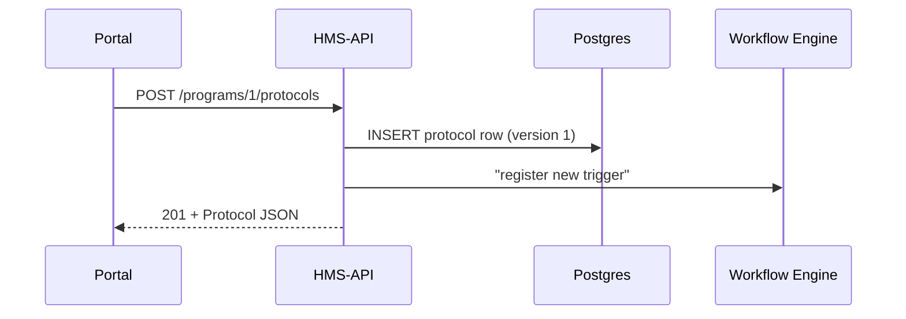

# Chapter 2: Protocol Model (Execution Playbook)

*(Jumped in from [Chapter 1 – Program Model (Core Service Catalogue)](01_program_model__core_service_catalogue__.md))*  

---

## 1 — Why Do We Need a Protocol Model?

Picture HUD’s “Affordable Housing 2030” program again.  
Creating the folder (the *Program*) was easy, but **citizens still need apartments inspected**:

1. A lead-paint checklist must be filled out.  
2. A wage-compliance form goes to the Department of Labor.  
3. When anything fails, CISA wants a cybersecurity self-assessment before payments flow.

Those three bullet points are *not* new programs; they are **instructions**—a *playbook* the system must follow every single time a unit is inspected.  
That playbook lives in HMS-API as a **Protocol**.

> Analogy:  
> • Program  =  “We will build houses.”  
> • Protocol = “Step 1: File a building permit ➜ Step 2: Pass a lead-paint test ➜ …”

---

## 2 — Core Ideas in Plain English

| Idea                | Think of it as…                                     |
|---------------------|-----------------------------------------------------|
| Protocol ID         | The binder label on the office shelf                |
| Steps               | Pages inside the binder (checklists, forms, API calls) |
| Trigger             | “When to open the binder?” (e.g., **on program > status = ‘Inspection’**) |
| Artifacts           | Documents produced (PDFs, CSV uploads, etc.)        |
| Version             | Federal Register notice number of the binder        |
| Owner Agency        | Who is allowed to edit (HUD, CISA, ODNI, …)         |

Keeping the **Protocol** separate from the **Program** means:

* Policy makers get an audit trail of *how* rules changed.
* Developers can automatically fire new workflows when a protocol’s version bumps.

---

## 3 — Quick 60-Second Code Tour

Let’s add a **“Lead-Paint Inspection”** protocol to our *Affordable Housing 2030* program.

```php
// routes/web.php  (<= 20 lines)
Route::post('/programs/{id}/protocols', function ($id) {
    $protocol = \App\Models\Core\Program\Program::findOrFail($id)
        ->protocols()
        ->create([
            'name'        => 'Lead-Paint Inspection',
            'trigger'     => 'unit.status == "ReadyForInspection"',
            'steps'       => json_encode([
                '1. Download HUD-9250 form',
                '2. Upload certified lab results',
                '3. Notify Local Housing Agency'
            ]),
            'owner_agency'=> 'HUD',
        ]);
    return $protocol;
});
```

What happens?

1. The route locates Program #1.  
2. It creates a new row in `protocols` with the JSON steps.  
3. JSON for the fresh protocol is returned to the caller.  

Sample response:

```json
{
  "id": 7,
  "name": "Lead-Paint Inspection",
  "version": 1,
  "trigger": "unit.status == \"ReadyForInspection\""
}
```

---

## 4 — Editing a Protocol (Versioning in Action)

Suppose EPA now requires a *mold* test in step 2. Updating looks the same:

```php
$protocol = Protocol::find(7);
$protocol->steps = json_encode([
    '1. Download HUD-9250 form',
    '2. Collect mold + lead lab results', // new text!
    '3. Notify Local Housing Agency'
]);
$protocol->save();          // version auto-increments to 2
```

Why it matters: downstream services see `version=2` and instantly know to run the new checklist.

---

## 5 — How Does This Work Under the Hood?



* **UI** – the micro-front-end a case worker uses.  
* **API** – Laravel controller shown above.  
* **WF** – small service that wakes up whenever a trigger expression turns true.

---

## 6 — Inside `Protocol.php`

```php
<?php
// app/Models/Core/Protocol/Protocol.php
namespace App\Models\Core\Protocol;
use Illuminate\Database\Eloquent\Model;

class Protocol extends Model
{
    protected $fillable = ['name','trigger','steps','owner_agency'];

    // bump version on every update
    protected static function booted()
    {
        static::updating(fn($p) => $p->version++);
    }

    public function program()
    {
        return $this->belongsTo(\App\Models\Core\Program\Program::class);
    }
}
```

Explanation (line-by-line):

1. `$fillable` lets us mass-assign friendly columns.  
2. `booted()` adds **automatic versioning**—no manual counter juggling.  
3. `program()` links the binder back to its folder.

---

## 7 — Triggering Workflows

The `trigger` field is a tiny expression language:

* `"unit.status == 'ReadyForInspection'"`  
* `"budget.amount > 5000000"`  
* `"application.type == 'Grant' && agency == 'CISA'"`

When the Workflow Engine detects one of these, it **replays the steps** list. Steps can point to:

* URLs of external APIs  
* Internal service calls (e.g., HMS-ACH to freeze funds)  
* Human review tasks (sent to the [Human-In-the-Loop Override](15_human_in_the_loop__hitl__override_.md))

---

## 8 — Government Analogy Cheat-Sheet

Protocol Model            | Real-World Counterpart
--------------------------|------------------------
`Protocol` row            | Official Standard Operating Procedure (SOP) binder
`trigger`                 | “Open this binder when form XYZ arrives”
`steps`                   | Pages inside the SOP
`version`                 | Federal Register revision number
`owner_agency`            | Seal on the binder (“Only HUD may edit”)

---

## 9 — Common Pitfalls for Beginners

1. **Hard-coding IDs**  
   Always fetch by name or slug; protocol IDs change in staging vs prod.
2. **Ignoring Version Bumps**  
   Clients should cache *protocol-id + version*.  
   A changed version means *re-fetch the steps*.
3. **Over-complex Triggers**  
   Keep triggers short; if logic grows, move it to the [Governance Layer](03_governance_layer__hms_sys___hms_cdf__.md).

---

## 10 — Mini-Exercise

1. Create a program named “Municipal Broadband 2026”.  
2. Add a protocol called “Fiber Rollout Checklist” with steps “Order Fiber”, “Book Engineering Team”.  
3. Update the protocol to add “CISA Cyber Assessment”.  
4. Verify the `version` jumped from 1 to 2.

Hint: copy-paste the snippets above and tweak the values.

---

## 11 — Recap & What’s Next

You now know how to:

* Attach **Protocols** (execution playbooks) to a **Program** record.
* Auto-version them for perfect audit trails.
* Define triggers so other services fire the right tasks at the right time.

Next we’ll look at who **approves** those protocol changes and how the *law-tech handshake* is enforced in the platform—read on to [Governance Layer (HMS-SYS → HMS-CDF)](03_governance_layer__hms_sys___hms_cdf__.md).

---

Generated by [AI Codebase Knowledge Builder](https://github.com/The-Pocket/Tutorial-Codebase-Knowledge)