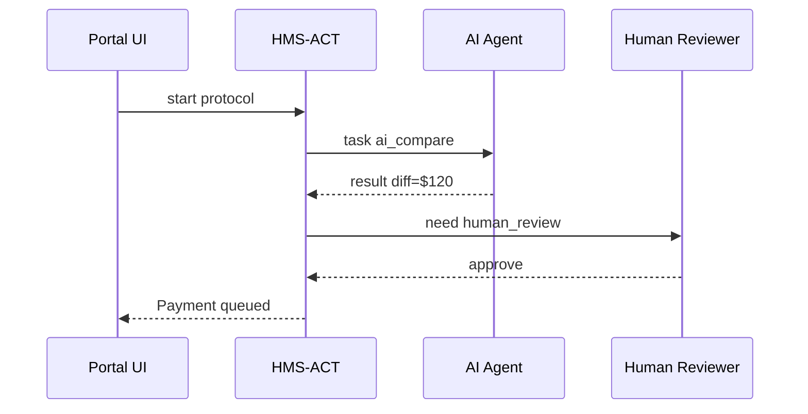
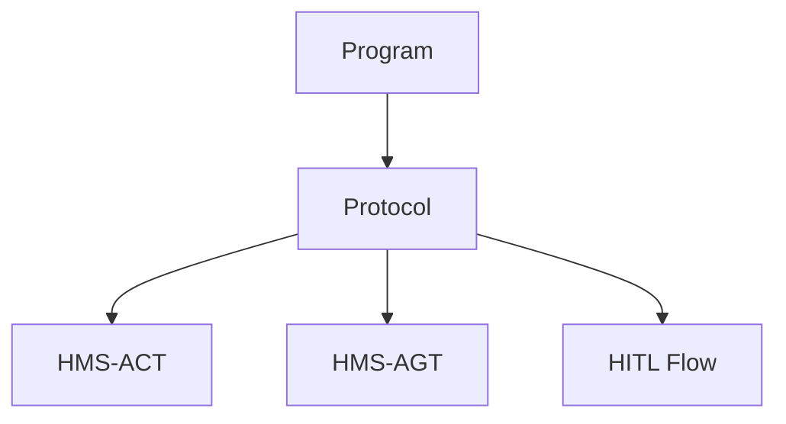

# Chapter 2: Protocol (Process Blueprint)


*(If you just arrived, skim [Chapter 1: Program (Policy Container)](01_program__policy_container__.md) first—Protocols always live **inside** a Program.)*

---

## 1. Motivation – “How exactly do we do this?”

Creating the filing cabinet (the Program) was great, but the moment a citizen clicks **“Apply for Veterans Housing Subsidy”** everyone asks:

1. Which form appears first?  
2. Who validates the form?  
3. What happens if income data looks suspicious?  
4. How long before payment is released?  

A **Protocol** answers every one of those questions—step-by-step, with no guesswork.  
Think **TSA security checkpoint**: remove shoes ➜ X-ray bags ➜ random swab ➜ clear to gate.  
The shoes, the X-ray, even the random swab odds are written in a Standard Operating Procedure.  
Our Protocol is the digital SOP for a Program action.

---

## 2. Real-Life Story: “Rent Payment Request” Protocol

Continuing the HUD example:

1. Veteran submits rent invoice.  
2. HMS-API validates required fields.  
3. AI agent compares invoice to lease on file.  
4. If difference > \$100, human reviewer at HUD is pinged.  
5. On approval, Treasury API is called.  
6. Log the payment & email the veteran.

That checklist **is** the Protocol.  
If later we shorten step 4 (AI auto-approves up to \$250 difference), we changed the Protocol—not the Program.

---

## 3. Key Vocabulary

| Word            | Plain English                                    |
|-----------------|--------------------------------------------------|
| Protocol ID     | Unique number for the recipe.                    |
| Program ID      | Cabinet the recipe lives in (see Chapter 1).     |
| Task            | Single action (e.g., “validate form”).           |
| Decision Point  | IF/ELSE logic (e.g., amount > \$100?).           |
| Escalation Rule | Who gets notified when something looks wrong.    |
| Form Schema     | JSON that describes required applicant fields.   |

---

## 4. Hands-On: Create Your First Protocol

We will attach one recipe to Program #42 (“Veterans Housing Subsidy”).

```php
<?php
use App\Models\Core\Protocol\Protocol;

// 1. Grab the cabinet
$programId = 42;

// 2. Draft the recipe
$proto = new Protocol();
$proto->program_id = $programId;
$proto->name       = 'Rent Payment Request';
$proto->version    = '1.0';
$proto->definition = [
    'tasks' => [
        ['id'=>'collect_form', 'type'=>'form', 'schema'=>'rent_invoice_v1.json'],
        ['id'=>'ai_compare',   'type'=>'ai',   'agent'=>'agt_invoice_compare'],
        ['id'=>'human_review', 'type'=>'hitl', 'role'=>'HUD Reviewer']
    ],
    'decisions' => [
        ['if'=>'diff>100', 'go'=>'human_review', 'else'=>'approve']
    ],
    'escalations' => [
        ['on'=>'timeout>48h', 'notify'=>'Supervisor']
    ]
]; // real code would JSON-encode
$proto->save();

echo "Protocol #{$proto->id} saved!";
```

Explanation (in plain words):

1. Fetch the **Program** the recipe belongs to.  
2. Fill in a friendly name, a version, and a **definition** array that lists tasks, decisions, and escalation rules.  
3. `save()` stores everything through HMS-API’s database layer.  

Sample response:

```json
{
  "id": 7,
  "program_id": 42,
  "name": "Rent Payment Request",
  "version": "1.0"
}
```

That’s all! We now have a living SOP that other engines can consult.

---

## 5. How Will This Protocol Run Later?

We won’t run it in this chapter, but sneak a peek:



• HMS-ACT (covered in [Agent Action Orchestration](07_agent_action_orchestration__hms_act__.md)) looks up the **definition** we just saved.  
• Decisions and escalations are enforced exactly as written—nothing ad-hoc.

---

## 6. Internal Implementation (Quick Tour)

Folder layout (trimmed):

```
app/
└─ Models/
   └─ Core/
      └─ Protocol/
         ├─ Protocol.php   # ActiveRecord model
         └─ Steps/         # Tiny classes: FormTask.php, AiTask.php…
```

Open `Protocol.php` (only the juicy parts):

```php
class Protocol extends Model
{
    protected $table = 'protocols';
    protected $casts = [
        'definition' => 'array', // auto JSON⇄PHP conversion
    ];

    /* Relationship back to cabinet */
    public function program() {
        return $this->belongsTo(
            \App\Models\Core\Program\Program::class
        );
    }
}
```

Why `casts['definition' => 'array']`?  
It lets us treat a JSON column like a normal PHP array—no manual parsing.

---

### What Happens on `save()`?

1. Laravel (or your ORM) wraps the array into JSON.  
2. Executes `INSERT INTO protocols (…)`.  
3. Database returns the new `id`.  
4. Model now holds `id = 7`.  

That’s it—only one table!  
Downstream services (HMS-ACT, HMS-AGT, etc.) query this table to know *what* to do.

---

## 7. Common Operations

### a) List all Protocols for a Program

```php
$protocols = Protocol::where('program_id', 42)->get();
```

### b) Upgrade Protocol Version

```php
$proto = Protocol::find(7);
$proto->version = '1.1';
$proto->definition['decisions'][0]['if'] = 'diff>250';
$proto->save();
```

Now AI can auto-approve invoices up to \$250—optimization achieved!

### c) Soft-Delete (Archive) a Protocol

```php
$proto->delete(); // uses Laravel's soft-delete; audit log kept
```

---

## 8. Where Protocol Sits in the Bigger Picture



• **Program** = cabinet  
• **Protocol** = recipe inside  
• **HMS-ACT / Agents / HITL** = chefs following the recipe

---

## 9. Recap & Next Steps

You learned:

1. What a **Protocol** is and why it matters.  
2. How to create, update, and archive it via HMS-API.  
3. How other components will read the recipe to perform real work.  
4. That tweaking a Protocol (not the Program) is the lever for process optimization.

In the next chapter we’ll peek behind the curtain of the **API Gateway** that stores these Models and connects every service:  
[Backend API Gateway (HMS-API / HMS-SVC)](03_backend_api_gateway__hms_api___hms_svc__.md)

---

Generated by [AI Codebase Knowledge Builder](https://github.com/The-Pocket/Tutorial-Codebase-Knowledge)