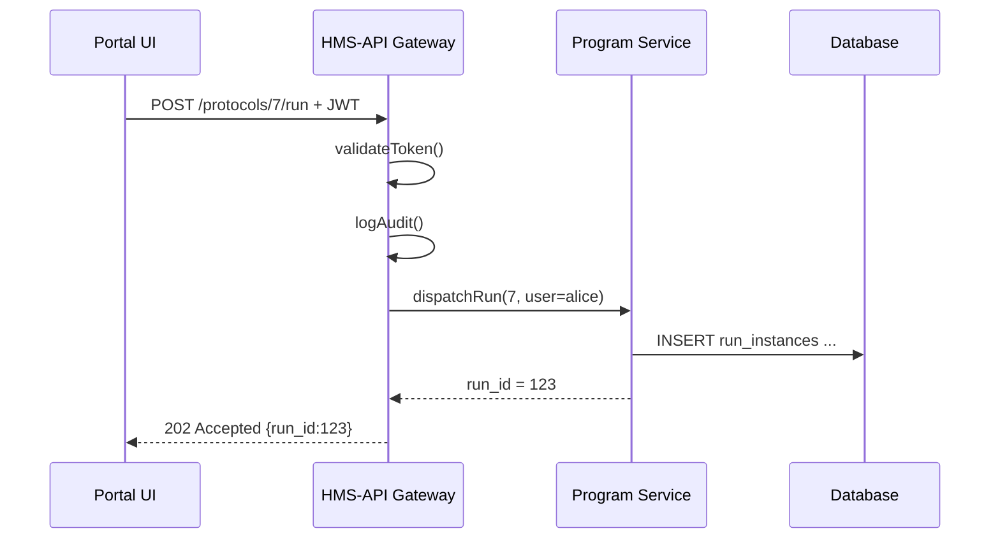

# Chapter 3: Backend API Gateway (HMS-API / HMS-SVC)


*(Coming from [Chapter 2: Protocol (Process Blueprint)](02_protocol__process_blueprint__.md)? Great—now you’ll see **where** those Programs and Protocols actually live and who guards the front door!)*

---

## 1. Why Do We Need a Gateway?

Imagine the Department of Housing and Urban Development (HUD) just published the **“Veterans Housing Subsidy”** Program.  
Within minutes:

* A citizen portal wants to **submit an application**.  
* An AI agent needs to **validate income**.  
* An internal HUD dashboard wishes to **update budget numbers**.

If every caller talked straight to the database, chaos would follow:

* No single place to verify security tokens.  
* No audit trail showing *who* changed *what*.  
* No consistent way to turn “approve invoice” into the right SQL `UPDATE`.

**HMS-API**, also nick-named **HMS-SVC**, is that single, consistent, and secure doorway.

> Analogy: Think of a courthouse clerk’s window. Whether you’re a lawyer, a judge, or a citizen, every filing is handed to **one** clerk first. The clerk checks ID, stamps the paper, and then places it in the right file.  
> HMS-API is that clerk for our Programs and Protocols.

---

## 2. Core Responsibilities (Clerk’s Checklist)

| # | Gateway Job | Plain-English Role |
|---|-------------|--------------------|
| 1 | **Authenticate** | “Show me your badge.” Verify JWT or OAuth tokens. |
| 2 | **Authorize** | “Are you allowed at this counter?” Check roles & scopes. |
| 3 | **Audit-Log** | Stamp every request with who/when/what. |
| 4 | **Translate Intents** | Turn high-level verbs (e.g., `PATCH /program/42/actions/close`) into low-level CRUD on multiple tables. |
| 5 | **Rate-Limit & Version** | Prevent flood attacks and keep old apps working after upgrades. |

Keep these five in mind—every code sample below touches at least one.

---

## 3. A Day in the Life — Walkthrough Example

### Use Case: “Submit Rent Invoice”

1. **Portal Front-End** gathers the form.  
2. Front-End sends `POST /programs/42/protocols/7/run` to HMS-API with a JWT.  
3. HMS-API:
   * Verifies the token is from an allowed domain.  
   * Logs “user = alice@veteran.gov ran protocol #7”.  
   * Expands “run protocol” into two DB inserts and a queue message for HMS-ACT.  
4. Returns `202 Accepted` so the portal can show “Your request is being processed”.

### Tiny Client Code (18 lines)

```javascript
// portal-submit.js
async function submitInvoice(data, jwt) {
  const res = await fetch(
    'https://api.hms.gov/programs/42/protocols/7/run',
    {
      method: 'POST',
      headers: {
        'Content-Type': 'application/json',
        'Authorization': `Bearer ${jwt}`
      },
      body: JSON.stringify(data)  // rent amount, leaseId, etc.
    }
  );
  return res.json(); // {run_id:123, status:"queued"}
}
```

*Line-by-line*  
1-4. Build the URL that represents **intent** (“run this protocol”).  
5-10. Add the JWT so the Gateway can authenticate Alice.  
11. Send the JSON payload.  
12. Gateway responds with a tiny receipt (`run_id`)—no DB details leaked!

---

## 4. Under the Hood — What Happens Inside HMS-API?



Breaking it down:

1. **validateToken** → Does the JWT signature match our public key?  
2. **logAudit** → Store “alice ran protocol 7” in `audit_logs`.  
3. **dispatchRun** → Service layer knows schemas and inserts into DB.  

Notice the Portal never touches the database directly and never sees private table names.

---

## 5. Key Building Blocks

### 5.1 Route Layer (Laravel-style)

```php
// routes/api.php
Route::middleware(['auth:api', 'audit'])
    ->post('/protocols/{id}/run', RunProtocolController::class);
```

*Explanation*  
* `auth:api` → verifies JWT (Job #1 + #2).  
* `audit` → logs request (Job #3).  
* Controller will handle Jobs #4-#5.

### 5.2 Controller Snippet

```php
class RunProtocolController
{
    public function __invoke($id, Request $req)
    {
        $run = ProtocolRunner::start($id, $req->user(), $req->all());
        return response(['run_id' => $run->id], 202);
    }
}
```

*Less than 10 lines!*  
Hands off real work to `ProtocolRunner`, then returns a clean receipt.

### 5.3 Service Class (Intent Translation)

```php
class ProtocolRunner
{
    public static function start($protoId, User $user, array $payload)
    {
        // Start DB transaction
        $run = RunInstance::create([
            'protocol_id' => $protoId,
            'user_id'     => $user->id,
            'payload'     => $payload
        ]);

        Queue::push(new ExecuteFirstTask($run->id));
        return $run; // object with id, status, etc.
    }
}
```

*Key Idea* — One high-level call (`start`) quietly performs:

1. A **CRUD** insert into `run_instances`.  
2. A **message** to a queue so [HMS-ACT](07_agent_action_orchestration__hms_act__.md) can continue.

---

## 6. Try It Yourself — Mini Lab

1. **Get a Token**  
   (Pretend) `curl https://auth.hms.gov/token -d "alice:password"` returns `eyJhbGciOi...`.

2. **List Programs**

```bash
curl -H "Authorization: Bearer eyJ..." \
     https://api.hms.gov/programs
```

Response (trimmed):

```json
[
  { "id": 42, "title": "Veterans Housing Subsidy" },
  ...
]
```

3. **Close a Program** (Intent Translation Showcase)

```bash
curl -X PATCH \
     -H "Authorization: Bearer eyJ..." \
     https://api.hms.gov/programs/42/actions/close
```

Even though no `programs.close` column exists, the Gateway:

* Marks `programs.status = 'closed'`.  
* Cascades close flag to active Protocols.  
* Logs “alice closed program 42”.

---

## 7. Security & Compliance Tips

* Use **short-lived JWTs** (15 min) + refresh tokens.  
* Enable **immutable audit logs** (Append-only).  
* Leverage **scoped tokens** → `scope:protocol.run` can’t edit budgets.  
* For public citizen apps, set **rate-limit = 5 req/s** to stop flood attacks.  

Think of these like courthouse metal detectors—most visitors are honest, but the detectors keep everyone safe.

---

## 8. Where the Gateway Sits in the HMS Universe

```mermaid
graph TD
    FE[Micro-Frontends<br/>(HMS-MFE)] --> GW[HMS-API Gateway]
    AGT[AI Agents<br/>(HMS-AGT)] ----> GW
    GOV[Governance Portal<br/>(HMS-GOV)] --> GW
    GW --> DTA[Central Data Repo<br/>(HMS-DTA)]
    GW --> ACT[Action Orchestration<br/>(HMS-ACT)]
```

No matter which component knocks—**all** enter through **GW**.

---

## 9. Recap

You now know:

1. The five core jobs of the **Backend API Gateway**.  
2. How a single “run protocol” request travels through authentication, audit, and intent translation.  
3. Basic route, controller, and service code that powers the flow.  
4. Security best-practices every public-sector API should follow.

Next we’ll switch to the **Governance Interface**—the friendly web portal policy makers use to tweak these Programs and Protocols:  
[Governance Interface (HMS-GOV Portal)](04_governance_interface__hms_gov_portal__.md)

---

Generated by [AI Codebase Knowledge Builder](https://github.com/The-Pocket/Tutorial-Codebase-Knowledge)