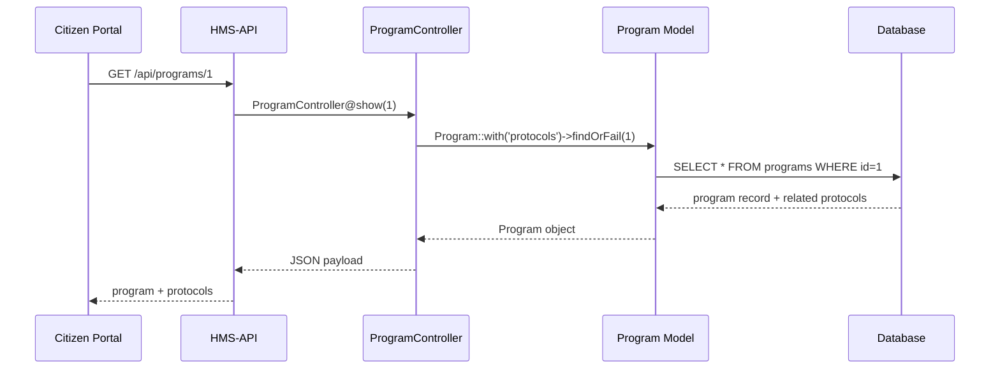

# Chapter 3: Backend API (HMS-API / HMS-MKT)

In [Chapter 2: Protocol Model (Core/Protocol)](02_protocol_model__core_protocol__.md), we saw how **Protocol** fits into our core data. Now let’s explore the **Backend API**—the plumbing that lets portals and external systems talk to those models.

---

## Why a Backend API?

Imagine the Commission on Presidential Scholars has a citizen-facing portal and a mobile app. Both need to:

1. List all scholarship **Programs**.  
2. Show each program’s **Protocols** (application steps, review rules).  
3. Let administrators **update** rules or deploy new policy changes.

The **Backend API (HMS-API / HMS-MKT)** provides a consistent, programmatic way to **create**, **read**, **update**, and **delete** core models like **Program** and **Protocol**, and to push policy updates live.

**Central Use Case**  
> A portal calls `GET /api/programs/1` to fetch program details and its protocols, then displays them to citizens.

---

## Key Concepts

1. **Routes**  
   Define HTTP endpoints (e.g., `GET /api/programs`, `POST /api/protocols`).

2. **Controllers**  
   Serve as translators: HTTP → Model calls → JSON response.

3. **Models**  
   Our familiar [Program](01_program_model__core_program__.md) and [Protocol](02_protocol_model__core_protocol__.md).

4. **Policy Deployment**  
   After updates, the API can trigger a notification or cache refresh so portals see new rules immediately.

---

## Quick Start: List Programs with Protocols

1. **Route** (routes/api.php)

   ```php
   // routes/api.php
   Route::get('programs', [ProgramController::class, 'index']);
   Route::get('programs/{id}', [ProgramController::class, 'show']);
   ```

2. **Controller** (app/Http/Controllers/ProgramController.php)

   ```php
   namespace App\Http\Controllers;
   use App\Models\Core\Program\Program;

   class ProgramController extends Controller {
       public function index() {
           // Load all programs with protocols
           $programs = Program::with('protocols')->get();
           return response()->json($programs);
       }

       public function show($id) {
           $program = Program::with('protocols')->findOrFail($id);
           return response()->json($program);
       }
   }
   ```

3. **Call the API**

   ```
   GET /api/programs
   → [
       { "id":1, "name":"Goldwater Scholarship", "protocols":[ … ] },
       { "id":2, "name":"Rural Broadband Grant", "protocols":[ … ] }
     ]
   ```

*Explanation:*  
- `Program::with('protocols')` eager-loads related protocols.  
- We wrap the result in JSON for frontend consumption.

---

## Under the Hood: Request Flow



---

## Deep Dive: How an Update Works

When an admin updates a protocol’s steps, we want the change to go live immediately.

1. **Route**

   ```php
   Route::put('protocols/{id}', [ProtocolController::class, 'update']);
   ```

2. **Controller**

   ```php
   namespace App\Http\Controllers;
   use App\Models\Core\Protocol\Protocol;
   use Illuminate\Http\Request;

   class ProtocolController extends Controller {
       public function update(Request $req, $id) {
           $protocol = Protocol::findOrFail($id);
           $protocol->fill($req->only('steps', 'description'));
           $protocol->save();

           // Deploy policy update (e.g., clear cache or notify agents)
           dispatch(new \App\Jobs\DeployPolicyUpdate($protocol));

           return response()->json($protocol);
       }
   }
   ```

3. **What Happens Internally?**

   ```mermaid
   sequenceDiagram
       participant Admin as Admin UI
       participant API as HMS-API
       participant Ctrl as ProtocolController
       participant Model as Protocol Model
       participant Job as DeployPolicyUpdate
       participant DB as Database

       Admin->>API: PUT /api/protocols/5 { steps: [...] }
       API->>Ctrl: update(5)
       Ctrl->>Model: findOrFail(5)
       Model->>DB: SELECT * FROM protocols WHERE id=5
       Model-->>Ctrl: Protocol object
       Ctrl->>Model: save()  // runs UPDATE SQL
       Ctrl->>Job: dispatch(Protocol)
       Job->>API: trigger cache clear / webhook
       Ctrl-->>API: JSON(updated protocol)
       API-->>Admin: 200 OK
   ```

---

## File Structure Overview

```
app/
├─ Http/
│  └─ Controllers/
│     ├─ ProgramController.php
│     └─ ProtocolController.php
├─ Models/
│  ├─ Core/
│  │  ├─ Program/Program.php
│  │  └─ Protocol/Protocol.php
routes/
└─ api.php
```

---

## Recap

In this chapter you learned:

- **What** the Backend API (HMS-API / HMS-MKT) does: exposes core models as HTTP services.  
- **How** to define routes, controllers, and connect to [Program](01_program_model__core_program__.md) and [Protocol](02_protocol_model__core_protocol__.md) models.  
- **What’s under the hood**: request flow, model queries, and policy deployment jobs.

Up next, we’ll build the user-facing side: the **Frontend Interface (HMS-MFE / HMS-GOV)**.  
[Next Chapter: Frontend Interface (HMS-MFE / HMS-GOV)](04_frontend_interface__hms_mfe___hms_gov__.md)

---

Generated by [AI Codebase Knowledge Builder](https://github.com/The-Pocket/Tutorial-Codebase-Knowledge)