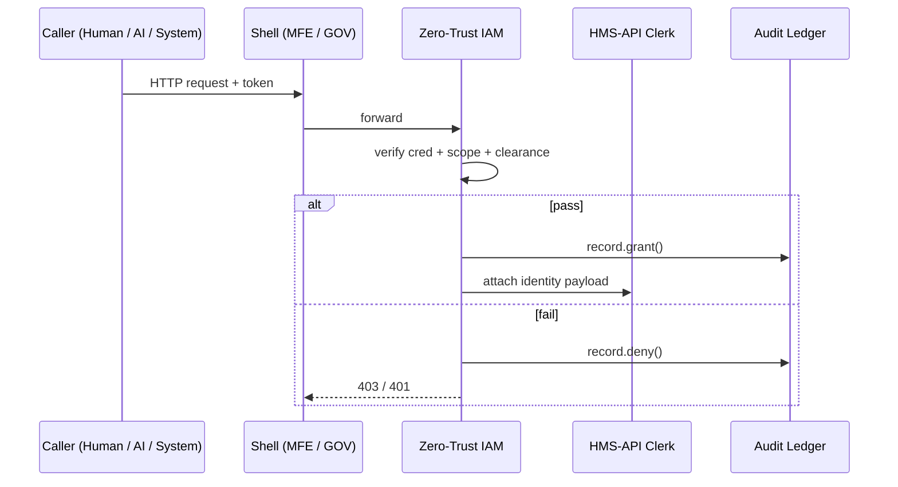

# Chapter 4: Access & Identity Control (Zero-Trust IAM)

[⬅︎ Back to Chapter 3: Backend API Layer (HMS-API)](03_backend_api_layer__hms_api__.md)

---

## 1. Why another “gate” in front of HMS-API?

Picture this:

1. **Emily**, a homeowner, opens **HMS-MFE** to file a National Flood Insurance Program (NFIP) claim.  
2. An **AI chatbot** in the county call-center tries the *same* API on her behalf.  
3. **Officer Brooks** at FEMA uses **HMS-GOV** to approve large payouts.

All three calls hit HMS-API, **but none can be blindly trusted**.  
The *Zero-Trust IAM* layer sits at the lobby door and asks three quick questions:

1. “Who exactly are you?” (identity)  
2. “What are you allowed to do *right now*?” (scope / least privilege)  
3. “Does this match federal clearance rules?” (FIPS 199, NIST SP 800-63)

Only if all answers check out does the request reach the clerk we met in Chapter 3.

---

## 2. Key ideas in plain English

| Term | What it really means | Fast analogy |
|------|----------------------|--------------|
| Zero-Trust | *Never* assume safe just because you’re “inside” | Airport security re-checks even staff |
| Actor | Human, AI agent, or external system that calls HMS | Passenger, robot cart, or service truck |
| Credential | Digital badge (JWT, API key, mTLS cert) | Boarding pass |
| Scope | Narrow list of actions allowed | “Gate B only, no lounge” |
| Least Privilege | Give *minimum* scope needed | Visitor badge vs. master key |
| Clearance Level | Map to FIPS 199 tiers (Public, Moderate, High) | Secret / Top-Secret stamps |
| Audit Log | Tamper-proof record of grants & revocations | CCTV + time-stamped logbook |

Keep these seven words in mind—everything else is wiring.

---

## 3. A 30-second demo

Assume we have a tiny token for Emily:

```bash
export TOKEN=$(npx hms-iam issue \
  --sub emily@example.com \
  --scope "nfip.claim:create" \
  --clearance "public")
```

Try a valid call:

```bash
curl -H "Authorization: Bearer $TOKEN" \
     -X POST http://localhost:5000/api/programs/nfip/claims \
     -d '{"propertyId":"AZ123","damage":"roof"}'
```

Expected → `201 Created`.

Now spoof a higher-risk action (adjust payouts):

```bash
curl -H "Authorization: Bearer $TOKEN" \
     -X PATCH http://localhost:5000/api/claims/42/adjust \
     -d '{"amount":75000}'
```

IAM response → `403 Forbidden – scope nfip.claim:adjust missing`.

Zero-trust in action: **same token, different endpoint, instant deny**.

---

## 4. How the IAM gate works (bird’s-eye view)



Only **five participants**—easy to trace.

---

## 5. Gluing IAM into HMS-API (5 lines!)

`src/index.ts` (from Chapter 3) becomes:

```ts
import { iamMiddleware } from './lib/iam';   // NEW 👈

app.use(iamMiddleware);       // <-- all routes below are protected
app.use('/api', createAppRouter({ logAction }));
```

One line higher, every endpoint underneath is now guarded.

---

## 6. Inside `iamMiddleware` (18 lines)

```ts
// src/lib/iam.ts
import jwt from 'jsonwebtoken';
const PUB_KEY = process.env.IAM_JWK!;   // Public key

export function iamMiddleware(req, res, next) {
  try {
    const [, token] = req.headers.authorization?.split(' ') || [];
    const payload = jwt.verify(token, PUB_KEY, { algorithms: ['RS256'] });

    // 1. Least privilege
    const need = scopeFrom(req);                 // e.g., "nfip.claim:create"
    if (!payload.scope?.includes(need)) throw 403;

    // 2. Clearance
    if (!clearanceOK(payload.clearance, need)) throw 403;

    // 3. Attach identity & continue
    req.user = { id: payload.sub, clearance: payload.clearance };
    next();
  } catch (e) {
    res.status(e === 403 ? 403 : 401).json({ error: 'Access denied' });
  }
}
```

Explanation, line-by-line:

1. Extract and verify JWT using **RS256** (public/private key).  
2. Derive the *required* scope from the HTTP method + path.  
3. Check the token *actually* carries that scope (least privilege).  
4. Compare clearance levels (simple helper not shown).  
5. Stuff the identity into `req.user` for HMS-API to read.

---

## 7. Mapping scopes to clearance (tiny helper)

```ts
// src/lib/clearance.ts
const MATRIX = {
  'nfip.claim:create':       'public',
  'nfip.claim:adjust':       'moderate',
  'program.policy:publish':  'high'
};

export function clearanceOK(actorLevel: string, scope: string) {
  const need = MATRIX[scope] || 'public';
  return rank(actorLevel) >= rank(need);
}

function rank(level: string) {
  return ['public', 'moderate', 'high'].indexOf(level);
}
```

• **3 lines** of data map scopes to FIPS 199-style tiers.  
• `rank()` turns text into numbers for an easy ≥ comparison.

---

## 8. Revoking a token in real time (soft kill-switch)

```ts
// src/lib/revocation.ts
const revoked: Set<string> = new Set();

export function revoke(jti: string) { revoked.add(jti); }
export function isRevoked(jti: string) { return revoked.has(jti); }
```

Hook it in the middleware:

```ts
if (isRevoked(payload.jti)) throw 401;
```

Add `revoke('abc-123')` from an admin script and the token dies instantly—handy for breached keys.

---

## 9. Bootstrapping the IAM service locally

```bash
# 1. Generate a key-pair (once)
npx hms-iam keygen   # writes ./keys

# 2. Start HMS-API with IAM vars
export IAM_JWK=$(cat keys/public.jwk)
npm run dev:api
```

Now issue tokens and experiment:

```bash
npx hms-iam issue --sub officer@fema.gov \
  --scope "nfip.claim:adjust" \
  --clearance "moderate"
```

Copy the token into `curl` and watch approvals sail through.

---

## 10. Common pitfalls & tips

| Pitfall | How to dodge it |
|---------|-----------------|
| Tokens never expire | Set short `exp` (15 min) + rotate refresh tokens |
| Over-broad scopes (`*:*`) | Reject wildcard during issuance |
| Hidden clearance creep | Log every **grant**, **deny**, **revoke** to the Audit Ledger |
| Clock skew in JWT | Allow ± 2 min, but monitor for frequent skews (possible replay attack) |

---

## 11. Where does IAM plug into the bigger story?

1. **Frontend Shells** (Chapter 1) inject tokens after login.  
2. **Navigation Engine** (Chapter 2) sends intents, IAM ensures they’re legal.  
3. **Backend API** (Chapter 3) trusts `req.user` *only* because IAM vouched for it.  
4. **Microservices Fabric** (Chapter 7) may add secondary checks but can generally rely on IAM’s badge.

---

## 12. What you learned

✓ Zero-trust mindset: verify every call, no exceptions  
✓ Core terms: credential, scope, least privilege, clearance  
✓ Added a 18-line Express middleware to guard HMS-API  
✓ Mapped scopes to FIPS 199 clearance levels  
✓ Revoked tokens on the fly for incident response

Next we’ll explore **how Programs and Protocols are formally described in code**, so policy changes don’t break our IAM contracts:  
[Chapter 5: Core Program Model](05_core_program_model_.md)

---

---

Generated by [AI Codebase Knowledge Builder](https://github.com/The-Pocket/Tutorial-Codebase-Knowledge)