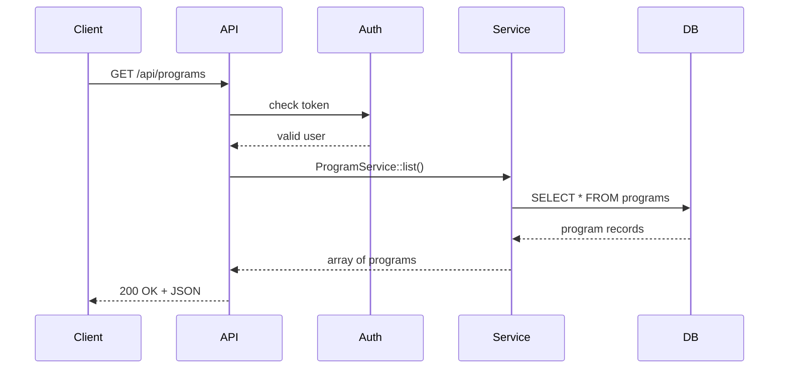

# Chapter 4: API Endpoint

Welcome back! In [Chapter 3: Backend API Service](03_backend_api_service_.md), you saw how HMS-API handles authentication, validation, routing, and governance. Now we’ll zoom in on the individual **API Endpoints**—the network routes like `GET /programs` or `POST /protocols` that let clients read or modify data.

## Why API Endpoints Matter

Imagine a crowded help desk at City Hall. Each window has a number and a purpose:

- **Window 1** handles ID verification  
- **Window 2** takes building permits  
- **Window 3** issues dog licenses  

An **API endpoint** is like one of those windows. It’s the address you call (e.g., `GET /programs`) to get a specific service—list programs, submit a protocol, or check workflow status.

### Real-World Use Case

A citizen wants to see all active programs. The frontend calls:

```bash
curl -X GET https://hms-api.gov/api/programs \
  -H "Authorization: Bearer YOUR_TOKEN"
```

They get back a JSON list:

```json
[
  { "id": 1, "name": "Electric Bus Grant", "description": "..." },
  { "id": 2, "name": "Public Health Outreach", "description": "..." }
]
```

Behind the scenes, that single request hit one endpoint: **GET /api/programs**.

---

## Key Concepts

1. **HTTP Method**  
   Indicates the action:  
   - `GET` to read data  
   - `POST` to create  
   - `PUT`/`PATCH` to update  
   - `DELETE` to remove  

2. **URL Path**  
   The route you call (e.g., `/programs`, `/protocols`).

3. **Handler**  
   Points to a controller method (e.g., `ProgramController@index`).

4. **Request & Response**  
   - **Request**: headers, query/body payload  
   - **Response**: HTTP status code + JSON body  

5. **Security & Validation**  
   Each endpoint uses middleware to check tokens and rules to validate data.

---

## Using an Endpoint

### Example 1: List Programs

1. Call the endpoint:

   ```bash
   curl -X GET https://hms-api.gov/api/programs \
     -H "Authorization: Bearer YOUR_TOKEN"
   ```

2. You receive:

   ```json
   [
     { "id": 1, "name": "Electric Bus Grant" },
     { "id": 2, "name": "Historic Site Review Workflow" }
   ]
   ```

That simple call hits the **GET /programs** endpoint to fetch all programs you’re allowed to see.

### Example 2: Create a Protocol

1. Call the endpoint:

   ```bash
   curl -X POST https://hms-api.gov/api/protocols \
     -H "Authorization: Bearer YOUR_TOKEN" \
     -H "Content-Type: application/json" \
     -d '{
       "program_id": 1,
       "name": "New Grant Workflow",
       "steps": ["submit", "review", "approve"]
     }'
   ```

2. You receive:

   ```json
   {
     "id": 10,
     "program_id": 1,
     "name": "New Grant Workflow",
     "steps": ["submit","review","approve"]
   }
   ```

This hits **POST /protocols** and returns the newly created protocol.

---

## Inside an Endpoint: Step-by-Step

Here’s what happens when you call **GET /api/programs**:



1. The **Client** calls the endpoint.  
2. The **API** runs authentication.  
3. On success, it invokes the **Service**.  
4. The **Service** queries the **DB**.  
5. Results flow back as a JSON response.

---

## How Endpoints Are Defined

### 1. Route Definitions  
File: `routes/api.php`

```php
// List all programs
Route::get('programs', 'ProgramController@index');

// Create a new protocol
Route::post('protocols', 'ProtocolController@store');
```

Simple lines that map URLs and HTTP methods to controller methods.

### 2. Controller Methods  
File: `app/Http/Controllers/ProgramController.php`

```php
class ProgramController
{
    public function index()
    {
        $programs = ProgramService::list();
        return response()->json($programs, 200);
    }
}
```

Receives requests, calls the service layer, and returns JSON.

### 3. Service Layer  
File: `app/Services/ProgramService.php`

```php
class ProgramService
{
    public static function list()
    {
        // Fetch all Program models
        return \App\Models\Core\Program\Program::all();
    }
}
```

Houses business logic—here, a simple “get all programs” call.

---

## Conclusion

In this chapter you learned:

- What an **API Endpoint** is and why it’s like a help-desk window  
- The main pieces: HTTP method, path, handler, security, and response  
- How to **use** endpoints with `curl` examples for `GET /programs` and `POST /protocols`  
- The **internal flow** with a sequence diagram  
- How endpoints look in code: routes, controllers, and services

Up next, we’ll explore how AI agents interact with these endpoints to automate tasks. See [Chapter 5: AI Representative Agent](05_ai_representative_agent_.md).

---

Generated by [AI Codebase Knowledge Builder](https://github.com/The-Pocket/Tutorial-Codebase-Knowledge)