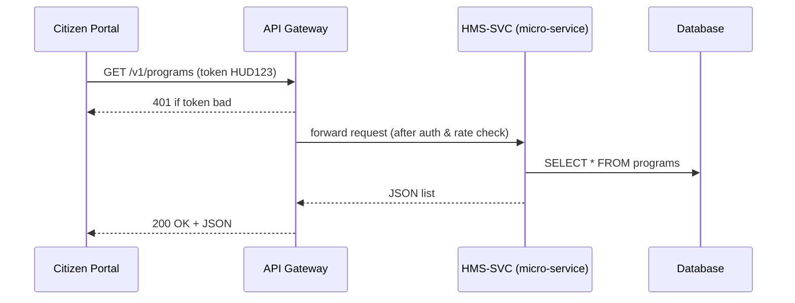

# Chapter 4: Backend API Gateway (HMS-API / HMS-SVC)

*(Jumped in from [Governance Layer (HMS-SYS → HMS-CDF)](03_governance_layer__hms_sys___hms_cdf__.md))*  

---

## 1 — Why Do We Need an “API Post Office”?

Imagine a case worker at HUD updates a **housing‐subsidy amount** at 9:00 AM.  
Five minutes later, HHS starts pulling **medical-claims totals** for a Congressional report.

If both calls hit the same database **without rules**, a typo in the housing update could:

* overload the network,
* collide with HHS queries,
* or bypass the security stamp that proves *who* made the change.

The **Backend API Gateway** is the “postal service” that prevents this chaos.  
Every parcel (request, update, metric) is:

1. Stamped with the sender’s identity.  
2. Sent down the correct lane (routing).  
3. Throttled so the highway never jams (rate limits).  
4. Sorted by edition so old clients still work (versioning).

When you master these four ideas, **a HUD patch never breaks an HHS report**.

---

## 2 — Key Concepts in Plain English

| Postal Analogy | API Term | One-Line Meaning |
|----------------|----------|------------------|
| Stamp          | Authentication token       | “Who sent this parcel?” |
| Lane           | Route / Service mapping    | “Where does it go?” |
| Speed limit    | Rate limiting              | “How many per minute?” |
| Edition label  | Versioning (`v1`, `v2`)    | “Which manual to use?” |

Keep this table in mind; the rest of the chapter builds on it.

---

## 3 — Quick Start: Your First “Hello, Agency!” Call

Below is the **minimum** code to add a new route through the Gateway.

```php
// routes/api_v1.php   (<= 15 lines)
use Illuminate\Http\Request;

Route::middleware(['auth:sanctum','throttle:30,1'])
     ->get('/hello', function (Request $request) {
         return [
             'msg'   => 'Hello, ' . $request->user()->agency . ' 👋',
             'stamp' => $request->bearerToken(),
         ];
     });
```

What happens?

1. `auth:sanctum` checks the **stamp** (token).  
2. `throttle:30,1` enforces **30 requests per minute**.  
3. The JSON reply greets the caller and echoes their token.

Try it with:

```bash
curl -H "Authorization: Bearer TEST_HUD_TOKEN" \
     https://api.example.gov/v1/hello
```

Expected output:

```json
{
  "msg": "Hello, HUD 👋",
  "stamp": "TEST_HUD_TOKEN"
}
```

---

## 4 — Concept #1: Authentication (The Stamp)

### 4.1 Where Do Tokens Come From?

```php
// app/Http/Controllers/Auth/IssueTokenController.php
public function issue(Request $r) {
    return $r->user()->createToken('api')->plainTextToken;
}
```

Explanation: Once an employee logs into the portal, a short-lived **Bearer token** is minted and stored in the browser. Every API call must include it.

### 4.2 Verifying the Stamp

```php
// app/Http/Middleware/CheckAgencyScope.php
public function handle($request, Closure $next, $scope) {
    if (! $request->user()->tokenCan($scope)) {
        return response('Forbidden', 403);
    }
    return $next($request);
}
```

Attach with `->middleware('scope:PROGRAM_READ')` to be sure only the right agency or system can hit the route.

---

## 5 — Concept #2: Rate Limiting (The Speed Limit)

Laravel makes it one line:

```php
Route::middleware('throttle:5,1') // 5 requests per minute
```

When a client exceeds the limit, they get HTTP 429 “Too Many Requests.”  
Tip: keep the limit generous for **inter-agency** calls, stricter for public traffic.

---

## 6 — Concept #3: Routing (Choosing the Lane)

```php
// routes/api_v1.php
Route::prefix('/programs')->group(function () {
    Route::get   ('/',  [ProgramController::class,'index']);
    Route::post  ('/',  [ProgramController::class,'store'])
         ->middleware('scope:PROGRAM_WRITE');
});
```

• `prefix('/programs')` = the **lane**.  
• Controller = the **sorting clerk** that decides which “sorting belt” (service) to send it to.

---

## 7 — Concept #4: Versioning (The Edition Label)

The URL path already hints the version: `/v1/…`.

To add a breaking change, duplicate the file:

```
routes/
 ├─ api_v1.php
 └─ api_v2.php    <-- new edition
```

Both live **side-by-side** so old mobile apps keep working while new portals adopt `v2`.

---

## 8 — What Happens Under the Hood?



* **UI** never talks to DB directly—only through **GW**.  
* **GW** enforces **stamp + speed + version** before forwarding.  
* **SVC** does the business logic we built in [Program Model](01_program_model__core_service_catalogue__.md).

---

## 9 — Inside the Gateway: File Tour

```
app/
 ├─ Http/
 │   ├─ Middleware/
 │   │   ├─ Authenticate.php      (stamp check)
 │   │   └─ ThrottleRequests.php  (speed limit)
 │   └─ Controllers/
 │       └─ GatewayProxy.php      (routes web → svc)
 └─ Services/
     └─ ServiceRouter.php         (maps lane to micro-service URL)
```

### 9.1 Service Router (Core Logic)

```php
// app/Services/ServiceRouter.php   (<= 15 lines)
class ServiceRouter {
    protected array $map = [
        '/programs' => 'http://hms-svc-program',   // micro-service
        '/protocols'=> 'http://hms-svc-protocol',
    ];

    public function target(string $path): string {
        foreach ($this->map as $prefix => $url) {
            if (str_starts_with($path, $prefix)) {
                return $url;
            }
        }
        throw new \Exception('No service found');
    }
}
```

The **GatewayProxy** controller uses `ServiceRouter` to forward payloads with Guzzle (one-liner omitted here for brevity).

---

## 10 — Common Beginner Pitfalls

1. **“It works local, fails in prod.”**  
   • Check if your prod token includes the right **scope**.

2. **“429 errors everywhere!”**  
   • Your test suite may hammer the same token. Bump the throttle just for `ENV=testing`.

3. **“Old mobile app broke after new release.”**  
   • Never delete `/v1` routes; deprecate them slowly and announce a sunset date.

4. **“Random 404 when routing.”**  
   • Confirm the path prefix exists in `ServiceRouter::$map`.

---

## 11 — Mini-Exercise

1. Issue a test token with scope `PROGRAM_READ`.  
2. Call `/v1/programs` five times in one minute—note it works.  
3. Call it 30 times—observe HTTP 429.  
4. Try calling `/v1/programs` **without** the token—observe HTTP 401.  
5. Finally, hit the same endpoint under `/v2/programs` (which doesn’t exist yet) and confirm you get HTTP 404.

---

## 12 — Recap & What’s Next

You learned how the **Backend API Gateway**:

* Stamps each request (authentication).  
* Keeps traffic flowing smoothly (rate limiting).  
* Routes parcels to the right micro-service.  
* Serves multiple editions at once (versioning).

With the highway in place, it’s time to build the **front doors** citizens actually touch—the micro-front-ends and government portals. Continue to [Interface Layer (HMS-MFE / GOV Portals)](05_interface_layer__hms_mfe___gov_portals__.md).

---

Generated by [AI Codebase Knowledge Builder](https://github.com/The-Pocket/Tutorial-Codebase-Knowledge)