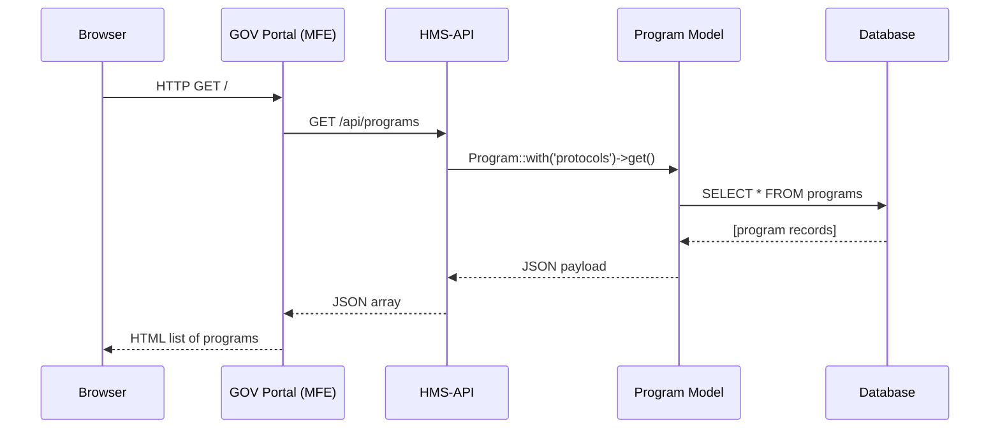

# Chapter 4: Frontend Interface (HMS-MFE / HMS-GOV)

Welcome back! In the previous chapter we built our HTTP services in the [Backend API (HMS-API / HMS-MKT)](03_backend_api__hms_api___hms_mkt__.md). Now it’s time to create the **storefront** and **control-room dashboards** that citizens and administrators actually see.

---

## Why a Frontend Interface?

Imagine you’re a student looking for scholarship opportunities on a government portal. You want to:

1. Browse available **Programs** (e.g., “Barry Goldwater Scholarship”).  
2. Click into a program to see its **Protocol** steps (application, review, notification).  
3. Track your application status in a dashboard.

The **Frontend Interface** (sometimes called HMS-MFE for micro-frontends or HMS-GOV for gov-branded apps) is the web portal that:

- Talks to our [Backend API](03_backend_api__hms_api___hms_mkt__.md)  
- Fetches data models (Program, Protocol)  
- Renders pages and components  
- Manages user interactions and states  

**Central Use Case**  
> Show a list of government Programs on a citizen portal homepage.

---

## Key Concepts

1. **Micro-Frontend (MFE) Structure**  
   A standalone web app that fetches data from our API.  

2. **Routing**  
   Mapping URLs (e.g. `/`) to pages or components.  

3. **Components**  
   Reusable UI pieces (lists, detail cards).  

4. **Services**  
   Tiny modules for calling `/api/programs` or `/api/protocols`.  

5. **HMS-GOV**  
   Shared styling, authentication, and layout for all gov portals.

---

## Quick Start: A Minimal GOV Portal

Here’s a simple file structure for our portal:

```
apps/gov-portal/
├─ src/
│  ├─ index.js          # Entry point
│  ├─ App.jsx           # Root component + routing
│  ├─ components/
│  │  └─ ProgramList.jsx
│  └─ services/
│     └─ api.js         # Fetch helpers
└─ public/
   └─ index.html        # <div id="root">
```

### 1. Entry Point: index.js

```js
// apps/gov-portal/src/index.js
import React from 'react';
import ReactDOM from 'react-dom';
import App from './App';

// Mount the App into public/index.html → <div id="root">
ReactDOM.render(<App />, document.getElementById('root'));
```

*Explanation:* This boots our React app and renders `<App/>` into the page.

### 2. Root Component + Routing: App.jsx

```js
// apps/gov-portal/src/App.jsx
import React from 'react';
import { BrowserRouter, Route } from 'react-router-dom';
import ProgramList from './components/ProgramList';

export default function App() {
  return (
    <BrowserRouter>
      {/* At "/" show the program list */}
      <Route path="/" exact component={ProgramList} />
    </BrowserRouter>
  );
}
```

*Explanation:* We use React Router to show `ProgramList` when users hit the root URL.

### 3. Fetching Data: api.js

```js
// apps/gov-portal/src/services/api.js
export async function fetchPrograms() {
  const response = await fetch('/api/programs');
  return response.json(); // → [{ id, name, ... }, …]
}
```

*Explanation:* A tiny helper to call our `GET /api/programs` endpoint and parse JSON.

### 4. Displaying Programs: ProgramList.jsx

```js
// apps/gov-portal/src/components/ProgramList.jsx
import React, { useEffect, useState } from 'react';
import { fetchPrograms } from '../services/api';

export default function ProgramList() {
  const [programs, setPrograms] = useState([]);

  useEffect(() => {
    fetchPrograms().then(data => setPrograms(data));
  }, []);

  return (
    <div>
      <h1>Available Programs</h1>
      <ul>
        {programs.map(p => <li key={p.id}>{p.name}</li>)}
      </ul>
    </div>
  );
}
```

*Explanation:*  
1. `useEffect` runs once on load to fetch programs.  
2. We store them in local `programs` state.  
3. Render each program’s `name` in a simple list.

---

## Under the Hood: Request Flow

Here’s what happens when a user visits `/`:



---

## A Bit More: HMS-GOV Wrappers

Most gov portals share styling or auth. We can wrap our app:

```js
// wrap in src/App.jsx
import { GovLayout, AuthProvider } from '@hms/gov-components';

export default function App() {
  return (
    <AuthProvider>
      <GovLayout>
        {/* our Router & Routes here */}
      </GovLayout>
    </AuthProvider>
  );
}
```

*Explanation:*  
- `AuthProvider` ensures only signed-in users see admin pages.  
- `GovLayout` adds header, footer, and common CSS.

---

## Recap

In this chapter you learned:

- **What** the Frontend Interface (HMS-MFE / HMS-GOV) is: the citizen/admin portal.  
- **How** to set up a minimal React app that fetches from our [Backend API](03_backend_api__hms_api___hms_mkt__.md).  
- **Key concepts**: routing, components, data services, gov wrappers.  
- **Under the hood**: the sequence of calls from browser → API → database → back.

Next up, we’ll look at the **Interface Layer**, which shows how micro-frontends integrate with each other.  
[Next Chapter: Interface Layer](05_interface_layer_.md)

---

Generated by [AI Codebase Knowledge Builder](https://github.com/The-Pocket/Tutorial-Codebase-Knowledge)