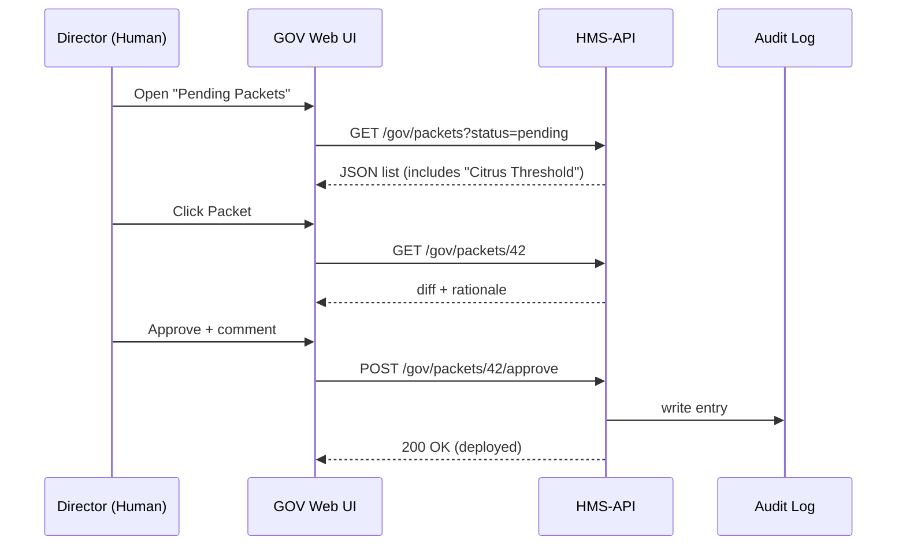
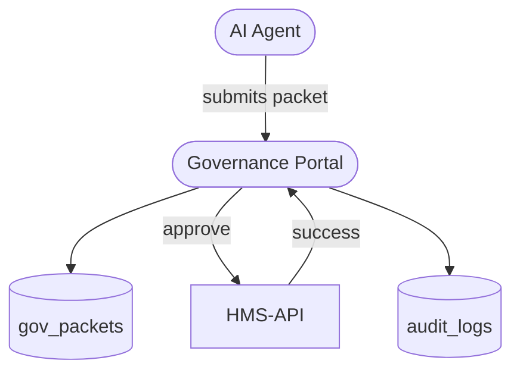

# Chapter 4: Governance Portal (HMS-GOV Interface)

[← Back to “HMS-API Gateway”](03_hms_api_gateway_.md)

---

## 1. Why Does a “Situation Room” Matter? – A 2-Minute Story  

The **Animal and Plant Health Inspection Service (APHIS)** discovers a new plant disease.  
An AI agent inside HMS writes the following policy change:

*“Lower the inspection threshold for imported citrus from 10% → 2%.”*

Without a central dashboard the update could:

* Get buried in someone’s e-mail  
* Be approved twice by two different directors  
* Leave no paper-trail for a future FOIA request

The **Governance Portal (HMS-GOV)** solves all that.  
It is the single web dashboard where decision-makers can **see, debate, approve, or veto** every incoming recommendation—and it automatically stores who did what, and when.

---

## 2. Key Concepts (Plain English)

| Term | Think of it as… | Why you care |
|------|-----------------|--------------|
| Decision Packet | A “folder” holding one proposed change (policy text, diff, AI rationale) | The basic unit GOV reviews |
| Redline Diff | Side-by-side “before vs after” of policy text | Lets humans spot risky edits fast |
| Authority Chain | Ordered list of officials who must sign | Satisfies agency bylaws & FOIA |
| One-Click Deploy | Button that ships an approved change to HMS-API | No SSH, no manual scripts |
| Audit Log | Immutable record of every GOV click | Proof for inspectors & journalists |

If you can review a track-changes Word doc, you can operate HMS-GOV.

---

## 3. First Walk-Through – Approving the Citrus Rule Change

Below is the *entire* happy path, stripped to its essentials:



Five calls, one human, full audit trail.

---

## 4. A 60-Second Curl Demo

Try it locally (run Gateway on `localhost:8000`):

```bash
# 1. List pending packets
curl -H "Authorization: Bearer ADMIN1" \
     http://localhost:8000/api/v1/gov/packets
```

Expected (truncated):

```json
[
  {
    "id": 42,
    "title": "Citrus Inspection Threshold",
    "program": "Agricultural Import Controls",
    "status": "pending"
  }
]
```

```bash
# 2. Approve Packet #42
curl -X POST \
     -H "Authorization: Bearer ADMIN1" \
     -d '{"comment":"Looks good — deploy."}' \
     http://localhost:8000/api/v1/gov/packets/42/approve
```

Output:

```
{
  "message": "Packet approved and deployed.",
  "deployment_id": "dpl_20240601_1234"
}
```

You just shipped new policy—no Git command required.

---

## 5. What Happens Under the Hood?

1. **AI Representative Agent** (covered later in [AI Representative Agent](06_ai_representative_agent__hms_agt___hms_agx__.md)) submits a *Decision Packet*.  
2. Portal stores it in table `gov_packets` with `status=pending`.  
3. When an authorized user clicks **Approve**, the portal:
   - Writes an `audit_logs` row (`user_id`, `packet_id`, timestamp, action).  
   - Sends the final payload to the **Program / Protocol** endpoints via the [HMS-API Gateway](03_hms_api_gateway_.md).  
   - Marks `status=deployed`.



---

## 6. Under-the-Hood Code (Super-Simple)

### 6.1  Model – `app/Models/Gov/DecisionPacket.php` (12 lines)

```php
class DecisionPacket extends Model
{
    protected $fillable = [
        'title', 'program_id', 'diff',
        'rationale', 'status'  // pending | deployed | rejected
    ];

    public function approvals()
    {
        return $this->hasMany(Approval::class);
    }
}
```

**Explanation**:  
Only the essentials—text fields plus a relationship to `Approval` records (who signed).

---

### 6.2  Approval Endpoint (truncated to 18 lines)

```php
class PacketController extends Controller
{
    public function approve(Request $req, $id)
    {
        $packet = DecisionPacket::findOrFail($id);

        // 1. Policy check (simplified)
        if (!$req->user()->can('approve', $packet)) {
            return response('Forbidden', 403);
        }

        // 2. Record approval
        $packet->approvals()->create([
            'user_id'  => $req->user()->id,
            'comment'  => $req->input('comment')
        ]);

        // 3. Deploy via Program/Protocol APIs
        HMS::deploy($packet->diff); // pseudo helper

        $packet->update(['status' => 'deployed']);
        return ['message' => 'Packet approved and deployed.'];
    }
}
```

Line-by-line:
1. Fetch packet or fail.  
2. Ensure user has the right badge.  
3. Append approval record.  
4. Ship change through a helper that talks to Program / Protocol services.  
5. Flip status.

---

### 6.3  Audit Log in One Shot (8 lines)

```php
class Audit
{
    public static function record($user, $action, $packetId)
    {
        \DB::table('audit_logs')->insert([
            'user_id'   => $user->id,
            'packet_id' => $packetId,
            'action'    => $action,
            'at'        => now()
        ]);
    }
}
```

Called inside the controller via `Audit::record(...)`.

---

## 7. Seeing the Redline Diff (Front-End Peek)

```js
// Vue / React pseudo-code (7 lines)
fetch('/api/v1/gov/packets/42')
  .then(r => r.json())
  .then(p => {
    diffViewer.render({
      original: p.diff.before,
      revised:  p.diff.after
    });
  });
```

The **diffViewer** library paints red/green lines just like a Word or Git comparison.

---

## 8. Hands-On Exercise (10 min)

1. `php artisan migrate` to create the included `gov_packets` and `audit_logs` tables.  
2. Run the seeder: `php artisan db:seed --class=GovDemoSeeder` (adds Packet #42).  
3. Visit `http://localhost:5173` (Vite dev server).  
4. Click “Pending (1)” → “Citrus Inspection Threshold”.  
5. Hit **Approve**.  
6. Open DB viewer; confirm:
   * `gov_packets.status = deployed`  
   * One row in `audit_logs`  

You just performed a full **Human-in-the-Loop (HITL) override workflow**—more on that in [HITL Override Workflow](07_hitl_override_workflow_.md).

---

## 9. How GOV Talks to Other Chapters

| Need | GOV Touchpoint | Linked Chapter |
|------|----------------|----------------|
| Display program meta | `/programs/{id}` | [Program Registry](01_program_registry__program_model__.md) |
| Show proposed protocol changes | `/protocols/{id}` | [Protocol Blueprint](02_protocol_blueprint__protocol_model__.md) |
| Route secure API calls | Via Gateway | [HMS-API Gateway](03_hms_api_gateway_.md) |
| Receive AI proposals | Webhook | [AI Representative Agent](06_ai_representative_agent__hms_agt___hms_agx__.md) |
| Store immutable logs | Emits events | [Operations & Monitoring Layer](16_operations___monitoring_layer__hms_ops__.md) |

---

## 10. Government Analogy Cheat-Sheet

• Governance Portal = The **Situation Room whiteboard**; nothing ships until the brass signs.  
• Decision Packet = A **staff memo** with track-changes.  
• Approve button = The **Secretary’s signature**.  
• Audit Log = The **official minutes** archived for historians or FOIA officers.  
• One-Click Deploy = The **courier** immediately delivering signed orders to every field office.

---

## 11. Summary & What’s Next

In this chapter you:

✔ Learned the purpose of HMS-GOV and its **Decision Packet** workflow.  
✔ Approved a policy change in two curl commands.  
✔ Saw how authority chains and audit logs satisfy legal transparency.  

Next we will see **how the portal’s widgets are built and reused** across agencies using a micro-frontend library.

[Continue to “Micro-Frontend Library (HMS-MFE)”](05_micro_frontend_library__hms_mfe__.md)

---

Generated by [AI Codebase Knowledge Builder](https://github.com/The-Pocket/Tutorial-Codebase-Knowledge)