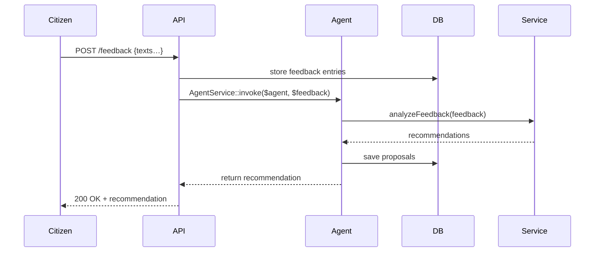

# Chapter 5: AI Representative Agent

In [Chapter 4: API Endpoint](04_api_endpoint_.md), we saw how clients call HMS-API routes like `GET /programs` or `POST /protocols`. Now we’ll meet the **AI Representative Agent**—an automated “advisor” inside HMS that digests citizen feedback, benchmarks performance, and drafts policy or workflow improvements.

## Why an AI Representative Agent?

Imagine the **Indian Health Service (IHS)** notices recurring complaints about long clinic wait times. Rather than manually reading thousands of survey responses, an AI agent can:

1. Analyze crowdsourced feedback  
2. Measure actual wait-time data  
3. Draft optimized check-in workflows  
4. Propose policy updates for clinic schedules  

This frees human staff to focus on decision-making, not data crunching.

## Key Concepts

1. AI Representative Agent  
   A special software actor authorized to act on behalf of the agency.

2. Feedback Analysis  
   The agent ingests text complaints, survey results, or performance metrics.

3. Workflow Generation  
   It creates or updates workflows—e.g., a new “express check-in” step.

4. Policy Proposal  
   It drafts policy changes, like “reduce maximum wait from 60 to 30 minutes.”

---

## Using the Agent in Code

Let’s walk through creating and running an AI Representative Agent.

1. **Register the agent** under a Program (e.g., an IHS clinic initiative):

```php
use App\Services\AgentService;

$agent = AgentService::createAiRepresentativeAgent([
  'program_id'  => 5,                    // IHS Clinic Program
  'name'        => 'WaitTimeAdvisor',
  'permissions' => ['feedback:read',     // can read feedback
                    'workflow:write',    // can generate workflows
                    'policy:propose'],   // can draft policy
]);
```
This call stores the agent in the database, links it to Program #5, and gives it the right scopes.

2. **Process incoming feedback**:

```php
// Suppose $feedbackList is an array of text comments
$recommendation = $agent->processFeedback($feedbackList);

echo $recommendation->workflow;    // e.g. ["triage", "quick_checkin", "full_review"]
echo $recommendation->policyDraft; // e.g. "All clinics must publish real-time wait estimates."
```

Behind the scenes, `processFeedback()` returns an object with proposed workflow steps and policy text.

---

## What Happens Under the Hood?



1. **Citizen** submits feedback.  
2. **API** saves raw data and calls the AI agent.  
3. **AgentService** drives the agent’s logic: analyze, benchmark, draft.  
4. Agent stores proposals and returns them to the caller.

---

## Inside the Implementation

### 1. Agent Model

File: `app/Models/Agent/AiRepresentativeAgent.php`

```php
<?php
namespace App\Models\Agent;

class AiRepresentativeAgent
{
  protected $attributes;

  public function __construct(array $attrs)
  {
    $this->attributes = $attrs;
  }

  // Core method: analyze and propose
  public function processFeedback(array $feedback)
  {
    // 1. Summarize complaints
    // 2. Call external AI service (omitted)
    // 3. Return a small object:
    return (object)[
      'workflow'   => ['triage','quick_checkin','detailed_review'],
      'policyDraft'=> 'Display wait times online every 15 minutes.'
    ];
  }
}
```

### 2. AgentService

File: `app/Services/AgentService.php`

```php
<?php
namespace App\Services;

use App\Models\Agent\AiRepresentativeAgent;

class AgentService
{
  public static function createAiRepresentativeAgent(array $data)
  {
    // Pseudo: write to DB, set permissions
    return new AiRepresentativeAgent($data);
  }

  public static function invoke(AiRepresentativeAgent $agent, array $feedback)
  {
    return $agent->processFeedback($feedback);
  }
}
```

- `createAiRepresentativeAgent()`: ties the agent to a Program and scopes.  
- `invoke()`: standard entry point for processing inputs.

---

## Real-World Analogy

Think of an AI Representative Agent as an expert consultant you hire:

- You give the consultant a stack of citizen letters (feedback).  
- They read, compare with data (performance metrics), and draft a new operation manual (workflow) plus a policy memo.  
- You review their drafts, adjust if needed, and then implement.

---

## Summary

In this chapter you learned how to:

- Define an **AI Representative Agent** to own feedback analysis and policy drafting  
- Register the agent under a Program via `AgentService`  
- Run the agent with `processFeedback()`, getting back workflow steps and policy proposals  
- Peek under the hood at the model and service code  
- See the internal flow with a simple sequence diagram  

Next up: turning those proposals into concrete **Process Proposals** in [Chapter 6: Process Proposal](06_process_proposal_.md).

---

Generated by [AI Codebase Knowledge Builder](https://github.com/The-Pocket/Tutorial-Codebase-Knowledge)