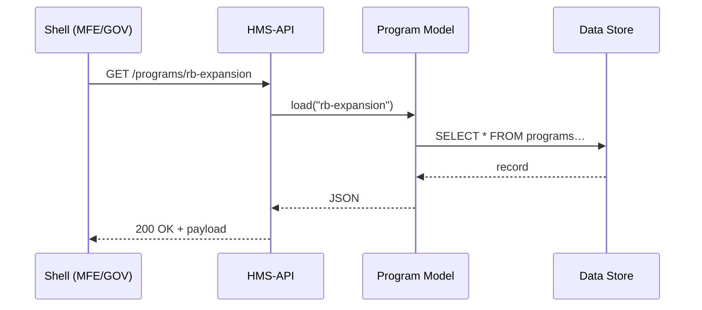

# Chapter 5: Core Program Model

[⬅︎ Back to Chapter&nbsp;4: Access & Identity Control (Zero-Trust IAM)](04_access___identity_control__zero_trust_iam__.md)

---

## 1. Why bother with a “Program” object?

Imagine Congress launches the **Rural Broadband Expansion Grant**.  
Suddenly dozens of teams must know:

* What is the total budget?  
* Which rules decide eligibility?  
* Who signs off on payouts?  
* When does the application window close?

If each microservice kept its own answers, chaos would reign.  
The **Core Program Model (CPM)** is our single “binder” that stores every vital fact—name, budget, timelines, and pointers to deeper rules (called *Protocols* in the next chapter).

Think of it as the **cover page of a bill**: one glance tells every downstream system, *“We are talking about Program #RB-2025, version 1.0.”*

---

## 2. Key concepts in plain English

| CPM Term | What it really means | Analogy |
|----------|---------------------|---------|
| Program ID | Unique slug like `rb-expansion` | Bill number “H.R. 1234” |
| Title & Description | Human-friendly label | The heading on the binder |
| Budget Lines | Money buckets (e.g., “Infrastructure”, “Training”) | Excel tabs in the treasury |
| Timeline | `start` / `end` dates, renewal cadence | Calendar invite |
| Stakeholders | Agencies & roles (e.g., “FCC”, “State IT Office”) | List of co-sponsors |
| Linked Protocols | Child objects that define actions (apply, approve, audit…) | Individual bill sections |

Keep these six in mind; everything you code will touch at least one of them.

---

## 3. A tiny Program record

Below is the *minimum* JSON that HMS-API accepts when creating a new program.

```json
{
  "id": "rb-expansion",
  "title": "Rural Broadband Expansion Grant",
  "description": "Helps counties build high-speed internet.",
  "budget": [
    { "code": "INFR", "amount": 50000000 },
    { "code": "TRAIN", "amount": 2000000 }
  ],
  "timeline": { "start": "2025-01-01", "end": "2029-12-31" },
  "stakeholders": ["FCC", "State_IT"]
}
```

Nothing scary—just a well-labeled folder.

---

## 4. Create & fetch a Program (hands-on)

### 4.1 Citizen developers can’t create programs  
Only authorized officers can. So first mint a token:

```bash
TOK=$(npx hms-iam issue \
     --sub "officer@fcc.gov" \
     --scope "program:create" \
     --clearance "high")
```

### 4.2 Create the Program

```bash
curl -X POST http://localhost:5000/api/programs \
     -H "Authorization: Bearer $TOK" \
     -H "Content-Type: application/json" \
     -d @rb-expansion.json
```

Expected response:

```json
{ "id": "rb-expansion", "status": "ACTIVE", "createdAt": "2024-11-01T10:00Z" }
```

### 4.3 Fetch the Program from any shell

```bash
curl http://localhost:5000/api/programs/rb-expansion
```

You’ll get the full JSON plus a `protocols` array (empty for now).

---

## 5. How shells use the Program model

HMS-MFE shows citizens only public fields, HMS-GOV shows everything.

```tsx
// src/mfe/screens/ProgramAbout.tsx
import { useEffect, useState } from 'react';

export function ProgramAbout({ id }: { id: string }) {
  const [prog, setProg] = useState<any>(null);

  useEffect(() => {
    fetch(`/api/programs/${id}`)
      .then(r => r.json()).then(setProg);
  }, [id]);

  if (!prog) return <p>Loading…</p>;
  return (
    <>
      <h1>{prog.title}</h1>
      <p>{prog.description}</p>
      <p>Open until {prog.timeline.end}</p>
    </>
  );
}
```

Under 20 lines and zero business logic—the CPM already distilled the facts.

---

## 6. What happens under the hood?



Four moving parts—that’s it.

---

## 7. Inside the code (PHP flavor)

> File: `app/Models/Core/Program/Program.php`

```php
<?php
namespace App\Models\Core\Program;

class Program
{
    protected array $attributes;

    // Simple constructor
    public function __construct(array $attrs) {
        $this->attributes = $attrs;
    }

    // Relationship to child protocols
    public function protocols(): array {
        // imagine a DB query here
        return Protocol::where('program_id', $this->id())->all();
    }

    // Helpers
    public function id() { return $this->attributes['id']; }
    public function toArray() { return $this->attributes; }
}
```

Explanation:  
1. Stores raw attributes from the database.  
2. `protocols()` Lazily pulls Protocol records when needed—keeping Program lean.  
3. Under the hood it’s plain arrays; no ORM wizardry required for beginners.

### TypeScript interface used in Node services

```ts
// src/types/Program.ts
export interface Program {
  id: string;
  title: string;
  description: string;
  budget: { code: string; amount: number }[];
  timeline: { start: string; end: string };
  stakeholders: string[];
}
```

Both languages share the same structure, so every team speaks one schema.

---

## 8. Linking to other chapters

* IAM enforces who can `create`, `update`, or `retire` a Program (see [Chapter 4](04_access___identity_control__zero_trust_iam__.md)).  
* Each Program points to one or more **Protocols** that define the *how* of an action (next up in [Protocol Blueprint](06_protocol_blueprint_.md)).  
* Microservices (Chapter 7) cache Program data for fast look-ups but always treat CPM as the source of truth.

---

## 9. Common pitfalls & tips

| Pitfall | Remedy |
|---------|--------|
| Forgetting a unique `id` | Add a DB constraint `UNIQUE(program.id)` |
| Mixing program data with protocol rules | Keep rules in Protocol objects; Program only *references* them |
| Hard-coding dates | Store all timelines in ISO-8601; adjust in front-end for locale |
| Budget decimals vs integers | Use **cents** (integers) to avoid floating errors |

---

## 10. What you learned

✓ Why every government initiative maps to a **Program** record  
✓ The six core fields that make up CPM  
✓ How to create, fetch, and display a Program in <20 lines of code  
✓ The simple flow from shell → API → database  
✓ How CPM plugs into IAM, Protocols, and Services

Ready to see *what actually happens inside* a Program—applications, renewals, audits?  
That logic lives in the child objects you’ll meet next in [Chapter 6: Protocol Blueprint](06_protocol_blueprint_.md).

---

---

Generated by [AI Codebase Knowledge Builder](https://github.com/The-Pocket/Tutorial-Codebase-Knowledge)