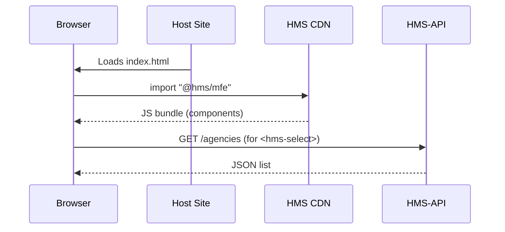

# Chapter 5: Micro-Frontend Library (HMS-MFE)


[← Back to “Governance Portal (HMS-GOV Interface)”](04_governance_portal__hms_gov_interface__.md)

---

## 1. The 30-Second Pitch

Imagine you are a citizen trying to **“Submit a Noise Complaint.”**  
Some days you land on a Department of Transportation site, other days on a city portal—but you still expect:

* the same big **Submit** button,  
* keyboard-friendly focus rings,  
* Spanish translation one click away.

**HMS-MFE** is the government’s Lego® kit that makes this consistency painless.  
Drop a pre-built block (`<hms-button>` or `<hms-data-table>`) into *any* agency site and it looks, sounds, and behaves exactly like every other federal service.

---

## 2. Why Not Just Copy-Paste HTML?

Copy-pasted snippets drift:

* Someone forgets the `aria-label`.  
* The color palette violates the new accessibility rule.  
* “Submit” is translated in one place but not the other.

With HMS-MFE each block is **versioned, centrally audited, and auto-updated**—change it once, every agency benefits overnight.

---

## 3. Key Concepts (Plain English)

| Term                | Think of it as…                            | Why you care                      |
|---------------------|--------------------------------------------|-----------------------------------|
| Component           | One Lego block – button, banner, table     | Re-use instead of rewrite         |
| Host App            | Your agency’s site that *imports* blocks   | Keeps its own branding & routing  |
| Theme Token         | A CSS variable like `--brand-color`        | Allows gentle re-skinning         |
| i18n Bundle         | A JSON file with `"Submit":"Enviar"`       | Built-in language switching       |
| Accessibility Guard | Linter that screams when you break WCAG    | Fail fast before deploy           |
| Module Federation   | Browser feature that grabs blocks at run-time | No recompile of host needed |

---

## 4. Quick Start – Your First HMS Button

Below is the **entire** setup for a static HTML page.

```html
<!-- index.html -->
<script type="importmap">
{
  "imports": {
    "@hms/mfe": "https://cdn.hms.gov/mfe/v1/index.js"
  }
}
</script>

<script type="module">
import { HmsButton } from '@hms/mfe';

customElements.define('hms-button', HmsButton);
</script>

<hms-button variant="primary" label="Submit Complaint"></hms-button>
```

Explanation:

1. `importmap` tells the browser **where** to download HMS-MFE.  
2. We import the `HmsButton` class and register it as a Web Component.  
3. Drop `<hms-button>` anywhere—done!  
4. Change `label="Submit Complaint"` to `label="Enviar Queja"` and the button auto-switches icons + RTL spacing.

---

## 5. Building a Mini Complaint Form (10-Lines Total)

```html
<form id="complaintForm">
  <hms-text-field name="message" label="Describe issue"></hms-text-field>
  <hms-select name="agency" 
              label="Agency"
              data-src="/api/agencies"></hms-select>
  <hms-button type="submit" variant="primary" label="Submit"></hms-button>
</form>

<script type="module">
import '@hms/mfe/complaint-kit.js'; // registers needed components

document
 .getElementById('complaintForm')
 .addEventListener('submit', e => {
     e.preventDefault();
     const data = Object.fromEntries(new FormData(e.target));
     fetch('/api/complaints', {method:'POST', body:JSON.stringify(data)});
 });
</script>
```

The `<hms-select>` auto-fetches agency names from the [HMS-API Gateway](03_hms_api_gateway_.md) endpoint, so every agency sees its *own* list without extra code.

---

## 6. How The Magic Happens (Step-By-Step)



Key points:

1. **Module Federation** lets the browser fetch the latest HMS blocks on-the-fly.  
2. The Host Site never bundles HMS code—updates arrive lazily from the CDN.  
3. Data calls travel through the standard [Gateway](03_hms_api_gateway_.md), keeping auth rules consistent.

---

## 7. Peeking Under the Hood

### 7.1  Simplified Component Source (Button)

_File: `packages/button/index.ts` (15 lines)_

```ts
export class HmsButton extends HTMLElement {
  static observedAttributes = ['label','variant'];

  connectedCallback() {
    this.render();
  }

  attributeChangedCallback() {
    this.render();          // re-render on prop change
  }

  render() {
    const label   = this.getAttribute('label') || '';
    const variant = this.getAttribute('variant') || 'primary';
    this.innerHTML = `
      <button class="hms-btn hms-${variant}">
        ${label}
      </button>`;
  }
}
```

• No framework lock-in—just Web Components.  
• Styling (`hms-btn`) lives in a central CSS file so colors update globally.

---

### 7.2  i18n Auto-Swap (5 lines)

_File: `packages/core/i18n.ts`_

```ts
export const t = (key:string) =>
  window.locale === 'es' ? ES[key] : EN[key];
```

Components call `t('Submit')`, so a single language switch ripples everywhere.

---

### 7.3  Accessibility Guard in CI (8 lines)

_File: `.github/workflows/a11y.yml`_

```yaml
- name: Run Axe Linter
  run: |
    npx axe-cli 'packages/**/demo.html' \
      --rules wcag2a,wcag2aa
```

If any component fails WCAG 2.1 AA, the pull request is blocked—agencies inherit safety **by default**.

---

## 8. Theming – Keeping Your Agency Colors

Want TSA blue instead of HHS teal? Override two CSS tokens:

```css
:root {
  --hms-color-primary: #004F9F; /* TSA blue */
  --hms-color-primary-hover: #003A75;
}
```

All `<hms-button variant="primary">` widgets instantly pick up the new palette—no code changes.

---

## 9. Hands-On Exercise (15 min)

1. `npm create vite@latest my-agency-site`.  
2. `npm i @hms/mfe`.  
3. Replace `App.jsx` with the “Mini Complaint Form” snippet above.  
4. Open `localhost:5173`—submit a test complaint.  
5. Switch browser language to Spanish (`navigator.language = 'es'` in DevTools) and refresh; labels auto-translate.  
6. Add the CSS token override; verify colors flip.

Congrats—you built an accessible, bilingual, branded form with **zero** custom UI code!

---

## 10. How HMS-MFE Relates to Other Chapters

| What the Component Needs         | Where It Comes From                                | Chapter Link |
|----------------------------------|----------------------------------------------------|--------------|
| Program / Agency names           | `/api/programs`, `/api/agencies`                  | [Program Registry](01_program_registry__program_model__.md) |
| Auth token for secure calls      | Added by Gateway interceptor                       | [HMS-API Gateway](03_hms_api_gateway_.md) |
| Policy-driven UI changes (e.g., new required field) | Delivered as a **Decision Packet** to update component props | [Governance Portal](04_governance_portal__hms_gov_interface__.md) |
| Error & UX metrics               | Emitted to OPS dashboards                          | [Operations & Monitoring Layer](16_operations___monitoring_layer__hms_ops__.md) |

---

## 11. Government Analogy Cheat-Sheet

• HMS-MFE Component = A **standard-issue government form template**—pre-stamped and ready.  
• Theme Token = The colored folder tab your agency clips on.  
• Module Federation = Federal printing office shipping the *latest* template overnight.  
• Accessibility Guard = The legal reviewer ensuring forms meet Section 508 before mailing.

---

## 12. Summary & What’s Next

You now know how HMS-MFE lets any agency spin up accessible, multilingual, on-brand pages with a few lines of HTML or JavaScript.

Up next, we meet the **AI Representative Agent (HMS-AGT / HMS-AGX)** that can *propose* new UI or policy changes and open Decision Packets automatically.

[Continue to “AI Representative Agent (HMS-AGT / HMS-AGX)”](06_ai_representative_agent__hms_agt___hms_agx__.md)

---

Generated by [AI Codebase Knowledge Builder](https://github.com/The-Pocket/Tutorial-Codebase-Knowledge)