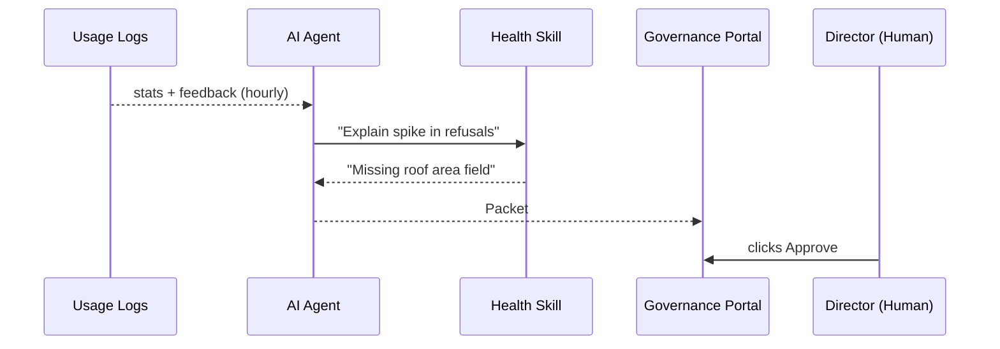
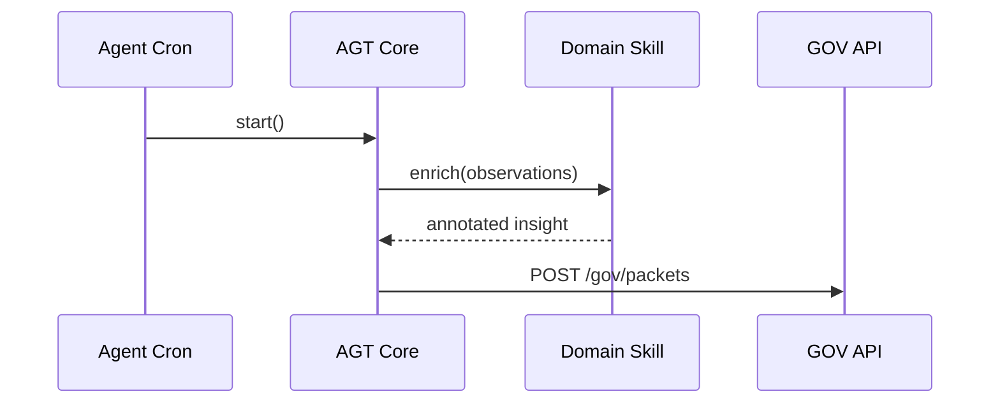

# Chapter 6: AI Representative Agent (HMS-AGT / HMS-AGX)

*[← Back to “Micro-Frontend Library (HMS-MFE)”](05_micro_frontend_library__hms_mfe__.md)*  

---

## 1. Why Bother With an “AI Policy Analyst”?

Picture the **Home Solar Rebate** program from earlier chapters.  
Last month, 35 % of citizen applications were rejected because *“roof size missing”*.

A human analyst could:

1. Pull usage numbers from the database.  
2. Read hundreds of angry feedback comments.  
3. Draft a proposal to **add a helper hint** inside the application form.  
4. Send a memo up the chain of command.

That takes days—and people get tired.

**AI Representative Agents** do the same 4 steps **every hour, 24/7**:

```text
Data ➜ Insight ➜ Draft change ➜ File “Decision Packet” for human review
```

HMS-AGT ships the brain; HMS-AGX plugs in the *specialty* knowledge (health, finance, etc.).

---

## 2. A Two-Minute Story



Result: By breakfast time the next day, citizens see a friendlier form—without a single late-night meeting.

---

## 3. Key Concepts (Plain English)

| Term                | Think of it as…                                           | Why you care                              |
|---------------------|-----------------------------------------------------------|-------------------------------------------|
| HMS-AGT             | The *core* AI brain—reads data, forms hypotheses.         | Same engine, no matter the policy domain. |
| HMS-AGX “Skill”     | Plug-in that adds domain context (health, tax, housing).  | Keeps AGT slim; swap skills as needed.    |
| Observation         | A single data point (e.g., *85 rejections today*).        | Raw fuel for analysis.                    |
| Insight             | Natural-language summary of *why* something happened.     | Goes into human-readable memos.           |
| Decision Packet     | JSON bundle mailed to [Governance Portal](04_governance_portal__hms_gov_interface__.md). | Triggers the human approval flow.         |
| Confidence Score    | 0-1 number showing how sure the agent is.                 | Low scores auto-flag for extra review.    |

If you can follow a weather report (“data → forecast → advice”), you already understand AGT/AGX.

---

## 4. Quick Hands-On: The Smallest Possible Agent

Below is a **15-line** pseudo-PHP script that runs once, finds a spike, and files a packet.  
Create `app/Agents/SpikeMonitor.php`.

```php
class SpikeMonitor
{
    public function __invoke()
    {
        // 1. Pull yesterday's stats
        $stat = Stats::today('roof_missing');   // e.g. 85

        // 2. Simple threshold check
        if ($stat < 50) return;  // nothing to do

        // 3. Draft insight (AGT core)
        $insight = "High rejection due to missing roof size.";

        // 4. Wrap as Decision Packet
        $packet = DecisionPacket::create([
            'title'     => 'Add Roof-Size Helper Hint',
            'program_id'=> Program::code('SOLAR')->id,
            'diff'      => ['ui_hint' => 'display'],
            'rationale' => $insight,
            'confidence'=> 0.72
        ]);

        // 5. File to GOV via Gateway
        Gateway::post('/gov/packets', $packet);
    }
}
```

What just happened?

1. Read a number from logs.  
2. If it crosses a line, write a plain-language rationale.  
3. Store + ship the **Decision Packet**—the same object humans saw in [Governance Portal](04_governance_portal__hms_gov_interface__.md).

---

## 5. Under the Hood – Step-By-Step

### 5.1  Overview Flow

```mermaid
graph LR
    A(Central Data Lake<br/>([15 – DTA])) --> B(AGT Core)
    B --> C{Need domain<br/>context?}
    C -- yes --> D(AGX Plug-in)
    C -- no  --> B
    B --> E(Packet Builder)
    E --> F(Governance Portal<br/>([04 – GOV]))
```

1. **Data Lake** holds logs, feedback, audits.  
2. **AGT Core** crunches generic stats.  
3. If extra knowledge is required, it calls the appropriate **AGX plug-in**.  
4. The final payload is a **Decision Packet** queued for human sign-off.

### 5.2  Mini Sequence Diagram



Only four participants—easy to reason about.

---

## 6. Code Walk-Through (20 Lines Total)

### 6.1  AGT Core Skeleton  
_File: `app/Agents/Core/Agent.php` (8 lines)_

```php
abstract class Agent
{
    abstract public function collect(): array; // pull observations
    abstract public function reason(array $obs): array; // return [insight, confidence]

    public function run()
    {
        $obs = $this->collect();
        [$txt,$score] = $this->reason($obs);

        if ($score < 0.6) return; // skip low-confidence ideas
        $this->filePacket($txt, $score);
    }
    /* filePacket() => see PacketService */
}
```

### 6.2  Domain Skill Interface  
_File: `app/Agents/Skills/Skill.php` (5 lines)_

```php
interface Skill
{
    public function enrich(array $obs): array; // add domain labels
}
```

Any AGX module only needs to supply `enrich()`.

### 6.3  Example Health Skill  
_File: `app/Agents/Skills/HealthSkill.php` (7 lines)_

```php
class HealthSkill implements Skill
{
    public function enrich(array $obs): array
    {
        // Pretend we look up ICD codes, lab values, etc.
        foreach ($obs as &$o) {
            $o['domain_tag'] = 'HEALTH';
        }
        return $obs;
    }
}
```

Swap in a **FinanceSkill** the same way—no core changes.

---

## 7. Scheduling Agents

Agents run like cron jobs. Add to `app/Console/Kernel.php`:

```php
$schedule->call(new SpikeMonitor())->hourly();
```

One line = continuous monitoring.

---

## 8. Safety & Compliance Guards

| Guard                          | How It Works (1 Line Summary) |
|--------------------------------|--------------------------------|
| PII Scrubber                   | Regex strips names before analysis. |
| Confidence Threshold (0.6)     | Low certainty? => Packet saved as **draft**, not auto-filed. |
| Rate Limiter (30 pkts/day)     | Prevents spam on GOV queue. |
| HITL Override                  | All packets *must* be approved; see next chapter. |

---

## 9. Try It Yourself (10 min)

1. Seed fake stats:  
   `php artisan db:seed --class=DemoStatsSeeder`  
   (creates a spike of 90 roof-size rejections)

2. Run the agent once:  
   `php artisan agent:run SpikeMonitor`

3. `curl /api/v1/gov/packets` (via Gateway) → you should see Packet #88 *“Add Roof-Size Helper Hint”* with `status=pending`.

4. Approve it inside GOV UI as learned earlier.  
   The new hint will appear automatically in the HMS-MFE form on next page refresh. 🌟

---

## 10. How AGT/AGX Touch Other Layers

| Purpose                               | Connected Chapter |
|---------------------------------------|-------------------|
| Reads usage & feedback logs           | [Central Data Lake](15_central_data_lake__hms_dta__.md) |
| Consults policy limits                | [Policy Engine](09_policy_engine__hms_cdf__.md) |
| Files Decision Packets                | [Governance Portal](04_governance_portal__hms_gov_interface__.md) |
| Executes on a timer                   | [Activity Orchestrator](08_activity_orchestrator__hms_act__.md) |
| Can be vetoed by humans               | [HITL Override Workflow](07_hitl_override_workflow_.md) |

---

## 11. Government Analogy Cheat-Sheet

• HMS-AGT = A **career OMB analyst** staying late to crunch spreadsheets.  
• HMS-AGX = Calling a **subject-matter expert** at CDC or Treasury.  
• Confidence Score = The analyst saying “I’m 70 % sure this change helps.”  
• Decision Packet = The **staff memo** slid across the director’s desk.  
• Cron Schedule = The analyst’s **standing weekly review meeting**, but faster.

---

## 12. What You Learned

✔ Why AI Representative Agents exist.  
✔ The difference between **core logic (AGT)** and **domain skills (AGX)**.  
✔ How to write a 15-line agent that files policy improvements.  
✔ Safety guards that keep AI suggestions under human control.

Ready to see how humans can *override* or *tweak* an agent’s action in real time?  
Continue to [HITL Override Workflow](07_hitl_override_workflow_.md).

---

Generated by [AI Codebase Knowledge Builder](https://github.com/The-Pocket/Tutorial-Codebase-Knowledge)