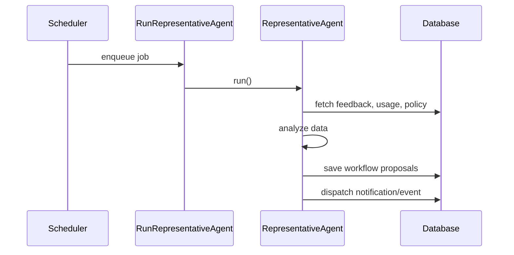

# Chapter 6: AI Representative Agent

In the previous chapter we learned how the [Interface Layer](05_interface_layer_.md) stitches together our micro-frontends. Now let’s add a tireless “policy analyst” that watches our system 24/7 and recommends smarter workflows: the **AI Representative Agent**.

---

## Why an AI Representative Agent?

Imagine you run a federal grants office. Every week you hear:

- “Our review process is too slow.”  
- “Applicants get stuck in Step 3.”  
- “We’re spending too much time on manual checks.”

Rather than waiting for humans to spot these bottlenecks, the **AI Representative Agent**:

1. Gathers **feedback** (citizen surveys, staff notes)  
2. Reads **usage data** (how long each step takes)  
3. Looks up **policy metadata** (required deadlines, rules)  
4. Proposes **optimized workflows** (e.g., run background checks in parallel)

It’s like having a policy analyst who never sleeps—and it sends its suggestions straight to your admin dashboard.

---

## Key Concepts

1. **Data Sources**  
   – Feedback records (surveys, help-desk tickets)  
   – Usage logs (time spent in each process step)  
   – Policy metadata (official deadlines, required documents)

2. **Analysis Engine**  
   A module that crunches numbers and spots slow or redundant steps.

3. **Proposal Generator**  
   Turns analysis results into concrete **Workflow Proposals**.

4. **Proposal Dispatcher**  
   Saves proposals and notifies admins (e.g., via events or dashboard).

---

## Quick Start: Running the Agent

### 1. Schedule the Agent

Add a cron job (or use Laravel scheduler) to dispatch a job daily:

```php
// app/Console/Kernel.php (simplified)
protected function schedule($schedule)
{
    // Run once a day at midnight
    $schedule->job(new \App\Jobs\RunRepresentativeAgent())->daily();
}
```

*Explanation:*  
We tell our system to enqueue `RunRepresentativeAgent` every day.

### 2. Job Entry Point

```php
// app/Jobs/RunRepresentativeAgent.php
namespace App\Jobs;

class RunRepresentativeAgent implements \Illuminate\Contracts\Queue\ShouldQueue
{
    public function handle()
    {
        \App\Services\AI\RepresentativeAgent::run();
    }
}
```

*Explanation:*  
The job simply calls our service’s `run()` method.

### 3. Service Workflow

```php
// app/Services/AI/RepresentativeAgent.php
namespace App\Services\AI;

use App\Models\Feedback;
use App\Models\UsageLog;
use App\Models\PolicyMetadata;
use App\Models\WorkflowProposal;

class RepresentativeAgent
{
    public static function run()
    {
        $fb   = Feedback::all();
        $log  = UsageLog::recent(30);
        $meta = PolicyMetadata::all();

        $proposals = self::analyze($fb, $log, $meta);
        self::dispatchProposals($proposals);
    }
}
```

*Explanation:*  
1. Load feedback, usage, and policy data.  
2. Call `analyze()` to generate suggestions.  
3. Save or notify via `dispatchProposals()`.

---

## Under the Hood: Step-by-Step



---

## Inside: Analysis & Dispatch

### analyze() – spotting a bottleneck

```php
protected static function analyze($fb, $log, $meta)
{
    // Example: compute average review time
    $avg = $log->avg('review_duration');
    $max = $meta->where('key','max_review_time')->first()->value;

    if ($avg > $max) {
        return [[
          'action' => 'parallelize_review',
          'detail' => 'Run background check at same time as eligibility check.',
          'benefit'=> 'Expected 30% faster approvals'
        ]];
    }

    return [];
}
```

*Explanation:*  
- Compute average review time vs. policy limit.  
- If it’s too slow, suggest running two checks in parallel.

### dispatchProposals() – saving and notifying

```php
protected static function dispatchProposals(array $items)
{
    foreach ($items as $p) {
        WorkflowProposal::create($p);
    }
    // Optionally: fire an event to refresh admin dashboard
    event(new \App\Events\NewWorkflowProposals($items));
}
```

*Explanation:*  
- Save each proposal in the database.  
- Fire an event so your micro-frontend can reload and show new suggestions.

---

## Data Model: WorkflowProposal

```php
// app/Models/WorkflowProposal.php
namespace App\Models;

use Illuminate\Database\Eloquent\Model;

class WorkflowProposal extends Model
{
    protected $fillable = [
        'action', 'detail', 'benefit'
    ];
}
```

*Explanation:*  
A simple Eloquent model to store our AI’s suggestions.

---

## How Admins See Proposals

Your admin micro-frontend (wired via the [Interface Layer](05_interface_layer_.md)) can call:

```js
// in your ProposalListMFE
fetch('/api/workflow-proposals')
  .then(r => r.json())
  .then(setProposals);
```

Then render each proposal with its **action**, **detail**, and **benefit**.

---

## Recap

In this chapter you learned:

- **What** the AI Representative Agent is: an automated policy analyst.  
- **Why** it matters: spots workflow bottlenecks and suggests improvements.  
- **How** to run it: schedule a job, call `RepresentativeAgent::run()`.  
- **Key steps** under the hood: data gathering, analysis, proposal dispatch.  

Up next, we’ll see how these proposals feed into our [AI-Facilitated Process Optimization](07_ai_facilitated_process_optimization_.md) layer.

---

Generated by [AI Codebase Knowledge Builder](https://github.com/The-Pocket/Tutorial-Codebase-Knowledge)