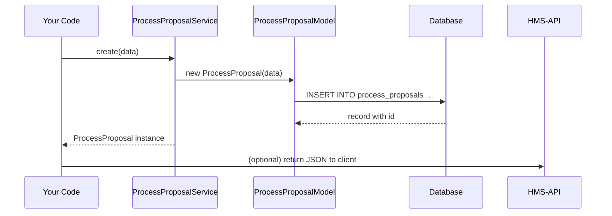

# Chapter 6: Process Proposal

Welcome back! In [Chapter 5: AI Representative Agent](05_ai_representative_agent_.md), we saw how an AI agent analyzes feedback and drafts workflow or policy ideas. Now we’ll package those ideas into a **Process Proposal**—a structured, shareable memo that shows what the system looked like before, what it will look like after, how conflicts were resolved, and where time or cost is saved.

---

## Why Process Proposals Matter

Imagine the Office of Juvenile Justice and Delinquency Prevention (OJJDP) wants to streamline grant reviews. The AI agent suggests splitting “application review” into two passes (technical, then budget). But administrators need a clear document:

- What steps existed **before**?
- What steps will exist **after**?
- Did any rules conflict? How were they resolved?
- How much time or money will this save?

A **Process Proposal** bundles all that into one record—much like a policy memo for a congressional committee.

---

## Key Concepts

1. **before_state**  
   A description or snapshot of the current workflow or policy.

2. **after_state**  
   The proposed new workflow or policy details.

3. **conflict_resolutions**  
   Notes on any conflicting rules or overlaps and how they’re addressed.

4. **efficiency_gains**  
   Estimates of time saved, cost reductions, or other benefits.

5. **agent_id**  
   Which AI Representative Agent (or human) produced this proposal.

---

## Creating a Process Proposal

Let’s say the AI agent “WaitTimeAdvisor” just produced new steps for clinic check-in. We wrap those into a proposal:

```php
use App\Services\ProcessProposalService;

// 1. Prepare proposal data
$data = [
  'agent_id'            => $agent->id,
  'before_state'        => 'triage → full check-in',
  'after_state'         => 'triage → express check-in → full check-in',
  'conflict_resolutions'=> 'Merged triage and initial survey steps',
  'efficiency_gains'    => '30% faster intake, ~5 min per patient'
];

// 2. Create and save
$proposal = ProcessProposalService::create($data);

// 3. Inspect the result
echo $proposal->id;        // e.g. 7
echo $proposal->after_state;
```

Explanation:  
- We pass a simple array describing before/after, conflicts, and gains.  
- `create()` stores it and returns a `ProcessProposal` model.

---

## What Happens Under the Hood

Here’s a simplified sequence when you call `ProcessProposalService::create()`:



1. **Service** wraps your data into a `ProcessProposal` model.  
2. **Model** writes to the database.  
3. You get back the saved proposal with its new ID.

---

## Inside the Implementation

### 1. The Model

File: `app/Models/Policy/ProcessProposal.php`

```php
<?php
namespace App\Models\Policy;

class ProcessProposal
{
    protected $attributes = [];

    public function __construct(array $attrs = [])
    {
        $this->attributes = $attrs;
    }

    public function save()
    {
        // Pseudo: write attrs to DB, set $this->attributes['id']
    }

    public function toArray()
    {
        return $this->attributes;
    }
}
```

- **`$attributes`** holds before/after and other fields.  
- **`save()`** persists to the database.

### 2. The Service

File: `app/Services/ProcessProposalService.php`

```php
<?php
namespace App\Services;

use App\Models\Policy\ProcessProposal;

class ProcessProposalService
{
    public static function create(array $data)
    {
        $proposal = new ProcessProposal($data);
        $proposal->save();
        return $proposal;
    }
}
```

- The service isolates business logic (e.g., you could add validation or notification here).

---

## Real-World Analogy

Think of a **Process Proposal** as a one-page briefing:

- **Before**: how the city issues building permits today.  
- **After**: a faster online pre-check step.  
- **Conflicts**: overlapping fee schedules merged.  
- **Savings**: 40% fewer in-office visits.

Agencies review this memo, suggest edits, and then decide whether to adopt it.

---

## Summary

In this chapter, you learned:

- What a **Process Proposal** is: a structured before-and-after memo with conflict resolution and efficiency gains.  
- How to create one in code using `ProcessProposalService::create()`.  
- The internal flow with a simple **sequence diagram**.  
- Peeked at the **Model** and **Service** implementations.

Next up, a human steps in to review and decide on these proposals. See [Chapter 7: Human Decision Maker](07_human_decision_maker_.md).

---

Generated by [AI Codebase Knowledge Builder](https://github.com/The-Pocket/Tutorial-Codebase-Knowledge)