# Chapter 6: Protocol Blueprint
[⬅︎ Back to Chapter 5: Core Program Model](05_core_program_model_.md)

---

## 1. Why do we need “Protocols”?

Imagine **Ava**, whose home was damaged by a hurricane.  
She opens **DisasterAssistance.gov** and clicks **“Request Temporary Shelter”**.

Behind that single click, FEMA must:

1. Check Ava’s county is on the declared-disaster list.  
2. Ask for income proof if she also requests rent aid.  
3. Auto-approve hotel vouchers **< $2 000**.  
4. Escalate bigger requests to a supervisor within 48 h.  
5. Log every step for the Office of Inspector General.

All of this is **exactly the same every day**.  
That repeatable recipe is what we call a **Protocol**.

> Program = *What* we offer (e.g., “Disaster Shelter”).  
> Protocol = *How* we run it (step-by-step playbook).

Developers and policy-makers can now tweak the recipe **without touching application code**—safer, faster, auditable.

---

## 2. Key parts of a Protocol

| Term | In plain words | Analogy |
|------|----------------|---------|
| Trigger | The event that starts the protocol (`request.shelter`) | Fire alarm |
| Stage | A named step the request must enter (“Eligibility Check”) | Folder tab |
| Guard | A yes/no rule that must pass to move forward | Turnstile |
| Action | What to do in the stage (create task, send email…) | Clerk filling a form |
| Escalation | Where to send a stuck request | Raising hand to manager |
| Version | Immutable snapshot of the recipe | Git tag |

Remember: **Stage → Guard → Action → (next Stage or Escalation)**.

---

## 3. The tiniest useful Protocol (YAML)

```yaml
# file: shelter_v1.yaml
id: fema-shelter.v1
trigger: request.shelter
stages:
  - name: eligibility
    guard: county_in_declared_list
    next: payment
  - name: payment
    guard: amount <= 2000
    action: auto_pay
    else: escalate
escalation:
  queue: supervisor@fema.gov
```

Explanation (all under 20 lines!):

1. When a **shelter request** arrives, start at `eligibility`.  
2. If the county is valid, jump to `payment`.  
3. Small amounts are **auto-paid**; big ones go to `escalate`.  
4. Escalated cases hit a dedicated supervisor inbox.

---

## 4. Registering the Protocol

Only high-clearance officers may publish a new protocol.

```bash
TOK=$(npx hms-iam issue \
      --sub "policy@fema.gov" \
      --scope "protocol:publish" \
      --clearance "high")

curl -X POST http://localhost:5000/api/programs/fema-shelter/protocols \
     -H "Authorization: Bearer $TOK" \
     -F "file=@shelter_v1.yaml"
```

Result:

```json
{ "id":"fema-shelter.v1", "status":"ACTIVE", "createdAt":"2025-02-10T09:00Z" }
```

HMS-API automatically links the new Protocol to the **FEMA Shelter Program** we created in Chapter 5.

---

## 5. What happens when Ava submits her request?

```mermaid
sequenceDiagram
    participant Ava as Citizen
    participant MFE as HMS-MFE
    participant API as HMS-API
    participant PE as Protocol Engine
    participant DB as Store
    Ava ->> MFE: Fill shelter form
    MFE ->> API: POST /shelter
    API ->> PE: start("request.shelter")
    PE ->> DB: log stage=eligibility
    PE -->> API: decision=auto_pay
    API -->> MFE: 201 Approved 🎉
```



Only **five players**—easy to follow.

---

## 6. Under the hood: tiny Protocol Engine (Node)

### 6.1 Loading a protocol

```ts
// src/lib/protocols.ts
import fs from 'fs';
import yaml from 'js-yaml';

export function load(id: string) {
  const file = fs.readFileSync(`./protocols/${id}.yaml`, 'utf8');
  return yaml.load(file) as any;
}
```

Reads the YAML, returns a JS object—4 lines.

### 6.2 Running a stage

```ts
// src/lib/runStage.ts
export async function runStage(p, stage, ctx) {
  if (!evalGuard(stage.guard, ctx)) return escalate(p, ctx);
  if (stage.action) await doAction(stage.action, ctx);
  return stage.next ? runStage(p, p.stages.find(s=>s.name===stage.next), ctx)
                    : 'DONE';
}
```

Walk-through:

1. Evaluate the `guard`.  
2. Perform `action` if any.  
3. Recurse to `next` stage or finish.  
4. On failure, call `escalate`.

Still under 15 lines.

### 6.3 Entry point used by HMS-API

```ts
// src/hooks/startProtocol.ts
import { load } from './protocols';
import { runStage } from './runStage';

export async function start(id, ctx) {
  const p = load(id);
  return runStage(p, p.stages[0], ctx);
}
```

HMS-API just calls `start('fema-shelter.v1', ctx)`—no deep coupling.

---

## 7. Updating a Protocol (safe versioning)

1. Copy `shelter_v1.yaml` → `shelter_v2.yaml`.  
2. Change the amount line to `amount <= 3_000`.  
3. Publish again with scope `protocol:publish`.  
4. Old requests continue under **v1**; new ones start **v2**.  
5. Audit logs record which version processed each request—critical for hearings or FOIA.

---

## 8. Common pitfalls & how to dodge them

| Pitfall | Remedy |
|---------|--------|
| Mixing program fields into protocol YAML | Keep budget/timeline in Program only. |
| Giant YAML monsters | Break into max ~ 100 lines; create more stages, not more logic. |
| Un-versioned edits (“hot-fixing v1”) | Disallow file overwrite; force new `id`. |
| Hidden circular stage flow | Lint rule: fail if a stage revisits an earlier name. |

---

## 9. How Protocols interact with other chapters

* Linked to a **Program** ([Core Program Model](05_core_program_model_.md)).  
* Enforced by HMS-API after **IAM** has validated the caller.  
* Heavy tasks (payments, emails) happen in workers inside the [Microservices Fabric](07_microservices_fabric__hms_svc__.md).  
* Human review of escalations is handled via [Human-in-the-Loop Governance](10_human_in_the_loop_governance__hitl__.md).

---

## 10. Recap & next steps

You now know how to:

✓ Describe day-to-day rules in a tidy YAML Protocol  
✓ Publish and safely version those rules  
✓ See how the Protocol Engine decides eligibility and actions  
✓ Avoid common missteps

In the coming chapter we’ll explore **how specialized microservices carry out the heavy lifting (payments, notifications, analytics)** once a Protocol says *“go”*.  
Ready? Jump to [Chapter 7: Microservices Fabric (HMS-SVC)](07_microservices_fabric__hms_svc__.md).

---

Generated by [AI Codebase Knowledge Builder](https://github.com/The-Pocket/Tutorial-Codebase-Knowledge)