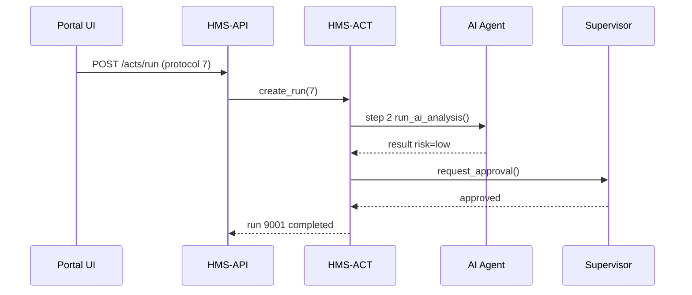

# Chapter 7: Agent Action Orchestration (HMS-ACT)

*(If you just read about the brainy ideas from [AI Representative Agent (HMS-AGT / HMS-AGX)](06_ai_representative_agent__hms_agt___hms_agx__.md), the next question is: **“Great … but who makes sure the ideas actually happen, in the right order, and are fully recorded?”***)

---

## 1. Motivation – “Who’s the Conductor?”

Imagine the **Bureau of Industry and Security** (BIS) processing an export-license renewal:

1. **Fetch applicant data** from the Central Data Repository.  
2. **Run AI analysis** to spot national-security risks.  
3. **Draft a license letter**.  
4. **Request a supervisor’s sign-off**.  
5. **Deploy the license** to the exporter’s portal.

If each team fires off its own scripts, chaos and finger-pointing follow.  
**HMS-ACT is the orchestra conductor**:

* Lines up every task in exact order.  
* Hands the baton from the database to the AI agent to the human approver.  
* Writes every move into an **Activity Log**—a “black box” flight recorder you can replay or audit later.

---

## 2. Key Concepts (Plain-English Cheat-Sheet)

| Term | Think of it as | Why it matters |
|------|---------------|----------------|
| **Run Instance** | A single “mission” (e.g., License #123 renewal) | Gives the sequence an ID you can query. |
| **Action Step** | One checklist item (fetch data, AI analysis…) | The conductor’s sheet music. |
| **Activity Log** | Tamper-proof timeline | FOIA requests & troubleshooting. |
| **Replay** | “Re-run the tape” | Debug or train new staff. |
| **Orchestrator** | Tiny state machine inside HMS-ACT | Moves the baton to the next step. |

Keep these five in mind—everything else is just details!

---

## 3. Hands-On Walk-Through – Renewing Export License #123

### 3.1 Start the Run

```bash
curl -X POST \
  -H "Authorization: Bearer $JWT" \
  -H "Content-Type: application/json" \
  https://api.hms.gov/acts/run \
  -d '{
        "protocol_id": 7,
        "payload": { "license_id": 123 }
      }'
```

Sample reply:

```json
{ "run_id": 9001, "status": "queued" }
```

**What happened?**

1. HMS-ACT stamped a new **Run Instance** `#9001`.  
2. Wrote `status = queued` to the Activity Log.  
3. Pushed a job onto its internal queue to begin Step 1.

---

### 3.2 Watch It Progress (Poll or Webhook)

```bash
curl https://api.hms.gov/acts/runs/9001
```

Possible response mid-flight:

```json
{
  "run_id": 9001,
  "current_step": "ai_analysis",
  "log": [
    {"t":"14:00:01", "step":"fetch_data", "status":"done"},
    {"t":"14:00:03", "step":"ai_analysis", "status":"running"}
  ]
}
```

When all steps are ✅ the run flips to `status:"completed"`.

---

### 3.3 Replay for Audit

```bash
curl https://api.hms.gov/acts/runs/9001/replay
```

HMS-ACT streams each log line back so an auditor (or a new hire) can watch the exact sequence.

---

## 4. Behind the Curtain – What Happens Internally?



Only **five** actors; easy to trace.

---

## 5. A 15-Line Peek at the Orchestrator

```python
# app/Orchestrators/RunEngine.py
class RunEngine:
    def tick(self, run):
        step = run.next_step()
        if step == 'fetch_data':
            run.payload['data'] = DataSvc.fetch(run.payload['license_id'])
        elif step == 'ai_analysis':
            run.payload['risk'] = AgentSvc.analyze(run.payload['data'])
        elif step == 'human_approval':
            NotifSvc.ask_supervisor(run.id)
            return  # wait for callback
        elif step == 'deploy':
            ExporterSvc.publish_license(run.payload)
        run.mark_step_done(step)
```

Explanation (line-by-line):

1. Grab the **next_step** from DB.  
2–6. Run tiny helper services; each finishes fast.  
7–8. Human approval pauses the engine until a webhook returns.  
9. Mark the step done → engine will call itself again.

---

### Where the Files Live

```
app/
├─ Orchestrators/
│  └─ RunEngine.py
├─ Models/
│  └─ ActivityLog.php     # Eloquent model
└─ Jobs/
   └─ TickRun.php         # queued every time a step finishes
```

*TickRun* simply calls `RunEngine.tick()`—one responsibility, one file.

---

## 6. Creating a Protocol That HMS-ACT Understands

*(Quick reminder: Protocols were built in [Protocol (Process Blueprint)](02_protocol__process_blueprint__.md))*  

A minimal “license renewal” definition:

```json
{
  "tasks": [
    {"id":"fetch_data",     "type":"script"},
    {"id":"ai_analysis",    "type":"agent"},
    {"id":"human_approval", "type":"hitl"},
    {"id":"deploy",         "type":"script"}
  ]
}
```

HMS-ACT simply walks this list top-to-bottom.  
If you later insert `{"id":"audit_sync", "type":"script"}` before `deploy`, *nothing* else changes; the conductor just sees an extra note in the sheet music.

---

## 7. Tips & Guardrails

* **Time-outs** – define `max_minutes` per step; ACT auto-flags stalled runs.  
* **Parallelism** – set `"type":"parallel"` in a task group to fan out.  
* **Idempotency** – each step records a checksum so replaying never double-charges a citizen.  
* **Immutable Logs** – ActivityLog uses append-only Postgres table + daily S3 backup.

---

## 8. Common API Endpoints (Cheat-Sheet)

| Verb & Path | Purpose |
|-------------|---------|
| `POST /acts/run` | Kick off a new run instance. |
| `GET /acts/runs/{id}` | Current status + mini log. |
| `GET /acts/runs/{id}/replay` | Stream full log. |
| `PATCH /acts/runs/{id}/cancel` | Abort gracefully. |

All share the same JWT & audit middleware you met in [Backend API Gateway](03_backend_api_gateway__hms_api___hms_svc__.md).

---

## 9. Recap & Next Steps

You now can:

1. Describe HMS-ACT in one sentence: **“the conductor + black-box recorder.”**  
2. Kick off a run, watch it execute, and replay it later.  
3. Glimpse the tiny state machine that drives each step.  
4. Understand how Protocol changes automatically alter the orchestration.

Next we’ll zoom into the critical step where **humans can jump in and override** an in-flight run:  
[Human-In-The-Loop (HITL) Override Flow](08_human_in_the_loop__hitl__override_flow_.md)

*Onward—let’s see how people and software dance together!*

---

Generated by [AI Codebase Knowledge Builder](https://github.com/The-Pocket/Tutorial-Codebase-Knowledge)