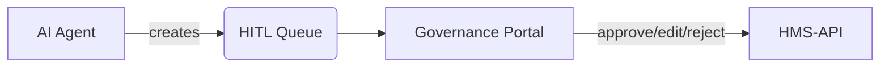
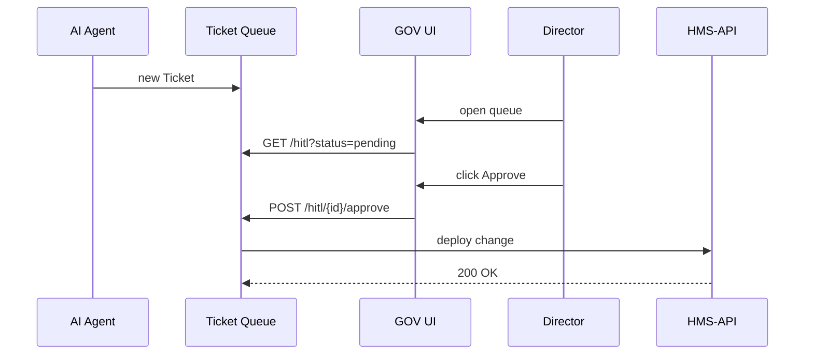

# Chapter 7: HITL Override Workflow  
*(Human-In-The-Loop safety valve for every AI action)*  

[← Back to “AI Representative Agent (HMS-AGT / HMS-AGX)”](06_ai_representative_agent__hms_agt___hms_agx__.md)

---

## 1. Why Do We Need a “Red Button”? – A 1-Minute Story  

Yesterday, our **AI Representative Agent** found that 85 % of *Home Solar Rebate* rejections were due to a missing roof-size field.  
It automatically created a **Decision Packet** suggesting:

> “Add a helper hint reminding citizens to measure roof area.”

Great! …but what if the agent **mis-read** the data or the hint violates a brand-new regulation?

To stay safe (and legal) every AI suggestion must **stop** in a **Human-In-The-Loop (HITL) queue** where a designated official can:

1. Approve it (✅ ship as-is)  
2. Edit it (✏️ tweak wording, fix typos)  
3. Veto it (⛔ trash the idea)  

The **HITL Override Workflow** is that queue.

---

## 2. High-Level Picture  



• **AGT** = automatic brains  
• **Q** = waiting room  
• **GOV** = humans with authority  
• **API** = micro-services that finally execute the change  

Nothing reaches production until a human breaks the seal.

---

## 3. Key Concepts (Plain English)

| Term                 | Think of it as…                                  |
|----------------------|--------------------------------------------------|
| HITL Ticket          | One item in the queue (links to a Decision Packet) |
| Reviewer             | Human officer allowed to act on tickets          |
| Action               | `approve`, `modify`, or `reject`                 |
| Log Entry            | Timestamped record of what happened & why        |
| SLA Clock            | How long a ticket can sit before escalation      |

If you can follow a help-desk ticket, you already get HITL tickets.

---

## 4. A Tiny End-to-End Demo (15 Lines Total)

### 4.1  Agent drops a ticket

```php
// app/Agents/SpikeMonitor.php (snippet)
HitlTicket::create([
    'packet_id' => 88,                    // the Decision Packet
    'status'    => 'pending',
    'submitted_by' => 'AGT_Solar',
]);
```

*Effect*: a new row in table `hitl_tickets` with status `pending`.

---

### 4.2  Reviewer approves

```bash
# curl as Director Jane
curl -X POST \
  -H "Authorization: Bearer DIRECTOR_JANE" \
  -d '{"comment":"Looks good"}' \
  http://localhost:8000/api/v1/hitl/88/approve
```

Returns:

```json
{ "message":"Ticket approved", "next_step":"deployed" }
```

---

### 4.3  What changed?

| Table          | Before            | After            |
|----------------|-------------------|------------------|
| hitl_tickets   | status = pending  | status = closed  |
| audit_logs     | —                 | +1 row (Jane, approve, reason) |
| program/protocol | unchanged        | helper hint now visible |

One POST call, full audit trail.

---

## 5. Under the Hood – Step-By-Step



Only five hops, all logged.

---

## 6. Very Small Code Tour

### 6.1  Model – `app/Models/HITL/HitlTicket.php` (12 lines)

```php
class HitlTicket extends Model
{
    protected $fillable = [
        'packet_id',      // FK to DecisionPacket
        'status',         // pending | closed
        'submitted_by',   // AGT or user id
    ];

    // relationship helpers
    public function packet() { return $this->belongsTo(DecisionPacket::class); }
    public function logs()   { return $this->hasMany(HitlLog::class); }
}
```

Minimal fields; everything else is derived.

---

### 6.2  Controller – approve action (18 lines)

```php
class HitlController extends Controller
{
    public function approve(Request $r, $id)
    {
        $t = HitlTicket::findOrFail($id);

        // 1. Auth guard
        if (!$r->user()->can('hitl-approve')) {
            return response('Forbidden', 403);
        }

        // 2. Deploy Packet
        $ok = PacketDeployer::run($t->packet); // success bool

        // 3. Close ticket + write log
        $t->update(['status'=>'closed']);
        $t->logs()->create([
            'user_id' => $r->user()->id,
            'action'  => 'approve',
            'comment' => $r->input('comment')
        ]);

        return ['message'=>'Ticket approved'];
    }
}
```

Line-by-line: guard → deploy → log → respond.

---

### 6.3  Migration for log table (8 lines)

```php
Schema::create('hitl_logs', function(Blueprint $t){
    $t->id();
    $t->foreignId('ticket_id');
    $t->foreignId('user_id');
    $t->string('action');   // approve | modify | reject
    $t->text('comment')->nullable();
    $t->timestamps();
});
```

Each click stored forever—auditors smile. 😊

---

## 7. SLAs & Escalation (Quick Note)

Add this to your scheduler:

```php
$schedule->command('hitl:escalate')->hourly();
```

The command locates tickets `> 48h` old and e-mails senior staff.  
Implementation is just:

```php
HitlTicket::where('created_at','<',now()->subHours(48))
          ->where('status','pending')
          ->each(fn($t)=> Mail::to('omb@agency.gov')->send(new Escalate($t)));
```

---

## 8. Hands-On Exercise (10 min)

1. Run migrations: `php artisan migrate`.  
2. Seed a fake ticket:  

```bash
php artisan tinker
>>> HitlTicket::factory()->create(['packet_id'=>88]);
```

3. `curl /api/v1/hitl` → see the pending ticket.  
4. Approve it with the earlier POST call.  
5. Check DB: `hitl_tickets.status` becomes `closed`; `hitl_logs` has one row.

You just walked a full **HITL Override Workflow** end-to-end!

---

## 9. Where HITL Touches Other Layers

| Purpose                          | Linked Chapter |
|----------------------------------|----------------|
| Receives AI packets              | [AI Representative Agent](06_ai_representative_agent__hms_agt___hms_agx__.md) |
| Shows tickets to humans          | [Governance Portal](04_governance_portal__hms_gov_interface__.md) |
| Deploys approved changes         | [Program Registry](01_program_registry__program_model__.md) & [Protocol Blueprint](02_protocol_blueprint__protocol_model__.md) |
| Time-based escalation            | [Activity Orchestrator](08_activity_orchestrator__hms_act__.md) |
| Stores immutable logs            | [Operations & Monitoring Layer](16_operations___monitoring_layer__hms_ops__.md) |

---

## 10. Government Analogy Cheat-Sheet

• HITL Ticket = **Clearance memo** on a supervisor’s desk  
• Approve = **Sign with blue ink**  
• Modify = **Red-pen edits, then sign**  
• Reject = **Stamp “Returned Without Action”**  
• Audit Log = The **sign-in sheet** historians use 10 years later

---

## 11. What You Learned

✔ Why a Human-In-The-Loop queue is mandatory for AI safety  
✔ How a ticket is created, reviewed, and logged in under 20 lines of code  
✔ Where HITL sits among other HMS layers  

Next, we will automate *non-AI* tasks—sending e-mails, running cron jobs, moving files—through the [Activity Orchestrator (HMS-ACT)](08_activity_orchestrator__hms_act__.md).

---

Generated by [AI Codebase Knowledge Builder](https://github.com/The-Pocket/Tutorial-Codebase-Knowledge)