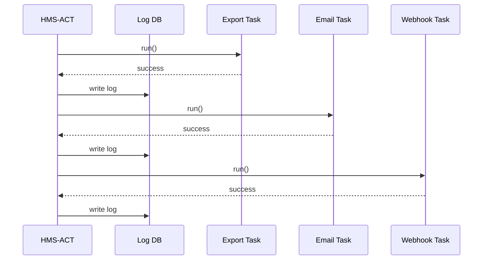

# Chapter 8: Activity Orchestrator (HMS-ACT)

[← Back to “HITL Override Workflow”](07_hitl_override_workflow_.md)

---

## 1. Why Do We Need a “Traffic Cop”? – A One-Minute Story

The **Federal Communications Commission (FCC)** just closed its annual grant window.  
Behind the scenes, ten things must fire **in exactly the right order**:

1. Lock the public form (UI update).  
2. Export all submissions to the Data Lake.  
3. Email finance to start audits.  
4. Spin up an AI Agent to spot fraud.  
5. Notify the press office that numbers are final.

If step #2 fails, **everything else must pause or retry**—otherwise finance audits an incomplete file or the press office tweets the wrong totals.

**HMS-ACT** is that traffic cop.  
It schedules each mini-job, watches for errors, retries when safe, and leaves a crystal-clear log.

---

## 2. Beginner-Friendly Overview

Think of HMS-ACT as a **Project Manager** for computers:

| Human PMO Analogy | HMS-ACT Term |
|-------------------|--------------|
| Task list in Excel | Workflow |
| “Dept A signs first, then Dept B” | Dependency |
| Reminder emails | Notification step |
| Meeting minutes | Activity log |
| Calling someone back who missed a deadline | Retry policy |

If you can follow a simple project checklist, you can use HMS-ACT. 🎉

---

## 3. Key Concepts in Plain English

| Concept | What It Really Means | Emoji Memory Hook |
|---------|----------------------|-------------------|
| **Workflow** | A named list of steps that must happen | 📋 |
| **Task / Step** | One action (API call, SQL export, email) | ✅ |
| **Dependency** | “Don’t start B until A is green” | 🔗 |
| **Retry Policy** | How many times to re-try a failed task | 🔁 |
| **Activity Log** | Timestamped history of every run | 🗒️ |

Keep these five in mind—you already know 90 % of ACT.

---

## 4. A Mini “Hello-Workflow” Example (FCC Submission Close-Out)

Below is a **full, runnable** example in <20 lines that:

1. Defines three tasks.  
2. Runs them with HMS-ACT.  
3. Prints a success log.

```php
use HMS\ACT\Workflow;
use HMS\ACT\Task;

// 1️⃣  Make tiny tasks
$export = Task::sql('EXPORT submissions TO data_lake')
              ->retries(3);

$email  = Task::email('finance@fcc.gov',
          'Submissions exported. Start audits.');

$press  = Task::webhook('https://press.fcc.gov/api/tweet');

// 2️⃣  Wire dependencies (export → email → press)
Workflow::create('FCC Close-Out')
    ->add($export)
    ->add($email)->after($export)
    ->add($press)->after($email)
    ->run();   // 3️⃣  Go!
```

What will happen:

1. `EXPORT` runs. If it fails, it auto-retries up to **3** times.  
2. Only when green, an email fires.  
3. Finally a webhook notifies the press bot.  
4. All events are written to the Activity Log table (`act_logs`).

---

### 4.1  Looking at the Log

```bash
# Quick peek
php artisan db:table act_logs
```

Example output (truncated):

| id | workflow | task  | status | retries | finished_at |
|----|----------|-------|--------|---------|-------------|
| 1  | FCC Close-Out | EXPORT submissions… | ✅ | 1 | 12:02 |
| 2  | FCC Close-Out | Email finance | ✅ | 0 | 12:03 |
| 3  | FCC Close-Out | POST /api/tweet | ✅ | 0 | 12:03 |

Success—no midnight emails to fix things. 🙂

---

## 5. What Happens Under the Hood? (Tiny Diagram)



Only one conductor (**ACT**) keeps track—no task can “forget” to report status.

---

## 6. A Peek Inside the Code (Super-Short)

### 6.1  Task Class (8 lines)

```php
class Task
{
    public function __construct(
        public string $type,
        public string $payload,
        public int    $maxRetries = 0
    ) {}

    public static function sql($cmd){ return new self('sql', $cmd); }
    public static function email($to,$msg){ return new self('email', "$to|$msg"); }
    public static function webhook($url){ return new self('webhook', $url); }

    public function retries($n){ $this->maxRetries=$n; return $this; }
}
```

Three factory helpers (`sql`, `email`, `webhook`) keep it readable for beginners.

---

### 6.2  Workflow Runner (truncated to 12 lines)

```php
class Workflow
{
    protected array $steps=[];

    public static function create($name){ return new self($name); }

    public function add(Task $t){ $this->steps[]=$t; return $this; }
    public function after(Task $prev){ end($this->steps)['dep']=spl_object_id($prev); return $this; }

    public function run(){
        foreach($this->steps as $t){
            if(isset($t->dep)) $this->waitUntilSuccess($t->dep);
            $this->execute($t);
        }
    }

    /* execute() writes to act_logs and handles retries (details skipped) */
}
```

• No magic—`run()` just loops, respects dependencies, and writes logs.  
• Real code has 50+ lines (queue drivers, back-off), but the gist is this simple.

---

## 7. How HMS-ACT Connects to Earlier Layers

| Need | Which Chapter Supplies It | Link |
|------|---------------------------|------|
| Schedule a nightly Agent run | AI Representative Agent | [AI Representative Agent](06_ai_representative_agent__hms_agt___hms_agx__.md) |
| Pause until humans approve | HITL Override Workflow | [HITL Override Workflow](07_hitl_override_workflow_.md) |
| Pull program metadata (e.g., grant window dates) | Program Registry | [Program Registry](01_program_registry__program_model__.md) |
| Store & display logs | Operations & Monitoring Layer | [Operations & Monitoring Layer](16_operations___monitoring_layer__hms_ops__.md) |

---

## 8. Hands-On Exercise (10 min)

1. `php artisan migrate --path=database/migrations/act`  
2. Copy the **Hello-Workflow** code into `routes/console.php`.  
3. Run it: `php artisan schedule:run` (or just `php artisan tinker` and paste).  
4. Inspect `act_logs`—see the three rows?  
5. Comment out your internet connection and retry; watch the webhook step fail, retry thrice, then mark `❌`.

Congratulations—you just orchestrated a multi-step, dependency-aware batch job!

---

## 9. Government Analogy Cheat-Sheet

• HMS-ACT = **Task tracker in a PMO office**.  
• Task = **Form SF-182** waiting for signatures.  
• Dependency = “Legal must sign before Finance.”  
• Retry = “Send a reminder email if no reply in 24 h.”  
• Activity Log = **Meeting minutes** archived for FOIA.

---

## 10. Recap & What’s Next

You now know how to:

✔ Define a **Workflow** with simple PHP helpers.  
✔ Chain tasks with **dependencies** and **automatic retries**.  
✔ Inspect a permanent **activity log** for audits.  

Next, we’ll switch gears and see **how formal policy rules decide *whether* a task *should* be allowed**.  
Continue to [Policy Engine (HMS-CDF)](09_policy_engine__hms_cdf__.md)

---

---

Generated by [AI Codebase Knowledge Builder](https://github.com/The-Pocket/Tutorial-Codebase-Knowledge)