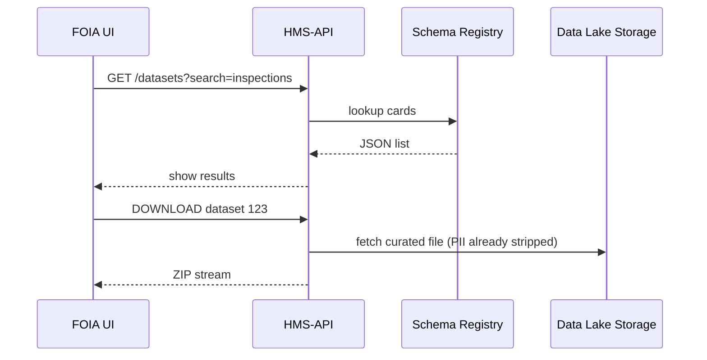

# Chapter 8: Data Lake & Schema Registry (HMS-DTA)

*(Jumped in from [Inter-Agency Communication Layer (HMS-A2A)](07_inter_agency_communication_layer__hms_a2a__.md))*  

---

## 1 — Why Do We Need a “Super Filing Cabinet”?

Friday 9 AM: A reporter files a **FOIA request**—

> “Give me every apartment-inspection result in New Orleans since Katrina.”

At the same time:

* HUD’s AI team wants the same data to train a “Mold Risk” model.  
* EPA lawyers must prove any Personally Identifiable Information (PII) gets deleted after **7 years**.

If each agency keeps its own spreadsheets, you end up with:

* Version hell (“Which CSV is the real one?”)  
* Privacy nightmares (PII floating around)  
* Weeks of manual work for FOIA

**HMS-DTA** is the *one* **filing cabinet** for all agencies.  
It has:

1. Three drawers—**Raw**, **Processed**, **Curated**.  
2. A **Schema Registry** that tags every file with **source**, **consent flags**, and **retention clock**.  
3. Search tools so a FOIA officer can type *“inspections AND New Orleans”* and download the correct, privacy-safe ZIP in minutes.

---

## 2 — Key Concepts in Plain English

| Cabinet Word | What it really means |
|--------------|----------------------|
| Raw Zone     | “Dump box.” Unchanged uploads straight from source systems. |
| Processed Zone | Cleaning closet—bad rows fixed, types normalised. |
| Curated Zone | Museum shelf—gold-standard tables ready for public or ML use. |
| Dataset Card | An index card (JSON) describing one dataset. |
| Schema       | Column blueprint—name, type, sensitivity. |
| Tag          | Sticky note (agency, consent flag, retention date). |

Remember: **Raw ➜ Processed ➜ Curated**, with a **Dataset Card** tracking the journey.

---

## 3 — 60-Second Walk-Through: Register & Ingest a Dataset

We’ll save **“Affordable Housing Inspections 2024”**.

### 3.1  Create a Dataset Card (≤ 15 lines)

```python
# register_dataset.py
from hms_dta import Registry

card = Registry().create(
    name="affordable_housing.inspections.2024",
    source="HUD",
    schema={
        "inspection_id": "string",
        "address":       "string",
        "passed":        "bool",
        "inspector":     "pii:string",
        "completed_at":  "timestamp"
    },
    consent="internal_use",
    retention_years=7
)
print("📇 Card ID:", card.id)
```

Explanation  
1. `Registry().create()` writes a **Dataset Card**.  
2. Columns tagged `pii:` are auto-redacted when data leaves the cabinet.  
3. The `retention_years` clock starts ticking **right now**.

### 3.2  Drop Raw Files (≤ 10 lines)

```bash
aws s3 cp inspections_2024.csv \
  s3://hms-datalake/raw/affordable_housing/inspections/2024/
```

*An ingestion daemon* sees the new file, links it to the card, and logs the checksum.

---

## 4 — Browsing & Querying

```sql
-- Query inside the Curated drawer
SELECT address, passed
FROM curated.affordable_housing.inspections.2024
WHERE passed = false
LIMIT 50;
```

Output: 50 failing inspection addresses—no PII because `inspector` was redacted.

---

## 5 — What Happens Under the Hood?



---

## 6 — Inside the Codebase

```
hms-dta/
 ├─ registry/             # micro-service (FastAPI)
 │   ├─ models.py         # DatasetCard ORM
 │   └─ routes.py         # REST endpoints
 ├─ ingest/               # daemon that watches /raw
 ├─ lake/                 # S3 or Azure Blob folders
 │   ├─ raw/
 │   ├─ processed/
 │   └─ curated/
 └─ policies/             # SQL & Python cleaners
```

### 6.1  Registry Snippet (≤ 15 lines)

```python
# registry/models.py
class DatasetCard(SQLModel, table=True):
    id:            int   | None = Field(default=None, primary_key=True)
    name:          str
    source:        str
    schema_json:   str   # stored as JSON
    consent:       str   # internal_use / public / pii
    retention_end: datetime
```

### 6.2  Ingest Daemon (≤ 15 lines)

```python
# ingest/watch.py
for file in watch("lake/raw/**"):
    card = Registry().find_by_path(file)
    cleaned = clean(file, card.schema)       # type fixes, null trims
    save(cleaned, zone="processed")
    if card.consent != "internal_use":
        curated = redact(cleaned, card.schema)
        save(curated, zone="curated")
```

---

## 7 — Common Beginner Pitfalls

1. **Skipping `pii:` Tags**  
   → PII leaks to public downloads; Governance blocks your release.  
2. **Forgetting Retention**  
   → Files linger past 7 years; nightly janitor job will delete them *and* email you.  
3. **Mixing Zones**  
   → Never query from `raw` in production dashboards—use `curated`.  
4. **Schema Drift**  
   → Adding a column? *Bump* the schema version (`name.v2`) so old scripts keep working.

---

## 8 — Mini-Exercise

1. Register a dataset named `social_security.appointments.2024`.  
2. Tag `ssn` as `pii:string`.  
3. Upload `appointments.csv` to the **Raw** zone.  
4. Run:

```bash
hms-dta query \
  "SELECT COUNT(*) FROM curated.social_security.appointments.2024"
```

5. Confirm the query works **and** the `ssn` column is gone.

---

## 9 — Recap & What’s Next

You learned how **HMS-DTA**:

* Stores every agency’s data in **Raw → Processed → Curated** drawers.  
* Uses a **Schema Registry** to tag source, consent, and retention.  
* Makes FOIA, ML, and privacy compliance painless.

Ready to move money based on that clean data?  
Jump to [Financial Transaction Engine (HMS-ACH)](09_financial_transaction_engine__hms_ach__.md).

---

Generated by [AI Codebase Knowledge Builder](https://github.com/The-Pocket/Tutorial-Codebase-Knowledge)