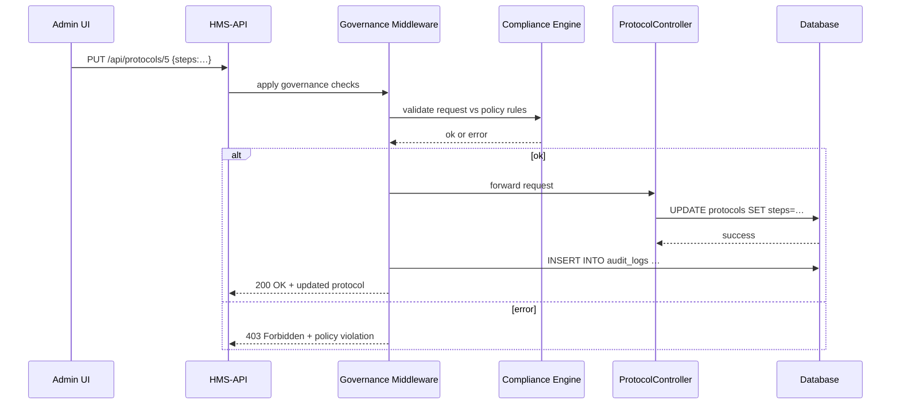

# Chapter 8: Governance Layer

In [Chapter 7: AI-Facilitated Process Optimization](07_ai_facilitated_process_optimization_.md) we built an AI loop that tweaks workflows automatically. Now we need a **constitutional framework** to make sure every change is transparent, ethical, private, and safe. That’s the **Governance Layer**.

---

## Why a Governance Layer?

Imagine your agency wants to speed up scholarship reviews by running background checks in parallel. Great for efficiency—but you must also:

- Prove you respect applicant privacy  
- Log each change for auditors  
- Ensure no steps violate ethics or regulations  

The **Governance Layer** sits at the top of HMS-API and enforces those policies. It’s like a government constitution: every action in the system must pass its rules.

**Central Use Case**  
> An administrator calls `PUT /api/protocols/5` to update review steps. Before the change goes live, the Governance Layer must:
> 1. Check that no personal data is exposed  
> 2. Verify the change follows transparency rules  
> 3. Log the action for audit  
> 4. Allow or reject the update

---

## Key Concepts

1. **Policy Rules**  
   Definitions of transparency, privacy, ethics, safety constraints.  

2. **Compliance Engine**  
   Code that checks each request or action against the rules.

3. **Audit Log**  
   Immutable records of who did what and when.

4. **Transparency Report**  
   A machine-readable summary of recent changes, published for oversight.

---

## How to Use the Governance Layer

### 1. Define Your Policies

In `config/governance.php` list your rules:

```php
// config/governance.php
return [
  'privacy' => ['no_public_ssn', 'mask_sensitive_fields'],
  'ethics'  => ['no_conflict_of_interest'],
  'safety'  => ['validate_data_sources'],
  'transparency' => ['log_all_changes'],
];
```
_Each key groups rules that the Compliance Engine will enforce._

### 2. Attach the Governance Middleware

In your API routes:

```php
// routes/api.php
Route::middleware('governance')
     ->put('protocols/{id}', [ProtocolController::class, 'update']);
```
_This ensures every `PUT /api/protocols/{id}` runs through our governance checks._

### 3. Make a Change

When an admin issues the update:

```http
PUT /api/protocols/5
Content-Type: application/json

{ "steps": ["Submit","Parallel Checks","Finalize"] }
```

- The **Governance Layer** checks the payload  
- If it passes, it logs the action and forwards to the controller  
- If it fails, it returns `403 Forbidden` with a policy error message  

---

## What Happens Step-by-Step



---

## Inside the Governance Layer

### Middleware: app/Http/Middleware/EnforceGovernance.php

```php
namespace App\Http\Middleware;

use Closure;
use App\Services\Governance\ComplianceEngine;
use App\Services\Governance\AuditLog;

class EnforceGovernance
{
    public function handle($request, Closure $next)
    {
        // Check request against policies
        $result = ComplianceEngine::check($request);
        if (! $result->passed) {
            return response()->json(['error'=>$result->message], 403);
        }

        // Log the approved action
        AuditLog::record($request, auth()->user());
        return $next($request);
    }
}
```
_This middleware blocks or allows requests, then records them._

### Compliance Engine: app/Services/Governance/ComplianceEngine.php

```php
namespace App\Services\Governance;

class ComplianceEngine
{
    public static function check($request)
    {
        $rules = config('governance');
        // Simplified: loop through rules and validate
        foreach ($rules as $group => $checks) {
            foreach ($checks as $rule) {
                if (! self::$rule($request)) {
                    return (object)['passed'=>false,'message'=>"$rule failed"];
                }
            }
        }
        return (object)['passed'=>true];
    }

    // Example rule
    protected static function no_public_ssn($req)
    {
        return strpos(json_encode($req->all()), 'ssn') === false;
    }
}
```
_The engine loads your policy groups and runs each rule against the request._

### Audit Log: app/Services/Governance/AuditLog.php

```php
namespace App\Services\Governance;

use App\Models\AuditLog as LogModel;

class AuditLog
{
    public static function record($request, $user)
    {
        LogModel::create([
          'user_id'   => $user->id,
          'action'    => $request->method().' '.$request->path(),
          'payload'   => json_encode($request->all()),
          'timestamp' => now(),
        ]);
    }
}
```
_Every approved request is stored for future audits._

---

## Transparency Reports

You can expose an endpoint for oversight:

```php
// routes/api.php
Route::get('governance/reports', function() {
  return \App\Models\AuditLog::latest()->take(100);
});
```
_Citizens or auditors can fetch the last 100 changes._

---

## Recap

In this chapter you learned:

- **What** the Governance Layer is: a top-level module enforcing transparency, ethics, privacy, and safety  
- **Key pieces**: Policy Rules, Compliance Engine, Audit Log, Transparency Reports  
- **How** to attach it: add `governance` middleware, define rules in `config/governance.php`, record every action  
- **Under the hood**: request validation, logging, and selective approval/rejection  

Next up: how real humans step in when AI or policies need overrides in [Chapter 9: Human Decision Maker](09_human_decision_maker_.md).

---

Generated by [AI Codebase Knowledge Builder](https://github.com/The-Pocket/Tutorial-Codebase-Knowledge)