# Chapter 9: AI Representative Agent (HMS-A2A)

[⬅︎ Back to Chapter 8: External System Sync Adapter](08_external_system_sync_adapter_.md)

---

## 1. Why invent a “virtual policy analyst”?

Imagine the National Weather Service (NWS) wants to reduce **false tornado alarms**:

1. Citizens file complaints: “Sirens went off again for blue skies!”  
2. Live metrics show a spike in **false-positive alerts**.  
3. A federal rule says any algorithm change must be documented and published.

Yesterday this would take weeks of staff time.  
With **HMS-A2A** an AI Agent:

1. Reads the metrics + complaints.  
2. Cross-checks legal thresholds.  
3. Drafts a **Protocol tweak** that raises the siren trigger from EF0 → EF1.  
4. Opens a pull-request for human “red-pen” edits.  
5. After sign-off, auto-publishes the new Protocol through [HMS-API](03_backend_api_layer__hms_api__.md).  

Citizens get quieter nights in **hours**, not weeks.

---

## 2. What exactly is HMS-A2A?

“AI Representative Agent” = _virtual civil-service staffer_ that lives inside **HMS-GOV**.  
It never sleeps, keeps perfect audit trails, and always asks permission before shipping changes.

---

## 3. Key concepts (plain English)

| Term | What it really means | Office analogy |
|------|----------------------|----------------|
| Insight Collector | Pulls **metrics** & **complaints** every hour | Intern reading the suggestion box |
| Constraint Checker | Reads statutes & agency rules | Lawyer flagging “section 508” issues |
| Draft Engine | Writes Protocol or Policy **diffs** | Staffer editing the handbook |
| Review Queue | Holds drafts for humans | Inbox tray marked “Needs Review” |
| Auto-Publisher | Sends approved drafts to HMS-API | Clerk stamping “OFFICIAL” |

Memorize these five—everything else is wiring.

---

## 4. A day in the life of the Agent

```mermaid
sequenceDiagram
    participant MET as Metrics DB
    participant A2A as AI Agent
    participant GOV as Human Reviewer
    participant API as HMS-API
    MET-->>A2A: Hourly stats
    A2A->>A2A: Check legal constraints
    A2A-->>GOV: Draft tornado-alert update
    GOV-->>API: Approve & publish 📜
    API-->>Public: New Protocol live
```



Five actors, easy to follow.

---

## 5. Quick hands-on: run a tiny Agent locally

### 5.1 Prerequisites

```bash
git clone hms-demo && cd hms-demo/agent-demo
npm ci
```

### 5.2 Environment

```text
METRICS_URL=http://localhost:5500/metrics
API_URL=http://localhost:5000/api
TOKEN=<iam token with scope "protocol:draft">
```

### 5.3 Start the loop

```bash
node agent.js    # prints every minute
```

Sample console log:

```
✓ Fetched 256 complaints (false alarms)
✓ Constraint OK (44 CFR §206.11)
✓ Drafted protocol v3→v4 patch (raising wind-speed threshold)
→ Waiting for human review at http://localhost:4000/gov/review/42
```

---

## 6. Minimal code tour (all files <20 lines)

### 6.1 agent.js

```js
import { fetchStats } from './metrics.js';
import { draftPatch } from './draft.js';
import { submit } from './review.js';

async function loop() {
  const data = await fetchStats();
  const patch = draftPatch(data);
  await submit(patch);           // goes to Review Queue
}
setInterval(loop, 60_000);        // run every minute
```

What it does:
1. Grabs metrics.  
2. Generates a Protocol patch.  
3. Sends it to the human Review Queue.

### 6.2 metrics.js

```js
export async function fetchStats() {
  const res = await fetch(process.env.METRICS_URL);
  return await res.json();     // { falseAlarms: 23, ... }
}
```

Pure fetch—no magic.

### 6.3 draft.js

```js
export function draftPatch(stats) {
  if (stats.falseAlarms < 10) return null;
  return {
    title: "Raise tornado siren threshold to EF1",
    changes: [{ op:"replace", path:"/thresholds/wind", value:86 }],
    rationale: `False alarms = ${stats.falseAlarms} (>9)`
  };
}
```

Simple rule: if complaints > 9, adjust wind speed to **86 mph (EF1)**.

### 6.4 review.js

```js
export async function submit(patch) {
  if (!patch) return;
  await fetch(`${process.env.API_URL}/drafts`, {
    method:'POST',
    headers:{
      'Authorization':`Bearer ${process.env.TOKEN}`,
      'Content-Type':'application/json'
    },
    body: JSON.stringify(patch)
  });
}
```

Posts the draft to HMS-API, which places it in the Review Queue.

---

## 7. Inside HMS-API: the `/drafts` endpoint (Node, 12 lines)

```ts
// src/routes/drafts.ts
r.post('/drafts', iam('protocol:draft'), async (req, res) => {
  const id = saveDraft(req.body, req.user.id);  // DB insert
  notifyReviewers(id);                         // email / dashboard
  res.status(201).json({ id });
});
```

• Guarded by IAM scope `protocol:draft`.  
• Stores draft + author ID.  
• Alerts reviewers for “red-pen” edits.

---

## 8. Human review flow (HITL)

When a reviewer opens HMS-GOV:


`/approve` triggers **Auto-Publisher**, which calls:

```
POST /programs/nws-alert/protocols
```

using the same publishing logic from [Protocol Blueprint](06_protocol_blueprint_.md).

---

## 9. Auto-Publisher snippet (8 lines)

```js
export async function publish(patch) {
  await fetch(`${API}/programs/${patch.program}/protocols`, {
    method:'POST',
    headers:{ 'Authorization':`Bearer ${TOKEN}` },
    body: JSON.stringify(patch)
  });
}
```

Runs only after `approve`.

---

## 10. Safety nets & best practices

| Risk | Mitigation |
|------|------------|
| Rogue Agent spams drafts | IAM scope limited to `protocol:draft`; daily quota enforced. |
| Illegal change slips through | Constraint Checker blocks anything violating linked statutes. |
| Reviewer fatigue | Draft must include auto-formatted **rationale** & diff for quick scan. |
| No audit trail | HMS-API logs: _who_, _what_, _when_, _source metrics hash_. |

---

## 11. Common pitfalls

1. **Oversized patches** – keep each draft under 50 JSON‐Patch ops.  
2. **Stale metrics** – schedule Insight Collector after Metrics Loop (see Chapter 12) finishes its hourly batch.  
3. **Token expiry** – Agent refreshes IAM token every 10 min; build this in early.

---

## 12. What you learned

✓ Why an always-on AI staffer speeds up policy updates  
✓ Five key building blocks: Collector → Checker → Draft → Review → Publisher  
✓ Ran a <20-line demo Agent  
✓ Saw how IAM and Review Queue keep humans in control  
✓ Understood how HMS-A2A plugs into Programs and Protocols through HMS-API  

Ready to zoom into the **human approval stage** in full detail?  
Continue to [Chapter 10: Human-in-the-Loop Governance (HITL)](10_human_in_the_loop_governance__hitl__.md)

---

---

Generated by [AI Codebase Knowledge Builder](https://github.com/The-Pocket/Tutorial-Codebase-Knowledge)