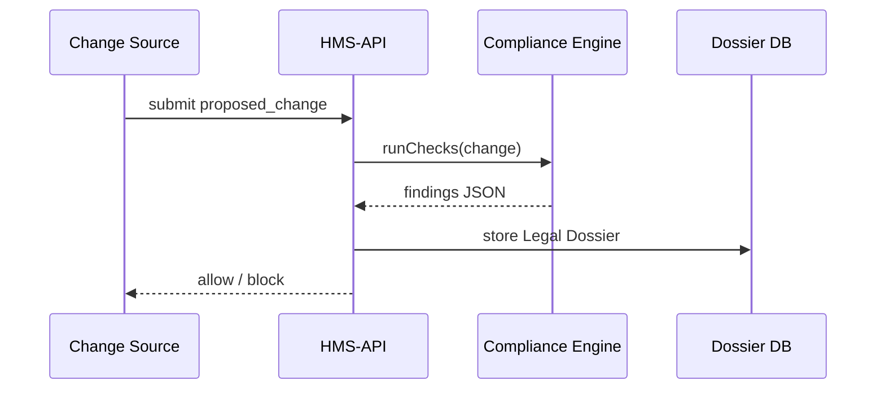

# Chapter 9: Compliance & Legal Reasoning Engine (HMS-ESQ)

*(Arriving from [Human-In-The-Loop (HITL) Override Flow](08_human_in_the_loop__hitl__override_flow_.md)?  
Perfect—now it’s time to invite the lawyers to the party!)*  

---

## 1. Why Do We Need a “Robot General Counsel”?

Imagine the U.S. Department of Agriculture (USDA) wants to **let AI auto-approve farm-subsidy payments up to \$5 000**.  

Before that rule goes live, someone must ask:

* Does the higher limit break any **statutory cap** in the Farm Bill?  
* Will extra data we collect violate **HIPAA** or **FERPA**?  
* Does a pre-existing **Memorandum of Understanding (MOU)** with the Treasury require a 30-day notice?  

Instead of emailing the legal desk for every tweak, HMS-ESQ acts like an **embedded Office of General Counsel** that runs lightning-fast checks the moment a change is proposed.

> Analogy: Think of ESQ as a “spell-checker,” but for laws instead of words—underline illegal clauses in red *before* you hit “publish.”

---

## 2. Key Concepts (Plain-English Pocket Guide)

| Term | Friendly Meaning |
|------|------------------|
| **Statutory Limit** | Number or rule set directly by Congress. |
| **Privacy Rule** | HIPAA, FERPA, GDPR—any law about personal data. |
| **MOU Constraint** | Agreement between two agencies (e.g., USDA ↔ Treasury). |
| **Finding** | Result of a check (“PASS”, “WARNING”, “BLOCK”). |
| **Legal Dossier** | JSON package of all findings saved with the change. |

Remember these five—everything ESQ does is built around them.

---

## 3. Hero Scenario – Raising the Auto-Approval Limit

1. AI Agent suggests:  
   `"diff>5 000"` instead of `"diff>2 500"` in the Payment Protocol.  
2. HMS-ESQ automatically checks:  
   * 7 U.S.C. § 7996 sets a **\$4 000 statutory cap**.  
   * No privacy concerns triggered.  
   * MOU with Treasury requires *email notice* if limit > \$3 000.  
3. ESQ returns **BLOCK** with two concrete reasons.  
4. Governance Portal shows red flags; official must revise request.

---

## 4. How to Call ESQ (One-Shot API)

```bash
curl -X POST \
  -H "Authorization: Bearer $JWT" \
  -H "Content-Type: application/json" \
  https://api.hms.gov/esq/validate \
  -d '{
        "program_id": 42,
        "proposed_change": {
          "protocol_id": 7,
          "field": "decisions[0].if",
          "new": "diff>5000"
        }
      }'
```

Sample response:

```json
{
  "status": "blocked",
  "findings": [
    {
      "type": "Statutory Limit",
      "citation": "7 U.S.C. § 7996",
      "severity": "block",
      "message": "Maximum auto-approval is $4,000."
    },
    {
      "type": "MOU Constraint",
      "reference": "USDA-TREAS-MOU-2021-09",
      "severity": "warn",
      "message": "Treasury requires 30-day notice if > $3,000."
    }
  ]
}
```

### What the JSON Means

* **status** = blocked → change cannot proceed.  
* **findings[0]** = hard stop (law).  
* **findings[1]** = soft warning (policy coordination).

---

## 5. Where Does ESQ Fit in the Big Picture?

```mermaid
graph TD
    AGT[AI Agent (HMS-AGT)] --> ESQ
    GOV[Governance Portal]  --> ESQ
    HITL[HITL Overrides]    --> ESQ
    ESQ --> API[HMS-API]    %% Writes dossier
```

Any actor that wants to publish a change must pass through ESQ first.

---

## 6. Peeking Under the Hood (Beginner-Friendly)

### 6.1 Sequence of Events



Only 4 hops—easy to trace!

### 6.2 Super-Tiny Rule File

```yaml
# rules/statutory.yaml
- id: usda_payment_cap
  applies_to: "program:USDA*"
  field: "diffLimit"
  max_value: 4000
  citation: "7 U.S.C. § 7996"
```

Beginners can read or edit this with no coding skills.

### 6.3 18-Line Validator Snippet

```python
# app/ESQ/validator.py
def run_checks(change):
    findings = []
    for rule in load_rules():
        if match(rule, change):
            if change["new_value"] > rule["max_value"]:
                findings.append({
                    "type":"Statutory Limit",
                    "citation": rule["citation"],
                    "severity":"block",
                    "message": f"Max is ${rule['max_value']}"
                })
    return findings
```

Line-by-line:

1-3. Start empty list.  
4. Loop through YAML rules.  
5-6. If the rule applies and value too high → add a **block finding**.  
7. Return list (could be empty if all good).

*(Real code also checks privacy, MOUs, etc.—but the structure is the same.)*

---

## 7. Folder Map for the Curious

```
app/
└─ ESQ/
   ├─ validator.py
   ├─ loaders/
   │   └─ yamlloader.py
   ├─ rules/                 # YAML & JSON files
   └─ services/
       └─ citation_resolver.py
```

All plain text—legal staff can PR rule files without touching Python code.

---

## 8. Common API Endpoints (Cheat-Sheet)

| Path | What it does |
|------|--------------|
| `POST /esq/validate` | Validate a *single* proposed change (example above). |
| `POST /esq/batch` | Validate many changes (e.g., annual update package). |
| `GET /esq/dossier/{id}` | Retrieve stored findings for a historic change. |

All protected by the same JWT & audit middleware you met in [Backend API Gateway](03_backend_api_gateway__hms_api___hms_svc__.md).

---

## 9. Best Practices & Tips

1. **Write Rules in Plain Language** – Lawyers can own the file.  
2. **Version Your Rules** – Tag rule sets (`v2024-Q3`) to replay past decisions exactly.  
3. **Fail Safe** – If ESQ is unreachable, HMS-API blocks *all* deployments.  
4. **Explain, Don’t Just Deny** – Return a *human-readable* message for every block.  
5. **Continuous Updates** – Use [Marketplace & Capability Registry](14_marketplace___capability_registry__hms_mkt__.md) to share rule packs across agencies.

---

## 10. Recap & What’s Next

You can now:

1. Describe HMS-ESQ as a **robot lawyer** that checks statutes, privacy rules, and MOUs.  
2. Call `/esq/validate` in one cURL and read the findings.  
3. Understand the simple YAML→Python flow under the hood.  
4. See how ESQ plugs into AI agents, the Governance Portal, and HITL overrides.

Ready to move proposals **from idea to production** after they pass legal muster?  
Head over to [Policy Proposal Pipeline](10_policy_proposal_pipeline_.md) to see how we package, route, and publish approved changes at scale!

---

Generated by [AI Codebase Knowledge Builder](https://github.com/The-Pocket/Tutorial-Codebase-Knowledge)